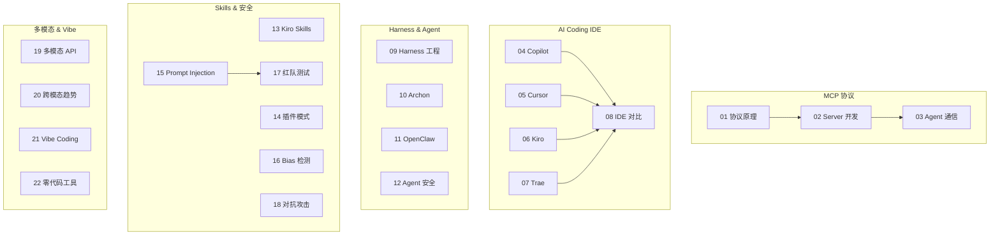
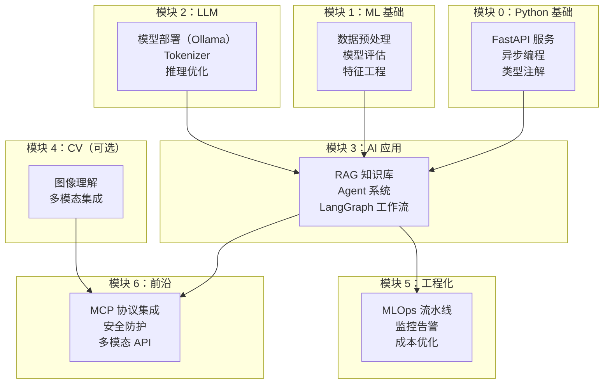

# 模块 6：AI 前沿与趋势

> **前置依赖**：模块 0（前提准备）、模块 3（AI 应用开发）。建议完成编码线核心模块后学习。
> **建议学习时间**：3-4 周

## 模块概览

本模块覆盖 AI 领域最前沿的技术趋势和工具生态，帮助你保持技术敏感度和竞争力。



## 知识点目录

### MCP 协议（Model Context Protocol）

| 序号 | 知识点 | 难度 | 面试频率 | 文档 |
|------|--------|------|---------|------|
| 01 | MCP 协议原理 | ⭐⭐⭐ | 🔥🔥🔥 | [01-mcp-protocol](./01-mcp-protocol) |
| 02 | MCP Server 开发 | ⭐⭐⭐ | 🔥🔥🔥 | [02-mcp-server-dev](./02-mcp-server-dev) |
| 03 | Agent 间标准化通信 | ⭐⭐⭐ | 🔥🔥🔥 | [03-mcp-agent-comm](./03-mcp-agent-comm) |

### AI Coding IDE

| 序号 | 知识点 | 难度 | 面试频率 | 文档 |
|------|--------|------|---------|------|
| 04 | GitHub Copilot | ⭐ | 🔥🔥 | [04-copilot](./04-copilot) |
| 05 | Cursor AI IDE | ⭐ | 🔥🔥 | [05-cursor](./05-cursor) |
| 06 | AWS Kiro | ⭐⭐ | 🔥🔥 | [06-kiro](./06-kiro) |
| 07 | Trae AI IDE | ⭐ | 🔥 | [07-trae](./07-trae) |
| 08 | IDE 选型对比 | ⭐ | 🔥🔥 | [08-ide-comparison](./08-ide-comparison) |

### AI Coding Harness

| 序号 | 知识点 | 难度 | 面试频率 | 文档 |
|------|--------|------|---------|------|
| 09 | Harness 工程概念 | ⭐⭐⭐ | 🔥🔥 | [09-harness-engineering](./09-harness-engineering) |
| 10 | Archon 框架 | ⭐⭐⭐ | 🔥 | [10-archon](./10-archon) |

### AI Agent 平台

| 序号 | 知识点 | 难度 | 面试频率 | 文档 |
|------|--------|------|---------|------|
| 11 | OpenClaw | ⭐⭐ | 🔥 | [11-openclaw](./11-openclaw) |
| 12 | Agent 架构与安全 | ⭐⭐⭐ | 🔥🔥🔥 | [12-agent-security](./12-agent-security) |

### AI Skills/插件

| 序号 | 知识点 | 难度 | 面试频率 | 文档 |
|------|--------|------|---------|------|
| 13 | Kiro Skills | ⭐⭐ | 🔥 | [13-kiro-skills](./13-kiro-skills) |
| 14 | 能力扩展模式 | ⭐⭐ | 🔥🔥 | [14-plugin-patterns](./14-plugin-patterns) |

### AI 安全与对齐

| 序号 | 知识点 | 难度 | 面试频率 | 文档 |
|------|--------|------|---------|------|
| 15 | Prompt Injection 防御 | ⭐⭐⭐ | 🔥🔥🔥 | [15-prompt-injection](./15-prompt-injection) |
| 16 | Bias 检测 | ⭐⭐⭐ | 🔥🔥🔥 | [16-bias-detection](./16-bias-detection) |
| 17 | 红队测试 | ⭐⭐⭐ | 🔥🔥🔥 | [17-red-teaming](./17-red-teaming) |
| 18 | 对抗攻击 | ⭐⭐⭐ | 🔥🔥 | [18-adversarial-attacks](./18-adversarial-attacks) |

### 多模态 AI

| 序号 | 知识点 | 难度 | 面试频率 | 文档 |
|------|--------|------|---------|------|
| 19 | 多模态 API 调用实战 | ⭐⭐ | 🔥🔥🔥 | [19-multimodal-fusion](./19-multimodal-fusion) |
| 20 | 跨模态应用趋势 | ⭐⭐ | 🔥🔥 | [20-cross-modal-trends](./20-cross-modal-trends) |

### Vibe Coding

| 序号 | 知识点 | 难度 | 面试频率 | 文档 |
|------|--------|------|---------|------|
| 21 | Vibe Coding | ⭐ | 🔥🔥 | [21-vibe-coding](./21-vibe-coding) |
| 22 | 零代码 AI 开发工具 | ⭐ | 🔥🔥 | [22-zero-code-ai](./22-zero-code-ai) |

## 代码示例

| 目录 | 说明 | 链接 |
|------|------|------|
| `mcp/01_mcp_server.py` | MCP Server 实现模拟 | [代码](/code-examples/06-ai-frontier/mcp/01_mcp_server.py) |
| `mcp/02_mcp_client.py` | MCP 客户端集成模拟 | [代码](/code-examples/06-ai-frontier/mcp/02_mcp_client.py) |
| `security/01_prompt_injection.py` | Prompt Injection 防御 | [代码](/code-examples/06-ai-frontier/security/01_prompt_injection.py) |
| `security/02_red_teaming.py` | 红队测试脚本 | [代码](/code-examples/06-ai-frontier/security/02_red_teaming.py) |
| `security/03_bias_detection.py` | Bias 检测 | [代码](/code-examples/06-ai-frontier/security/03_bias_detection.py) |

## 里程碑项目

| 项目 | 说明 | 链接 |
|------|------|------|
| MCP Multi-Agent 系统 | MCP Server + 多 Agent 协作 | [代码](/code-examples/06-ai-frontier/milestone_projects/mcp_multi_agent/main.py) |
| AI Coding 工具评测 | 多 IDE 同一任务评测 | [代码](/code-examples/06-ai-frontier/milestone_projects/coding_benchmark/benchmark.py) |
| 安全审计项目 | Prompt Injection + 红队测试 | [代码](/code-examples/06-ai-frontier/milestone_projects/security_audit/main.py) |

## 辅助资源

- [面试指南](./interview) — MCP/安全/Agent 等高频面试题
- [速查卡片](./cheatsheet) — 核心概念和 API 速查

---

## 🎓 最终大项目整合方案

### 项目名称：AI 全栈智能助手系统

**目标**：串联模块 0-6 核心知识点，构建一个完整的 AI 应用系统。



### 系统架构

```
ai-fullstack-assistant/
├── api/                    # FastAPI 服务（模块 0）
│   ├── main.py
│   ├── routes/
│   └── middleware/
├── ml/                     # ML 模型（模块 1）
│   ├── preprocessing.py
│   └── evaluation.py
├── llm/                    # LLM 集成（模块 2）
│   ├── model_manager.py
│   └── inference.py
├── rag/                    # RAG 知识库（模块 3）
│   ├── document_loader.py
│   ├── vector_store.py
│   └── retriever.py
├── agents/                 # Agent 系统（模块 3+6）
│   ├── orchestrator.py
│   ├── research_agent.py
│   └── mcp_bridge.py      # MCP 集成（模块 6）
├── security/               # 安全防护（模块 6）
│   ├── injection_detector.py
│   └── output_filter.py
├── monitoring/             # 监控（模块 5）
│   ├── metrics.py
│   └── alerting.py
├── docker-compose.yml      # 服务编排
└── tests/                  # 测试
```

### 核心功能

1. **RAG 知识库**（模块 3）：文档加载 → 向量化 → 检索 → 生成
2. **多 Agent 协作**（模块 3+6）：通过 MCP 协议实现 Agent 间通信
3. **安全防护**（模块 6）：Prompt Injection 检测 + 输出过滤
4. **多模态支持**（模块 4+6）：图文理解 + 多模态 API 集成
5. **生产监控**（模块 5）：Prometheus 指标 + 告警
6. **API 服务**（模块 0）：FastAPI + JWT 认证 + 速率限制

### 技术栈

| 组件 | 技术 | 对应模块 |
|------|------|---------|
| Web 框架 | FastAPI | 模块 0 |
| LLM 推理 | Ollama / vLLM | 模块 2 |
| 向量数据库 | Chroma | 模块 3 |
| Agent 框架 | LangGraph | 模块 3 |
| Agent 通信 | MCP 协议 | 模块 6 |
| 安全防护 | 自定义中间件 | 模块 6 |
| 监控 | Prometheus + Grafana | 模块 5 |
| 容器化 | Docker Compose | 模块 5 |
