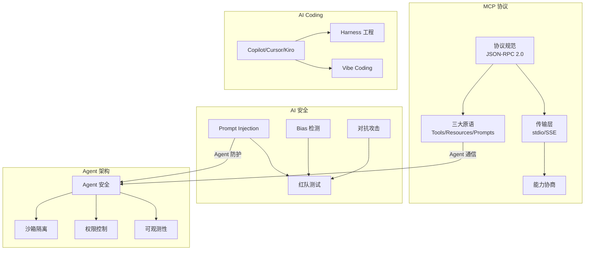
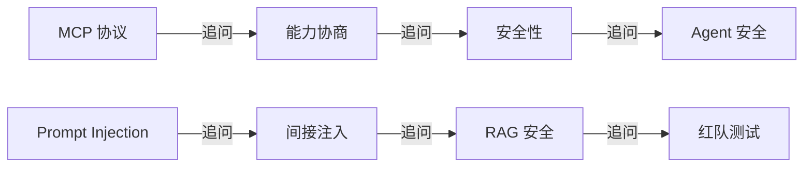

# 模块 6 面试指南

> 本指南覆盖 AI 前沿与趋势领域的高频面试题，适用于 AI 应用工程师、AI 安全工程师和 AI 架构师岗位。

## AI 前沿知识图谱

## 面试题集

### Q1: 请解释 MCP 协议的核心架构和设计理念

**难度**：⭐⭐⭐⭐ | **频率**：🔥🔥🔥 | **岗位**：AI 应用工程师

**答题思路**：
1. MCP 的定位和解决的问题（M×N → M+N）
2. 基于 JSON-RPC 2.0 的协议架构
3. 三大核心原语（Tools/Resources/Prompts）
4. 传输层选择（stdio/SSE）
5. 与 Function Calling 的对比

**标准答案**：MCP 是 Anthropic 发布的开放标准协议，解决 AI 应用集成外部工具的 M×N 问题。基于 JSON-RPC 2.0 构建，采用 Client-Server 架构。三大原语：Tools（模型调用的函数）、Resources（可读取的数据）、Prompts（预定义模板）。支持 stdio（本地）和 SSE（远程）两种传输方式。连接建立时通过 initialize 方法进行能力协商。

**深入追问**：
- MCP 的能力协商机制具体是怎样的？
- MCP 如何保证通信安全性？
- MCP 在生产环境中的性能表现如何？

---

### Q2: 如何设计多层 Prompt Injection 防御体系？

**难度**：⭐⭐⭐⭐ | **频率**：🔥🔥🔥 | **岗位**：AI 安全工程师

**答题思路**：
1. Prompt Injection 的类型（直接/间接）
2. 输入层防御（过滤/分类/限制）
3. 系统层防御（Prompt 加固/分隔符/权限）
4. 输出层防御（检测/脱敏/审核）
5. 监控层（日志/告警/审计）

**标准答案**：多层防御体系包含四层：(1) 输入层——正则匹配已知攻击模式、ML 分类器检测、输入长度限制；(2) 系统层——System Prompt 加固（安全规则 + 分隔符标记用户输入边界）、权限最小化、工具调用白名单；(3) 输出层——检测异常输出模式、敏感信息脱敏、高风险操作人工确认；(4) 监控层——记录所有输入输出、异常检测告警、定期安全审计。

**深入追问**：
- 间接注入（RAG 数据投毒）如何防御？
- ML 分类器检测的训练数据从哪里来？
- Prompt Injection 能否被完全防御？

---

### Q3: 如何设计一个安全的 AI Agent 系统？

**难度**：⭐⭐⭐⭐⭐ | **频率**：🔥🔥🔥 | **岗位**：AI 架构师

**答题思路**：
1. 威胁模型分析
2. 沙箱隔离设计
3. 权限控制模型（RBAC）
4. 输入验证和输出过滤
5. 可观测性（Logs/Metrics/Traces）

**标准答案**：安全 Agent 系统设计包含四层防御：(1) 输入防线——输入验证、Prompt Injection 检测、速率限制；(2) 执行防线——沙箱隔离（Docker 容器）、最小权限原则、资源限制（CPU/内存/GPU 配额）、工具调用白名单；(3) 输出防线——敏感信息脱敏、内容安全检查、输出格式验证；(4) 监控防线——结构化审计日志、性能指标采集、异常检测告警。核心原则是最小权限和纵深防御。

**深入追问**：
- Agent 之间的权限提升攻击如何防范？
- 如何实现 Agent 的热更新而不影响安全性？
- Agent 可观测性的三支柱是什么？

---

### Q4: AI Coding IDE 如何选型？Copilot/Cursor/Kiro 的核心区别是什么？

**难度**：⭐⭐⭐ | **频率**：🔥🔥 | **岗位**：AI 应用工程师

**答题思路**：
1. 各 IDE 的核心理念
2. 功能维度对比
3. 按场景选型
4. 成本考量

**标准答案**：核心区别：Copilot 侧重代码补全（FIM 技术），是最成熟的 AI 编程助手；Cursor 侧重 AI-first 编辑（Composer 多文件编辑），适合快速开发；Kiro 侧重 Spec 驱动开发（需求→设计→任务→实现），适合工程化项目。选型建议：日常编码用 Copilot，快速开发用 Cursor，工程化项目用 Kiro，中文团队考虑 Trae。

**深入追问**：
- .cursorrules 和 Kiro Steering 有什么异同？
- AI IDE 的代码隐私问题如何解决？

---

### Q5: 什么是 Vibe Coding？它对软件开发行业有什么影响？

**难度**：⭐⭐ | **频率**：🔥🔥 | **岗位**：通用

**答题思路**：
1. 概念定义（Karpathy 提出）
2. 与传统编程的区别
3. 适用场景和局限性
4. 对行业的影响

**标准答案**：Vibe Coding 是 Andrej Karpathy 提出的编程范式，开发者通过自然语言描述意图，让 AI 生成和迭代代码。与传统编程的区别：输入从代码变为自然语言，开发者角色从编写者变为审查者/引导者。适合快速原型和个人项目，安全关键系统仍需传统方式。对行业的影响：降低编程门槛、改变开发者技能要求（从"写代码"到"描述需求+审查代码"）、催生新的开发工具生态。

**深入追问**：
- Vibe Coding 会让程序员失业吗？
- 如何在 Vibe Coding 中保证代码质量？

---

### Q6: 多模态模型的架构是怎样的？如何选择多模态 API？

**难度**：⭐⭐⭐ | **频率**：🔥🔥🔥 | **岗位**：AI 应用工程师

**答题思路**：
1. 多模态模型三大组件
2. 主流模型对比
3. 选型维度
4. 实际应用场景

**标准答案**：多模态模型由三部分组成：视觉编码器（ViT/CLIP）、投影层（线性映射/Q-Former）、语言模型（LLM Decoder）。选型考虑：通用理解用 GPT-4o，长视频用 Gemini 1.5 Pro，中文场景用 Qwen-VL，文档分析用 Claude 3.5 Sonnet，本地部署用 LLaVA 开源版。

**深入追问**：
- 视觉编码器和语言模型之间的对齐如何实现？
- 多模态 API 的 Token 计费如何计算图像部分？

---

### Q7: 如何对 LLM 应用进行红队测试？

**难度**：⭐⭐⭐⭐ | **频率**：🔥🔥🔥 | **岗位**：AI 安全工程师

**答题思路**：
1. 红队测试流程
2. 攻击向量分类
3. 自动化 vs 人工
4. 结果处理和修复

**标准答案**：红队测试步骤：(1) 定义范围——确定攻击向量（Prompt Injection、越狱、数据提取、有害内容等）；(2) 构造攻击——基于已知技术（角色扮演、编码绕过、多语言等）生成测试 Prompt；(3) 执行测试——自动化批量测试 + 人工创意攻击；(4) 结果评估——分类漏洞严重程度；(5) 修复验证——实施防御后回归测试。建议建立持续的红队测试能力，纳入 CI/CD 流水线。

**深入追问**：
- 自动化红队和人工红队各有什么优势？
- 如何构建红队攻击向量库？

---

### Q8: MCP Server 开发的核心步骤是什么？三大原语分别适用什么场景？

**难度**：⭐⭐⭐ | **频率**：🔥🔥🔥 | **岗位**：AI 应用工程师

**答题思路**：
1. SDK 选择和项目搭建
2. 工具注册（装饰器 + Schema）
3. 资源暴露（URI + 读取逻辑）
4. 三大原语的适用场景

**标准答案**：开发步骤：(1) 选择 SDK（Python 用 `mcp` 包）；(2) 创建 Server 实例（FastMCP）；(3) 用 `@mcp.tool()` 注册工具，写清晰的 docstring；(4) 用 `@mcp.resource()` 暴露资源；(5) 配置传输层；(6) 用 MCP Inspector 调试。三大原语：Tools 适合"做某事"（查询、发送），Resources 适合"读某物"（配置、日志），Prompts 适合"按模板交互"（代码审查、SQL 生成）。

**深入追问**：
- 工具的 JSON Schema 是如何自动生成的？
- stdio 模式下为什么不能用 print()？

---

### Q9: AI 模型中的偏见有哪些来源？如何检测和缓解？

**难度**：⭐⭐⭐⭐ | **频率**：🔥🔥🔥 | **岗位**：AI 安全工程师 / ML 工程师

**答题思路**：
1. 偏见来源分类
2. 公平性指标
3. 检测方法
4. 缓解策略

**标准答案**：偏见来源：数据偏见（采样不均、标注偏好、历史不公）、模型偏见（表示不均、聚合偏差）、部署偏见（使用差异、反馈循环）。检测方法：分群体评估指标、公平性指标计算（Demographic Parity、Equal Opportunity）、模板化偏见测试。缓解策略：数据平衡（重采样）、公平约束（正则化）、后处理校准（阈值调整）、Prompt 引导。

**深入追问**：
- 不同公平性指标之间是否存在冲突？
- 如何在模型性能和公平性之间取得平衡？

## 面试准备建议

### 按岗位重点

| 岗位 | 重点知识 | 推荐题目 |
|------|---------|---------|
| AI 应用工程师 | MCP 协议、多模态 API、IDE 选型 | Q1, Q4, Q6, Q8 |
| AI 安全工程师 | Prompt Injection、红队测试、Bias | Q2, Q3, Q7, Q9 |
| AI 架构师 | Agent 安全、Harness 工程 | Q3, Q1, Q4 |

### 常见追问路径

