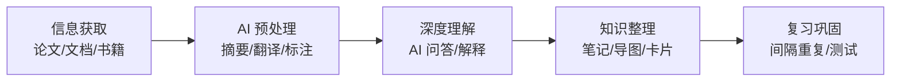

# AI 阅读与学习

## 概念说明

AI 阅读与学习工具帮助用户高效处理海量信息，从论文阅读、知识整理到思维导图生成，AI 正在重塑学习方式。核心价值在于：将"被动阅读"转变为"主动对话"，通过向 AI 提问来深入理解内容。

### AI 辅助学习流程



### AI 学习工具能力矩阵

| 学习环节 | AI 能力 | 推荐工具 |
|----------|---------|----------|
| **论文搜索** | 语义搜索、相关论文推荐 | Semantic Scholar、Elicit |
| **论文阅读** | 摘要、翻译、问答 | ChatPDF、Kimi、Claude |
| **知识整理** | 笔记生成、概念图 | Notion AI、ChatGPT |
| **思维导图** | 自动生成结构化导图 | Xmind AI、秘塔搜索 |
| **间隔复习** | 生成复习卡片 | Anki + AI |

## 论文阅读

### AI 论文阅读工具对比

| 工具 | 核心功能 | 中文支持 | 定价 | 适用场景 |
|------|----------|----------|------|----------|
| **Elicit** | 论文搜索、摘要提取、数据表格 | ⭐⭐⭐ | 免费/Pro | 文献综述、系统性回顾 |
| **Semantic Scholar** | 语义搜索、引用图谱、影响力分析 | ⭐⭐⭐ | 免费 | 论文发现、引用追踪 |
| **ChatPDF** | 上传 PDF 直接问答 | ⭐⭐⭐⭐ | 免费/Pro | 单篇论文深度阅读 |
| **Kimi** | 超长文档分析、中文理解 | ⭐⭐⭐⭐⭐ | 免费 | 中文论文、长文档 |
| **Claude** | 200K 上下文、深度分析 | ⭐⭐⭐⭐ | 免费/Pro | 复杂论文、多文档对比 |
| **Connected Papers** | 论文关系图谱可视化 | ⭐⭐ | 免费/Pro | 发现相关论文 |
| **Consensus** | 学术共识搜索 | ⭐⭐⭐ | 免费/Pro | 验证研究结论 |

### 论文阅读实操流程

**第一步：快速筛选**
```
# 使用 Elicit 搜索相关论文
搜索：What are the latest techniques for reducing LLM hallucination?
→ Elicit 返回相关论文列表 + 自动提取摘要和关键发现
→ 快速筛选出 5-10 篇核心论文
```

**第二步：快速理解**
```
# 将论文 PDF 上传到 Kimi/ChatPDF
请帮我快速理解这篇论文：
1. 用 3 句话总结论文的核心贡献
2. 这篇论文解决了什么问题？
3. 提出了什么方法？
4. 实验结果如何？
5. 与之前的方法相比有什么优势？
```

**第三步：深度阅读**
```
# 针对论文的具体部分提问
关于论文中的 [具体方法/公式/实验]：
1. 请详细解释 [方法名] 的工作原理
2. 公式 [X] 中各个符号的含义是什么？
3. 为什么选择这种方法而不是 [替代方法]？
4. 这个方法的局限性是什么？
5. 如何在实际项目中应用这个方法？
```

**第四步：文献综述**
```
# 使用 Claude 整理多篇论文
我已经阅读了以下 5 篇关于 [主题] 的论文：
1. [论文 1 标题和核心观点]
2. [论文 2 标题和核心观点]
...

请帮我：
1. 按方法类型对这些论文进行分类
2. 对比各方法的优缺点
3. 总结该领域的发展趋势
4. 指出尚未解决的问题
5. 生成一个文献综述的大纲
```

## 知识整理

### AI 辅助笔记

**Notion AI 使用场景：**

| 功能 | 说明 | 使用方式 |
|------|------|----------|
| **AI 总结** | 自动总结页面内容 | 选中文本 → Ask AI → Summarize |
| **AI 续写** | 根据上下文继续写作 | 光标处 → Ask AI → Continue writing |
| **AI 改写** | 改变语气、简化、扩展 | 选中文本 → Ask AI → Improve writing |
| **AI 翻译** | 多语言翻译 | 选中文本 → Ask AI → Translate |
| **AI 提取** | 从文本中提取待办事项 | 选中文本 → Ask AI → Extract action items |

**知识卡片生成 Prompt：**
```
请将以下知识点整理为知识卡片格式：

知识点：[主题]

输出格式：
📌 概念：一句话定义
🔑 关键词：3-5 个关键词
💡 核心原理：2-3 句话解释
📝 示例：一个具体例子
⚠️ 注意事项：1-2 个常见误区
🔗 关联知识：相关知识点链接
```

### 概念图生成

**使用 AI 生成概念关系：**
```
请为以下主题生成概念关系图（Mermaid 格式）：

主题：RAG（检索增强生成）架构

要求：
1. 包含核心概念和子概念
2. 标注概念之间的关系
3. 使用 Mermaid graph 语法
4. 层次不超过 3 层
```

## 思维导图生成

### AI 思维导图工具对比

| 工具 | AI 能力 | 中文支持 | 定价 | 特点 |
|------|---------|----------|------|------|
| **Xmind AI** | AI 生成导图、扩展节点 | ⭐⭐⭐⭐⭐ | 免费/Pro | 专业导图工具 + AI |
| **秘塔搜索** | 搜索结果自动生成导图 | ⭐⭐⭐⭐⭐ | 免费 | 搜索 + 导图一体 |
| **ChatGPT + Markmap** | AI 生成 Markdown → 导图 | ⭐⭐⭐⭐ | 免费 | 灵活定制 |
| **GitMind** | AI 一键生成导图 | ⭐⭐⭐⭐⭐ | 免费/Pro | 在线协作 |
| **ProcessOn AI** | AI 辅助绘图 | ⭐⭐⭐⭐⭐ | 免费/Pro | 多种图表类型 |

### 思维导图生成 Prompt

```
请为以下主题生成思维导图（Markdown 缩进格式）：

主题：[学习主题]

要求：
1. 中心主题 → 3-5 个一级分支
2. 每个一级分支 → 2-4 个二级分支
3. 关键节点标注重要程度（⭐）
4. 使用 Markdown 缩进格式，方便导入导图工具

示例输出格式：
- 中心主题
  - 分支 1
    - 子节点 1.1
    - 子节点 1.2 ⭐
  - 分支 2
    - 子节点 2.1
```

## 实战要点

### 学习场景工具组合

**技术学习组合：**
1. **发现**：Perplexity / 秘塔搜索 → 找到学习资源
2. **阅读**：Kimi / Claude → 深度阅读文档和论文
3. **整理**：Notion AI / ChatGPT → 生成笔记和知识卡片
4. **导图**：Xmind AI / Markmap → 可视化知识结构
5. **复习**：Anki + AI 生成的复习卡片 → 间隔重复

**论文研究组合：**
1. **搜索**：Elicit + Semantic Scholar → 找到相关论文
2. **筛选**：Consensus → 验证研究共识
3. **阅读**：ChatPDF / Claude → 深度理解论文
4. **综述**：Claude / ChatGPT → 整理文献综述
5. **可视化**：Connected Papers → 论文关系图谱

### 高效学习策略

1. **费曼学习法 + AI**：学完一个概念后，尝试向 AI 解释，让 AI 指出你理解的偏差
2. **苏格拉底式提问**：让 AI 通过提问引导你思考，而不是直接给答案
3. **对比学习**：让 AI 对比相似概念的异同，加深理解
4. **实例驱动**：让 AI 为抽象概念提供具体的代码或生活实例

**费曼学习法 Prompt：**
```
我刚学了 [概念]，让我来解释一下：
[你的解释]

请你扮演一个好奇的学生，指出我解释中：
1. 不准确的地方
2. 遗漏的关键点
3. 可以更简单表达的部分
然后用追问帮我加深理解。
```

**苏格拉底式学习 Prompt：**
```
我想学习 [主题]。请不要直接告诉我答案，
而是通过一系列问题引导我自己思考和发现。
从最基础的问题开始，逐步深入。
如果我回答错误，给我提示而不是直接纠正。
```

## 注意事项

- **避免浅层学习**：不要只看 AI 的总结就认为理解了，需要深入原文
- **批判性思维**：AI 的解释可能有误，需要交叉验证
- **主动学习**：用 AI 辅助而非替代思考过程
- **知识内化**：定期复习和实践，将知识转化为能力

## 参考资料

- [Elicit — AI 研究助手](https://elicit.com)
- [Semantic Scholar](https://www.semanticscholar.org)
- [ChatPDF](https://www.chatpdf.com)
- [Connected Papers](https://www.connectedpapers.com)
- [Notion AI](https://www.notion.so/product/ai)
- [Xmind AI](https://xmind.ai)
