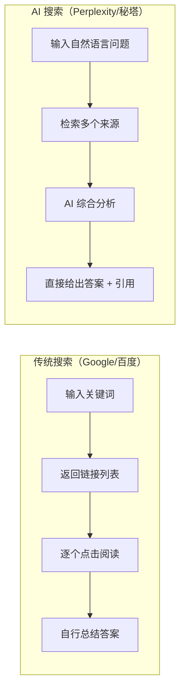

# AI 搜索

## 概念说明

AI 搜索是将大语言模型与实时网络检索结合的新一代搜索方式。与传统搜索引擎返回链接列表不同，AI 搜索直接给出结构化的答案，并附带信息来源引用，大幅减少用户筛选信息的时间。

### AI 搜索 vs 传统搜索



### 核心优势

| 维度 | 传统搜索 | AI 搜索 |
|------|----------|---------|
| **输入方式** | 关键词组合 | 自然语言提问 |
| **输出形式** | 链接列表 | 结构化答案 |
| **信息整合** | 用户手动整合 | AI 自动综合 |
| **来源追溯** | 需逐个查看 | 自动标注引用 |
| **时效性** | 实时索引 | 实时检索 + AI 分析 |
| **深度分析** | 依赖用户能力 | AI 辅助深度分析 |
| **适用场景** | 精确查找、导航 | 研究、学习、综合分析 |

## 主流 AI 搜索工具详解

### Perplexity AI

Perplexity 是目前最成熟的 AI 搜索引擎，被称为"AI 时代的 Google"。

**核心功能：**
- **实时搜索**：联网检索最新信息，回答附带来源引用
- **Pro Search**：深度搜索模式，多轮检索后给出综合答案
- **Focus 模式**：可选择搜索范围（全网/学术/YouTube/Reddit/写作）
- **Collections**：将搜索结果组织为主题集合
- **文件上传**：上传文档后基于文档内容搜索和问答

**使用技巧：**
```
# 学术研究场景
搜索模式：Academic Focus
提问：What are the latest advances in RAG optimization techniques in 2024?
效果：返回学术论文引用 + 技术总结

# 技术调研场景
搜索模式：Pro Search
提问：对比 vLLM 和 TGI 在生产环境中的性能差异，包括吞吐量、延迟和资源占用
效果：多轮检索后给出详细对比分析
```

**定价：**
- 免费版：每天有限次搜索，基础模型
- Pro 版：$20/月，无限 Pro Search，可选 GPT-4/Claude 模型

### 秘塔搜索（Metaso）

秘塔搜索是国内领先的 AI 搜索引擎，专注中文搜索体验。

**核心功能：**
- **深度搜索**：类似 Perplexity Pro Search，多步骤深度分析
- **学术搜索**：专门的学术论文搜索模式
- **简洁模式**：快速给出简短答案
- **思维导图**：将搜索结果自动生成思维导图
- **大纲模式**：将复杂话题整理为结构化大纲

**适用场景：**
- 中文学术研究和论文调研
- 中文技术文档和教程搜索
- 国内行业报告和数据查找
- 中文知识整理和学习

**使用技巧：**
```
# 学术搜索
模式：学术搜索
提问：大语言模型幻觉问题的最新解决方案有哪些？
效果：返回中英文论文引用 + 方法总结

# 深度搜索
模式：深度搜索
提问：2024 年国内 AI 大模型创业公司融资情况分析
效果：多步骤检索，返回详细分析报告
```

### 天工 AI（Tiangong）

天工 AI 是昆仑万维推出的 AI 搜索 + 对话产品。

**核心功能：**
- **AI 搜索**：中文互联网实时搜索
- **AI 对话**：基于天工大模型的对话能力
- **AI 写作**：长文写作和内容生成
- **AI 阅读**：文档上传和分析
- **多模态**：图像理解和生成

**适用场景：**
- 中文互联网信息搜索
- 日常问答和知识查询
- 中文内容创作辅助

### 其他值得关注的 AI 搜索工具

| 工具 | 特点 | 适用场景 |
|------|------|----------|
| **Consensus** | 学术论文专用 AI 搜索 | 科研文献调研 |
| **Elicit** | AI 研究助手，论文分析 | 学术研究 |
| **You.com** | AI 搜索 + 代码搜索 | 开发者搜索 |
| **Phind** | 开发者专用 AI 搜索 | 编程问题搜索 |
| **360 AI 搜索** | 国内 AI 搜索 | 中文通用搜索 |

## AI 搜索选型对比表

| 维度 | Perplexity | 秘塔搜索 | 天工 AI | Phind |
|------|-----------|----------|---------|-------|
| **中文支持** | ⭐⭐⭐ | ⭐⭐⭐⭐⭐ | ⭐⭐⭐⭐⭐ | ⭐⭐ |
| **英文支持** | ⭐⭐⭐⭐⭐ | ⭐⭐⭐ | ⭐⭐⭐ | ⭐⭐⭐⭐⭐ |
| **学术搜索** | ⭐⭐⭐⭐ | ⭐⭐⭐⭐⭐ | ⭐⭐⭐ | ⭐⭐ |
| **技术搜索** | ⭐⭐⭐⭐⭐ | ⭐⭐⭐⭐ | ⭐⭐⭐ | ⭐⭐⭐⭐⭐ |
| **深度分析** | ⭐⭐⭐⭐⭐ | ⭐⭐⭐⭐ | ⭐⭐⭐ | ⭐⭐⭐ |
| **引用质量** | ⭐⭐⭐⭐⭐ | ⭐⭐⭐⭐ | ⭐⭐⭐ | ⭐⭐⭐⭐ |
| **免费额度** | 有限 | 充足 | 充足 | 充足 |
| **访问方式** | 需科学上网 | 直接访问 | 直接访问 | 需科学上网 |
| **付费价格** | $20/月 | 免费 | 免费 | $15/月 |

## 实战要点

### 场景化使用指南

**技术调研流程：**
1. 先用 Perplexity Pro Search 获取英文技术社区的最新信息
2. 再用秘塔搜索补充中文社区的实践经验
3. 对比两者结果，形成完整的技术调研报告

**学术研究流程：**
1. 用秘塔学术搜索找到相关中文论文
2. 用 Perplexity Academic Focus 搜索英文论文
3. 用 Consensus 验证研究结论的共识度

**日常问题解决：**
1. 简单事实性问题 → 任意 AI 搜索工具
2. 需要最新信息 → Perplexity（英文）/ 秘塔（中文）
3. 编程问题 → Phind 或 Perplexity
4. 深度分析 → Pro Search / 深度搜索模式

### 搜索 Prompt 技巧

```
# 对比分析型
对比 LangChain 和 LlamaIndex 在 RAG 场景下的优缺点，
包括：架构设计、易用性、性能、社区生态、适用场景。
请以表格形式呈现。

# 最新动态型
2024 年下半年 AI Agent 领域有哪些重要进展？
请按时间线整理，标注来源。

# 技术方案型
如何在生产环境中部署一个高可用的 RAG 系统？
请从架构设计、技术选型、性能优化、监控告警四个方面详细说明。
```

### 何时用 AI 搜索 vs 传统搜索

| 场景 | 推荐方式 | 理由 |
|------|----------|------|
| 查找特定网站 | 传统搜索 | 导航类查询，直接找到目标 |
| 查找官方文档 | 传统搜索 | 需要精确的官方来源 |
| 技术概念学习 | AI 搜索 | 综合多来源，结构化呈现 |
| 方案对比调研 | AI 搜索 | 自动整合对比信息 |
| 最新新闻事件 | 传统搜索 | 新闻聚合更及时 |
| 深度技术分析 | AI 搜索 | 多步骤深度分析 |
| 购物比价 | 传统搜索 | 电商平台直接对比 |
| 学术文献综述 | AI 搜索 | 自动整理论文要点 |

## 注意事项

- **信息时效性**：AI 搜索的信息可能有延迟，关键决策需验证来源
- **引用准确性**：AI 可能错误引用或曲解来源内容，重要信息需点击原文确认
- **搜索偏见**：AI 搜索可能存在信息偏见，建议多工具交叉验证
- **隐私保护**：搜索敏感信息时注意隐私保护

## 参考资料

- [Perplexity AI 官方网站](https://www.perplexity.ai)
- [秘塔搜索](https://metaso.cn)
- [天工 AI](https://www.tiangong.cn)
- [Phind — AI 开发者搜索](https://www.phind.com)
- [Consensus — 学术 AI 搜索](https://consensus.app)
