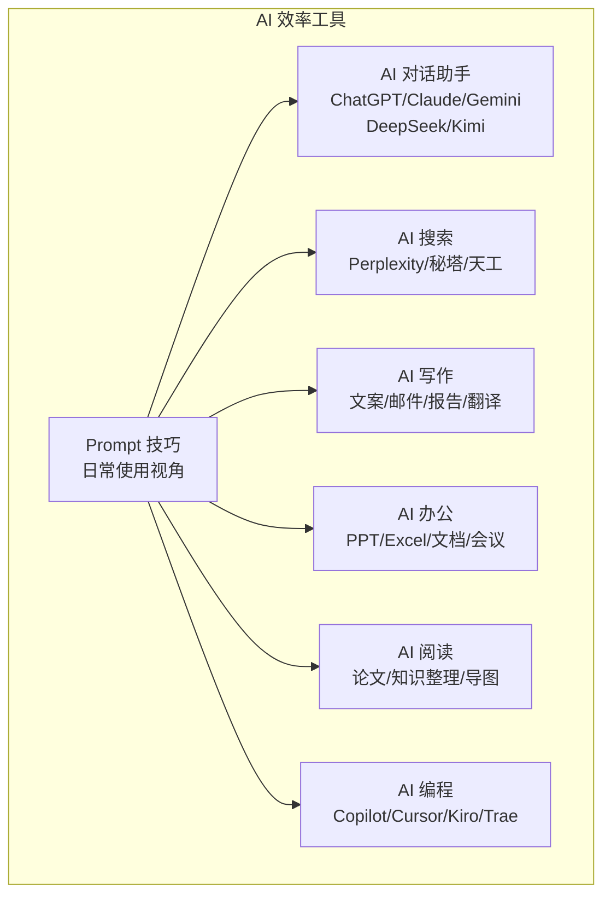

# 7.1 AI 效率工具

> **前置依赖**：无，本模块为独立参考章节，可随时查阅。
> **建议学习时间**：1 周

## 模块概览

本子模块覆盖日常工作中最常用的 AI 效率工具，帮助你在对话、搜索、写作、办公、阅读、编程等场景中大幅提升效率。

## 知识点目录

| 序号 | 知识点 | 核心内容 | 文档 |
|------|--------|----------|------|
| 1 | AI 对话助手 | ChatGPT/Claude/Gemini/DeepSeek/Kimi 选型对比 | [ai-chat](./ai-chat) |
| 2 | AI 搜索 | Perplexity/秘塔/天工 + AI 搜索 vs 传统搜索 | [ai-search](./ai-search) |
| 3 | AI 写作 | 文案生成/邮件撰写/报告总结/翻译润色 | [ai-writing](./ai-writing) |
| 4 | AI 办公 | PPT 生成/Excel 公式/文档总结/会议纪要 | [ai-office](./ai-office) |
| 5 | AI 阅读/学习 | 论文阅读/知识整理/思维导图生成 | [ai-reading](./ai-reading) |
| 6 | AI 编程辅助 | Copilot/Cursor/Kiro/Trae 日常使用 | [ai-coding](./ai-coding) |
| 7 | Prompt 技巧 | 日常 Prompt 写法/角色设定/结构化提问 | [prompt-tips](./prompt-tips) |

## 快速选型指南

### 按场景选工具

| 场景 | 推荐工具 | 备选 |
|------|----------|------|
| 日常中文对话 | DeepSeek / Kimi | 通义千问 |
| 代码开发 | Cursor / Copilot | Kiro / Trae |
| 技术调研 | Perplexity | 秘塔搜索 |
| 文档写作 | Claude / ChatGPT | DeepSeek |
| PPT 制作 | Gamma AI | 美图 AI PPT |
| 论文阅读 | Kimi / ChatPDF | Elicit |
| 会议纪要 | 通义听悟 / 飞书妙记 | 讯飞听见 |

### 按预算选方案

| 预算 | 推荐组合 |
|------|----------|
| **免费** | DeepSeek + 秘塔搜索 + Kimi + 通义听悟 + Trae |
| **$20/月** | ChatGPT Plus + Perplexity + Cursor |
| **$40/月** | ChatGPT Plus + Claude Pro + Cursor Pro |

## 学习建议

1. 先学 [Prompt 技巧](./prompt-tips)，掌握与 AI 高效对话的方法
2. 根据自己的工作场景，选择 1-2 个工具深入使用
3. 建立个人 Prompt 模板库，持续优化使用效率
4. 定期关注工具更新，AI 工具迭代速度很快

## 工具能力速查表

| 工具 | 对话 | 搜索 | 写作 | 办公 | 阅读 | 编程 | 多模态 | 免费 |
|------|------|------|------|------|------|------|--------|------|
| ChatGPT | ✅ | ✅ | ✅ | ❌ | ✅ | ✅ | ✅ | 有限 |
| Claude | ✅ | ❌ | ✅ | ❌ | ✅ | ✅ | ✅ | 有限 |
| DeepSeek | ✅ | ✅ | ✅ | ❌ | ✅ | ✅ | ✅ | 充足 |
| Kimi | ✅ | ✅ | ✅ | ❌ | ✅ | ⭐ | ✅ | 充足 |
| Gemini | ✅ | ✅ | ✅ | ✅ | ✅ | ⭐ | ✅ | 充足 |
| Perplexity | ⭐ | ✅ | ❌ | ❌ | ❌ | ❌ | ❌ | 有限 |
| 秘塔搜索 | ⭐ | ✅ | ❌ | ❌ | ❌ | ❌ | ❌ | 充足 |
| Cursor | ❌ | ❌ | ❌ | ❌ | ❌ | ✅ | ❌ | 有限 |
| Copilot | ❌ | ❌ | ❌ | ❌ | ❌ | ✅ | ❌ | 有限 |
| Kiro | ❌ | ❌ | ❌ | ❌ | ❌ | ✅ | ❌ | 有限 |

> ✅ = 核心能力，⭐ = 基础支持，❌ = 不支持

## 常见问题

### Q：AI 效率工具会取代人类工作吗？

AI 效率工具是"增强"而非"替代"。它们帮助你更快完成重复性工作，让你有更多时间专注于创造性和决策性任务。关键是学会与 AI 协作，而不是被 AI 替代。

### Q：免费工具和付费工具差距大吗？

对于日常使用，免费工具（DeepSeek、Kimi、秘塔搜索）已经足够。付费工具（ChatGPT Plus、Claude Pro）在复杂任务、代码能力和多模态方面有明显优势。建议先用免费工具入门，有明确需求后再考虑付费。

### Q：如何保护使用 AI 工具时的数据隐私？

- 不要在公共 AI 对话中输入敏感信息（密码、API Key、公司机密）
- 使用企业版或 API 调用（通常有更好的数据保护政策）
- 对于高度敏感的数据，考虑使用本地部署的模型（如 Ollama + DeepSeek）
