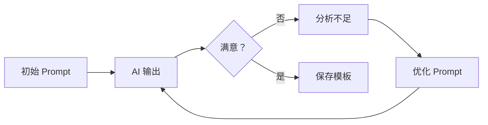

# Prompt 技巧（日常使用视角）

## 概念说明

Prompt（提示词）是与 AI 对话的"编程语言"。好的 Prompt 能让 AI 输出质量提升数倍，差的 Prompt 则会得到模糊、不准确的回答。本节从日常使用视角介绍实用的 Prompt 技巧，帮助你在各种场景中高效使用 AI。

> 📌 如需了解 Prompt Engineering 的技术原理（Chain-of-Thought、Few-shot 等），请参考 [模块 3：Prompt Engineering 进阶](/3-ai-apps/01-prompt-engineering)。

### Prompt 质量对比

| 维度 | 差的 Prompt | 好的 Prompt |
|------|------------|------------|
| **清晰度** | "帮我写个代码" | "用 Python 写一个 FastAPI 接口，实现用户注册功能" |
| **上下文** | "这个报错怎么办" | "运行 pip install torch 时报错 CUDA not found，系统是 Ubuntu 22.04，GPU 是 RTX 4090" |
| **格式** | "总结一下" | "请用 3 个要点总结这篇文章的核心观点，每个要点不超过 50 字" |
| **角色** | "翻译这段话" | "你是一位专业的技术文档翻译，请将以下内容翻译为中文，保留技术术语原文" |

## 日常 Prompt 写法

### CRISPE 框架

CRISPE 是一个实用的 Prompt 结构框架：

| 要素 | 含义 | 示例 |
|------|------|------|
| **C** — Capacity | 角色/能力 | "你是一位资深的 Python 后端工程师" |
| **R** — Request | 请求/任务 | "请帮我设计一个 RESTful API" |
| **I** — Input | 输入/上下文 | "项目使用 FastAPI + PostgreSQL" |
| **S** — Style | 风格/格式 | "请以表格形式对比不同方案" |
| **P** — Purpose | 目的 | "用于团队技术方案评审" |
| **E** — Extra | 额外约束 | "代码需要包含类型注解和中文注释" |

**完整示例：**
```
【角色】你是一位有 10 年经验的 Python 后端架构师。
【任务】请帮我设计一个高并发的消息队列消费者服务。
【上下文】
- 技术栈：Python 3.11 + FastAPI + RabbitMQ
- 预期 QPS：1000+
- 消息类型：订单创建、支付回调、库存更新
【格式】请包含：架构图（Mermaid）、核心代码、配置说明
【目的】用于技术方案评审，需要说明设计决策的理由
【约束】代码使用 async/await，包含错误重试和死信队列处理
```

### 五个核心原则

**1. 明确具体**
```
# ❌ 模糊
帮我写个爬虫

# ✅ 具体
用 Python + aiohttp 写一个异步爬虫，爬取豆瓣电影 Top250 的电影名称、评分和简介，
结果保存为 CSV 文件。要求：
- 控制并发数不超过 5
- 每次请求间隔 1-3 秒随机延迟
- 包含异常处理和重试机制
```

**2. 提供上下文**
```
# ❌ 缺少上下文
这段代码有什么问题？

# ✅ 提供上下文
以下 Python 代码在处理大文件（>1GB）时内存溢出，请分析原因并给出优化方案：
- Python 版本：3.11
- 运行环境：8GB 内存的 Linux 服务器
- 文件格式：CSV，约 5000 万行

[粘贴代码]
```

**3. 指定输出格式**
```
# ❌ 不指定格式
对比一下 Redis 和 Memcached

# ✅ 指定格式
请对比 Redis 和 Memcached，以表格形式呈现，包含以下维度：
| 维度 | Redis | Memcached |
数据结构、持久化、集群、性能、内存管理、适用场景
最后给出选型建议。
```

**4. 分步骤思考**
```
# ❌ 一步到位
帮我优化这个系统的性能

# ✅ 分步骤
请按以下步骤分析这个系统的性能问题：
1. 首先，分析代码中可能的性能瓶颈
2. 然后，按影响程度排序
3. 对每个瓶颈给出优化方案
4. 最后，给出优化的优先级建议
```

**5. 提供示例**
```
# ❌ 没有示例
帮我写产品描述

# ✅ 提供示例
请参考以下风格为新产品写描述：

示例：
"轻盈如风，强劲如虎。XX 笔记本电脑，1.2kg 极致轻薄机身，
搭载 M3 Pro 芯片，18 小时超长续航。为创造者而生。"

新产品信息：
- 产品：无线降噪耳机
- 核心卖点：40dB 主动降噪、30 小时续航、Hi-Res 音质
- 目标受众：通勤白领
- 风格：简洁高端
```

## 角色设定

### 常用角色模板

| 角色 | Prompt | 适用场景 |
|------|--------|----------|
| **技术专家** | "你是一位有 10 年经验的 [技术] 专家" | 技术问题、代码审查 |
| **产品经理** | "你是一位资深产品经理" | 需求分析、产品设计 |
| **文案专家** | "你是一位获奖的广告文案" | 营销文案、品牌故事 |
| **面试官** | "你是 [公司] 的技术面试官" | 面试准备、模拟面试 |
| **老师** | "你是一位耐心的 [学科] 老师" | 学习辅导、概念解释 |
| **批评者** | "你是一位严格的代码审查者" | 代码质量、方案评审 |

### 角色组合技巧

```
# 多角色辩论
请分别从以下三个角色的视角分析"是否应该使用微服务架构"：
1. 【架构师】：从技术架构角度分析
2. 【运维工程师】：从运维复杂度角度分析
3. 【CTO】：从成本和团队能力角度分析

最后给出综合建议。
```

## 结构化提问

### 问题分解

```
# 复杂问题分解
我想搭建一个 AI 知识库系统，请帮我分解为以下子问题：
1. 技术选型：应该用什么技术栈？
2. 架构设计：系统架构应该怎么设计？
3. 数据处理：文档如何处理和向量化？
4. 检索优化：如何提高检索准确率？
5. 部署方案：如何部署到生产环境？

请逐个回答，每个问题给出 2-3 个方案并对比。
```

### 约束条件

```
# 添加约束条件
请推荐一个 Python Web 框架，约束条件：
- 必须支持异步
- 社区活跃，文档完善
- 性能在同类框架中排名前 3
- 学习曲线不能太陡
- 支持 OpenAPI 自动文档生成
```

## 多轮对话策略

### 上下文管理

```
# 第一轮：建立上下文
我正在开发一个电商后端系统，使用 Python + FastAPI + PostgreSQL。
接下来我会问你一系列关于这个项目的问题，请记住这个上下文。

# 第二轮：具体问题
用户表应该怎么设计？需要支持手机号和邮箱两种登录方式。

# 第三轮：深入追问
基于上面的用户表设计，如何实现 JWT 认证？

# 第四轮：扩展
如果要加上 OAuth2 第三方登录（微信、GitHub），表结构需要怎么调整？
```

### 对话重置

```
# 当对话偏离主题时
让我们重新开始。忘记之前的对话内容。
现在我需要你帮我 [新的任务描述]。
```

### 追问技巧

```
# 要求深入
请更详细地解释第 3 点。

# 要求举例
能给一个具体的代码示例吗？

# 要求对比
这个方案和 [替代方案] 相比有什么优缺点？

# 要求简化
请用更简单的语言重新解释，假设我是一个初学者。

# 要求实战
在实际项目中，这个方案可能遇到什么问题？如何解决？
```

## 实用 Prompt 模板库

### 代码相关

```
# 代码审查
请审查以下代码，从代码质量、性能、安全性、可维护性四个维度给出评价和改进建议。
[代码]

# Bug 修复
以下代码在 [场景] 下出现 [错误]。
环境：[Python 版本/操作系统/依赖版本]
错误信息：[完整错误堆栈]
请分析原因并给出修复方案。

# 代码重构
请重构以下代码，目标：
1. 提高可读性
2. 减少重复代码
3. 添加类型注解
4. 保持功能不变
[代码]
```

### 学习相关

```
# 概念学习
请用通俗易懂的语言解释 [概念]：
1. 它是什么？（一句话定义）
2. 为什么需要它？（解决什么问题）
3. 它是怎么工作的？（核心原理）
4. 一个具体的例子
5. 常见的误解

# 技术对比
请对比 [技术 A] 和 [技术 B]：
1. 设计理念的差异
2. 各自的优缺点
3. 适用场景
4. 性能对比
5. 选型建议
```

### 工作相关

```
# 方案设计
请为 [需求] 设计技术方案：
1. 需求分析
2. 技术选型（给出 2-3 个方案并对比）
3. 架构设计（包含架构图）
4. 核心流程
5. 风险评估
6. 时间估算

# 问题排查
[系统/服务] 出现 [问题现象]。
已知信息：[已收集的日志/指标/现象]
已尝试：[已尝试的排查步骤]
请给出排查思路和可能的原因。
```

## 实战要点

### Prompt 优化迭代流程



### 常见问题和解决方案

| 问题 | 原因 | 解决方案 |
|------|------|----------|
| 回答太笼统 | Prompt 不够具体 | 添加具体约束和示例 |
| 回答太长 | 没有限制长度 | 指定字数或条目数 |
| 格式不对 | 没有指定格式 | 明确输出格式要求 |
| 内容不准确 | 缺少上下文 | 提供更多背景信息 |
| 风格不匹配 | 没有设定角色 | 添加角色设定 |
| 遗漏关键点 | 问题太宽泛 | 分解为子问题 |

## 注意事项

- **隐私安全**：不要在 Prompt 中包含敏感信息
- **批判思维**：AI 的回答需要验证，不要盲目信任
- **持续优化**：建立个人 Prompt 模板库，不断迭代优化
- **了解局限**：AI 有知识截止日期，最新信息需要联网搜索

## 参考资料

- [OpenAI Prompt Engineering 指南](https://platform.openai.com/docs/guides/prompt-engineering)
- [Anthropic Prompt 设计文档](https://docs.anthropic.com/claude/docs/prompt-design)
- [Learn Prompting](https://learnprompting.org)
- [Prompt Engineering Guide](https://www.promptingguide.ai)
