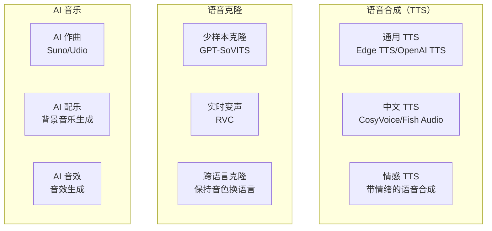

# AI 音频与语音

## 概念说明

AI 音频技术覆盖文本转语音（TTS）、语音克隆、AI 音乐生成等领域。这些技术在内容创作、短视频配音、有声书制作、播客生产等场景中广泛应用，大幅降低了音频内容的制作门槛。

### AI 音频技术图谱



## TTS 文本转语音

### 主流 TTS 工具对比

| 工具 | 中文质量 | 音色数量 | 情感表达 | 开源 | 价格 | 适用场景 |
|------|----------|----------|----------|------|------|----------|
| **Edge TTS** | ⭐⭐⭐⭐ | 100+ | ⭐⭐⭐ | ✅ | 免费 | 日常配音 |
| **OpenAI TTS** | ⭐⭐⭐ | 6 | ⭐⭐⭐⭐ | ❌ | 按量付费 | 英文配音 |
| **CosyVoice** | ⭐⭐⭐⭐⭐ | 多 | ⭐⭐⭐⭐⭐ | ✅ | 免费 | 中文高质量 |
| **Fish Audio** | ⭐⭐⭐⭐⭐ | 1000+ | ⭐⭐⭐⭐ | 部分 | 免费/付费 | 多音色选择 |
| **ChatTTS** | ⭐⭐⭐⭐ | 可控 | ⭐⭐⭐⭐ | ✅ | 免费 | 自然对话 |
| **讯飞语音** | ⭐⭐⭐⭐⭐ | 多 | ⭐⭐⭐⭐ | ❌ | 按量付费 | 商业应用 |

### Edge TTS 实操指南

Edge TTS 是微软提供的免费 TTS 服务，质量好、速度快、音色丰富。

**安装和基础使用：**
```python
# 安装
# pip install edge-tts

import edge_tts
import asyncio

async def text_to_speech(text, output_file, voice="zh-CN-XiaoxiaoNeural"):
    """文本转语音"""
    communicate = edge_tts.Communicate(text, voice)
    await communicate.save(output_file)
    print(f"音频已保存到: {output_file}")

# 使用不同音色
voices = {
    "女声-晓晓": "zh-CN-XiaoxiaoNeural",
    "女声-晓伊": "zh-CN-XiaoyiNeural",
    "男声-云希": "zh-CN-YunxiNeural",
    "男声-云健": "zh-CN-YunjianNeural",
    "粤语女声": "zh-HK-HiuGaaiNeural",
    "台湾女声": "zh-TW-HsiaoChenNeural",
}

# 生成配音
asyncio.run(text_to_speech(
    "欢迎来到 AI 知识库，今天我们学习语音合成技术。",
    "output.mp3",
    voice="zh-CN-YunxiNeural"
))
```

**批量生成配音：**
```python
import edge_tts
import asyncio
import json

async def batch_generate(scripts, voice, output_dir="audio"):
    """批量生成配音"""
    import os
    os.makedirs(output_dir, exist_ok=True)
    
    for i, script in enumerate(scripts):
        output_file = f"{output_dir}/scene_{i+1:02d}.mp3"
        communicate = edge_tts.Communicate(script["text"], voice)
        await communicate.save(output_file)
        print(f"场景 {i+1}: {output_file}")

# 短剧配音脚本
scripts = [
    {"scene": 1, "text": "在这个城市的某个角落，有一家不起眼的咖啡馆。"},
    {"scene": 2, "text": "每天下午三点，她都会准时出现在靠窗的位置。"},
    {"scene": 3, "text": "直到有一天，那个位置坐了一个陌生人。"},
]

asyncio.run(batch_generate(scripts, "zh-CN-XiaoxiaoNeural"))
```

### CosyVoice 使用

CosyVoice 是阿里通义实验室开源的语音合成模型，中文质量极高。

**核心能力：**
- 零样本语音克隆（3-10 秒参考音频）
- 跨语言语音合成
- 情感控制和语速调节
- 支持多种中文方言

### OpenAI TTS API

```python
from openai import OpenAI

client = OpenAI()

# 生成语音
response = client.audio.speech.create(
    model="tts-1-hd",      # tts-1（快速）或 tts-1-hd（高质量）
    voice="alloy",          # alloy/echo/fable/onyx/nova/shimmer
    input="Hello, welcome to the AI knowledge base.",
    speed=1.0               # 0.25-4.0
)

response.stream_to_file("output.mp3")
```

## 语音克隆

### 语音克隆工具对比

| 工具 | 克隆质量 | 所需样本 | 中文支持 | 开源 | 实时性 |
|------|----------|----------|----------|------|--------|
| **GPT-SoVITS** | ⭐⭐⭐⭐⭐ | 5-30 秒 | ⭐⭐⭐⭐⭐ | ✅ | 非实时 |
| **RVC** | ⭐⭐⭐⭐ | 10+ 分钟 | ⭐⭐⭐⭐ | ✅ | 可实时 |
| **Fish Audio** | ⭐⭐⭐⭐ | 10 秒 | ⭐⭐⭐⭐⭐ | 部分 | 非实时 |
| **ElevenLabs** | ⭐⭐⭐⭐⭐ | 30 秒 | ⭐⭐⭐ | ❌ | 可实时 |
| **CosyVoice** | ⭐⭐⭐⭐ | 3-10 秒 | ⭐⭐⭐⭐⭐ | ✅ | 非实时 |

### GPT-SoVITS 使用流程

```
# GPT-SoVITS 语音克隆流程
1. 准备参考音频（5-30 秒清晰人声，无背景音）
2. 安装 GPT-SoVITS（需要 GPU）
3. 上传参考音频
4. 输入要合成的文本
5. 选择参考音频的对应文本
6. 生成克隆语音

# 音频准备要求
- 格式：WAV/MP3
- 采样率：44100Hz 以上
- 无背景音乐和噪声
- 发音清晰、语速适中
- 时长：5-30 秒（越长越好）
```

### 伦理与法律边界

| 行为 | 合法性 | 说明 |
|------|--------|------|
| 克隆自己的声音 | ✅ 合法 | 个人使用无限制 |
| 经授权克隆他人声音 | ✅ 合法 | 需要书面授权 |
| 未经授权克隆他人声音 | ❌ 违法 | 侵犯肖像权/声音权 |
| 用克隆声音进行欺诈 | ❌ 违法 | 构成诈骗罪 |
| 克隆公众人物声音 | ⚠️ 风险 | 可能侵权，需谨慎 |

## AI 配乐

### AI 音乐生成工具对比

| 工具 | 音乐质量 | 风格范围 | 歌词支持 | 中文歌曲 | 价格 |
|------|----------|----------|----------|----------|------|
| **Suno AI** | ⭐⭐⭐⭐⭐ | 广泛 | ✅ | ⭐⭐⭐⭐ | 免费/Pro |
| **Udio** | ⭐⭐⭐⭐ | 广泛 | ✅ | ⭐⭐⭐ | 免费/Pro |
| **Stable Audio** | ⭐⭐⭐⭐ | 中等 | ❌ | ⭐⭐ | 免费/Pro |
| **AIVA** | ⭐⭐⭐⭐ | 古典/影视 | ❌ | ❌ | 免费/Pro |

### Suno AI 使用指南

```
# 生成背景音乐（纯音乐）
风格标签：cinematic, emotional, piano, strings
描述：A gentle and hopeful piano melody with soft strings, 
     suitable for a romantic short film scene
时长：60 秒
模式：Instrumental（纯音乐）

# 生成中文歌曲
风格标签：pop, chinese, emotional
歌词：[粘贴歌词]
描述：温柔的中文流行歌曲，女声演唱

# 不同场景的配乐风格
| 场景 | 风格标签 |
|------|----------|
| 悬疑 | dark, suspenseful, tension, orchestral |
| 浪漫 | romantic, gentle, piano, warm |
| 动作 | energetic, epic, drums, cinematic |
| 搞笑 | playful, quirky, upbeat, comedy |
| 悲伤 | melancholic, sad, piano, slow |
| 科技 | electronic, futuristic, synth |
```

## 实战要点

### 音频制作工作流

**短视频配音工作流：**
```
1. 编写配音脚本
2. 选择合适的 TTS 工具和音色
3. 批量生成配音音频
4. 使用 Suno 生成背景音乐
5. 在剪辑软件中混音
   - 配音音量：-3dB
   - 背景音乐：-15dB
   - 音效：-6dB
6. 导出最终音频
```

### 场景化工具选择

| 场景 | 推荐方案 | 成本 |
|------|----------|------|
| 短视频旁白 | Edge TTS | 免费 |
| 有声书制作 | CosyVoice / Fish Audio | 免费 |
| 角色配音 | GPT-SoVITS 克隆 | 免费（需 GPU） |
| 英文配音 | OpenAI TTS | 按量付费 |
| 背景音乐 | Suno AI | 免费/Pro |
| 商业项目 | 讯飞语音 + 正版音乐 | 付费 |

### 音频质量优化

1. **降噪处理**：使用 Adobe Podcast 或 Audacity 去除背景噪声
2. **音量标准化**：统一所有音频的音量水平
3. **EQ 调节**：根据场景调整音频频率
4. **混响控制**：室内场景添加适当混响
5. **格式选择**：视频配音用 MP3/AAC，高质量用 WAV/FLAC

## 注意事项

- **版权问题**：AI 生成音乐的版权归属需关注平台条款
- **声音权益**：未经授权不得克隆他人声音
- **商用限制**：部分免费工具不允许商业使用
- **质量检查**：AI 语音可能有发音错误，需人工检查
- **伦理边界**：不要用语音克隆进行欺诈或冒充

## 参考资料

- [Edge TTS Python 库](https://github.com/rany2/edge-tts)
- [CosyVoice](https://github.com/FunAudioLLM/CosyVoice)
- [GPT-SoVITS](https://github.com/RVC-Boss/GPT-SoVITS)
- [Suno AI](https://suno.com)
- [Fish Audio](https://fish.audio)
- [OpenAI TTS API](https://platform.openai.com/docs/guides/text-to-speech)
