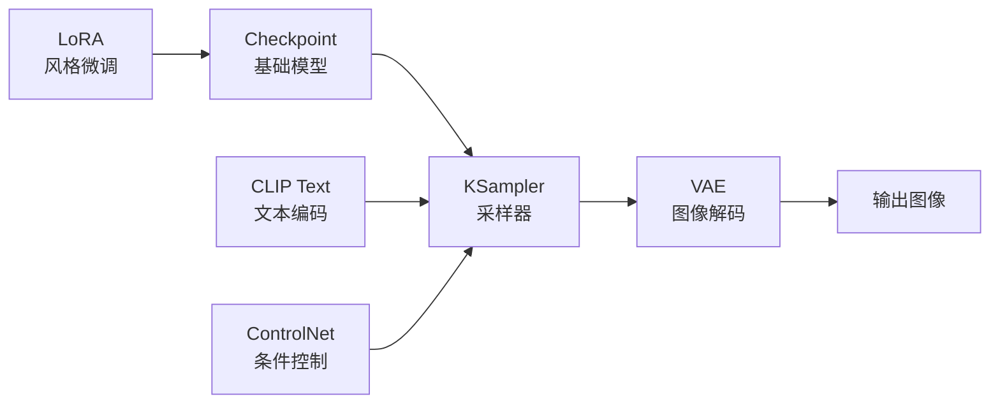

# ComfyUI 进阶

## 概念说明

ComfyUI 是基于节点的 Stable Diffusion 图像生成工作流工具。与 WebUI 的表单式操作不同，ComfyUI 通过可视化节点连接来构建图像生成流程，提供了极高的灵活性和可控性。它是进阶用户和专业创作者的首选工具。

### ComfyUI vs WebUI 对比

| 维度 | ComfyUI | WebUI (A1111) |
|------|---------|---------------|
| **操作方式** | 节点连接（可视化编程） | 表单填写 |
| **灵活性** | ⭐⭐⭐⭐⭐ | ⭐⭐⭐ |
| **学习曲线** | 较陡（需理解节点概念） | 平缓（填参数即可） |
| **工作流复用** | ✅ 导出/导入 JSON | ❌ 需手动配置 |
| **显存效率** | ⭐⭐⭐⭐⭐（更优） | ⭐⭐⭐ |
| **批量生成** | ⭐⭐⭐⭐⭐ | ⭐⭐⭐ |
| **自定义节点** | 丰富的社区节点 | 丰富的扩展 |
| **API 调用** | ✅ 原生支持 | ✅ 需配置 |
| **适合人群** | 进阶用户、开发者 | 入门用户 |

### 核心概念



| 概念 | 说明 |
|------|------|
| **节点（Node）** | 工作流的基本单元，每个节点执行一个操作 |
| **连接（Link）** | 节点之间的数据流，连接输出到输入 |
| **工作流（Workflow）** | 节点和连接组成的完整生成流程 |
| **Checkpoint** | 基础模型文件（SDXL、SD3、Flux 等） |
| **KSampler** | 采样器节点，控制生成过程 |
| **CLIP** | 文本编码器，将 Prompt 转为模型理解的向量 |
| **VAE** | 变分自编码器，将潜空间转为图像 |

## 安装与配置

### 安装方式

```bash
# 方法一：Git 克隆（推荐）
git clone https://github.com/comfyanonymous/ComfyUI
cd ComfyUI
pip install -r requirements.txt
python main.py

# 方法二：便携版（Windows）
# 下载 ComfyUI_windows_portable.zip
# 解压后运行 run_nvidia_gpu.bat

# 启动参数
python main.py --listen 0.0.0.0 --port 8188  # 远程访问
python main.py --lowvram                       # 低显存模式
python main.py --cpu                           # CPU 模式（慢）
```

### 模型放置

```
ComfyUI/
├── models/
│   ├── checkpoints/     # 基础模型（.safetensors）
│   ├── loras/           # LoRA 模型
│   ├── vae/             # VAE 模型
│   ├── controlnet/      # ControlNet 模型
│   ├── clip/            # CLIP 模型
│   ├── embeddings/      # 文本嵌入
│   └── upscale_models/  # 放大模型
```

## 基础工作流

### 文生图工作流

```
节点连接：
1. Load Checkpoint → 加载基础模型
2. CLIP Text Encode (Positive) → 正向提示词
3. CLIP Text Encode (Negative) → 反向提示词
4. Empty Latent Image → 设置图像尺寸
5. KSampler → 采样生成
6. VAE Decode → 解码为图像
7. Save Image → 保存图像

参数设置：
- Checkpoint: SDXL base
- Positive: masterpiece, best quality, [描述]
- Negative: low quality, blurry, deformed
- Size: 1024x1024
- Steps: 30
- CFG: 7.0
- Sampler: dpmpp_2m
- Scheduler: karras
- Seed: 随机或固定
```

### 图生图工作流

```
在文生图基础上添加：
1. Load Image → 加载参考图
2. VAE Encode → 编码为潜空间
3. 连接到 KSampler 的 latent_image 输入
4. 调整 denoise 参数（0.3-0.7）
   - 低值：更接近原图
   - 高值：更多创意变化
```

## 进阶工作流

### ControlNet 条件控制

ControlNet 允许使用边缘、姿势、深度等条件引导图像生成。

```
# ControlNet 工作流节点
1. Load ControlNet Model → 加载 ControlNet 模型
2. Load Image → 加载条件图（边缘/姿势/深度图）
3. Apply ControlNet → 应用条件控制
4. 连接到 KSampler

# 常用 ControlNet 类型
| 类型 | 用途 | 输入 |
|------|------|------|
| Canny | 边缘控制 | 边缘检测图 |
| OpenPose | 姿势控制 | 人体姿势图 |
| Depth | 深度控制 | 深度图 |
| Scribble | 涂鸦控制 | 手绘草图 |
| Tile | 细节增强 | 低分辨率图 |
| IP-Adapter | 风格迁移 | 参考图片 |
```

### IP-Adapter 风格迁移

IP-Adapter 可以将参考图片的风格应用到新生成的图像中。

```
# IP-Adapter 工作流
1. Load IP-Adapter Model
2. Load CLIP Vision Model
3. Load Reference Image → 风格参考图
4. Apply IP-Adapter → 应用风格
5. 连接到 KSampler

# 参数调节
- weight: 0.5-1.0（风格强度）
- noise: 0.0-0.5（添加随机性）
```

### AnimateDiff 动画生成

AnimateDiff 可以将静态图像生成流程扩展为动画生成。

```
# AnimateDiff 工作流
1. Load AnimateDiff Model
2. 配置动画参数：
   - frames: 16-32（帧数）
   - fps: 8-16（帧率）
   - motion_scale: 1.0（运动幅度）
3. 连接到标准文生图工作流
4. 输出为 GIF 或视频

# 运动控制
- 使用 motion LoRA 控制运动类型
- 使用 AnimateDiff + ControlNet 精确控制
```

## 自定义节点

### 常用自定义节点包

| 节点包 | 功能 | 安装方式 |
|--------|------|----------|
| **ComfyUI Manager** | 节点管理器，一键安装 | 必装 |
| **ComfyUI Impact Pack** | 面部修复、分割、检测 | 推荐 |
| **ComfyUI Controlnet Aux** | ControlNet 预处理 | 推荐 |
| **ComfyUI IPAdapter Plus** | IP-Adapter 增强 | 推荐 |
| **ComfyUI AnimateDiff** | 动画生成 | 按需 |
| **ComfyUI WD14 Tagger** | 图像标签识别 | 按需 |
| **ComfyUI Essentials** | 常用工具节点 | 推荐 |

### 安装自定义节点

```bash
# 方法一：ComfyUI Manager（推荐）
# 在 ComfyUI 界面中点击 Manager → Install Custom Nodes

# 方法二：手动安装
cd ComfyUI/custom_nodes
git clone https://github.com/[作者]/[节点包名]
pip install -r requirements.txt  # 如果有依赖
# 重启 ComfyUI
```

## 批量生成

### 参数化批量生成

```
# 使用 Prompt 列表批量生成
1. 创建 Prompt 列表文件（CSV/TXT）
2. 使用 "Load Text" 节点读取
3. 使用 "Batch" 节点循环处理
4. 自动保存所有生成结果

# 种子批量生成
1. 使用 "Seed Generator" 节点
2. 设置起始种子和数量
3. 自动生成多个变体
```

### API 自动化

```python
import json
import urllib.request

# ComfyUI API 调用
def generate_image(prompt, negative_prompt, seed=0):
    """通过 API 调用 ComfyUI 生成图像"""
    
    # 加载工作流 JSON
    with open("workflow.json", "r") as f:
        workflow = json.load(f)
    
    # 修改参数
    workflow["6"]["inputs"]["text"] = prompt           # 正向提示词
    workflow["7"]["inputs"]["text"] = negative_prompt   # 反向提示词
    workflow["3"]["inputs"]["seed"] = seed              # 随机种子
    
    # 发送请求
    data = json.dumps({"prompt": workflow}).encode("utf-8")
    req = urllib.request.Request(
        "http://127.0.0.1:8188/prompt",
        data=data,
        headers={"Content-Type": "application/json"}
    )
    response = urllib.request.urlopen(req)
    return json.loads(response.read())

# 批量生成
prompts = [
    "a beautiful sunset over the ocean",
    "a cozy cabin in the snowy mountains",
    "a futuristic city at night with neon lights",
]

for i, prompt in enumerate(prompts):
    result = generate_image(
        prompt=f"masterpiece, best quality, {prompt}",
        negative_prompt="low quality, blurry",
        seed=42 + i
    )
    print(f"任务 {i+1} 已提交: {result}")
```

## 实战要点

### 工作流设计原则

1. **模块化**：将复杂工作流拆分为可复用的子模块
2. **参数外露**：将常调参数放在工作流入口，方便修改
3. **注释标注**：使用 Group 节点和注释说明工作流逻辑
4. **版本管理**：保存不同版本的工作流 JSON 文件
5. **性能优化**：合理使用缓存，避免重复计算

### 显存优化技巧

| 技巧 | 说明 | 节省显存 |
|------|------|----------|
| FP16 模型 | 使用半精度模型 | ~50% |
| --lowvram | 低显存模式 | 显著 |
| Tiled VAE | 分块解码 | 大图必备 |
| 模型卸载 | 不用时卸载模型 | 按需 |
| 减小批次 | 一次生成一张 | 按需 |

### 常见问题排查

| 问题 | 可能原因 | 解决方案 |
|------|----------|----------|
| 黑图 | VAE 不匹配 | 更换 VAE 或使用模型自带 VAE |
| 显存不足 | 图像太大或模型太多 | 使用 --lowvram 或减小尺寸 |
| 节点报错 | 缺少依赖或版本不兼容 | 更新节点包或安装依赖 |
| 生成慢 | Steps 太多或模型太大 | 减少 Steps 或使用更快的采样器 |
| 质量差 | 参数不当 | 调整 CFG、Steps、采样器 |

## 注意事项

- **硬件要求**：建议 8GB+ 显存的 NVIDIA GPU
- **模型版权**：注意模型的使用许可证
- **工作流分享**：分享工作流时注意不包含敏感信息
- **定期更新**：ComfyUI 和节点包更新频繁，定期更新

## 参考资料

- [ComfyUI GitHub](https://github.com/comfyanonymous/ComfyUI)
- [ComfyUI Manager](https://github.com/ltdrdata/ComfyUI-Manager)
- [ComfyUI 社区工作流](https://comfyworkflows.com)
- [OpenArt ComfyUI 工作流](https://openart.ai/workflows)
- [ComfyUI 中文教程](https://www.comflowy.com)
