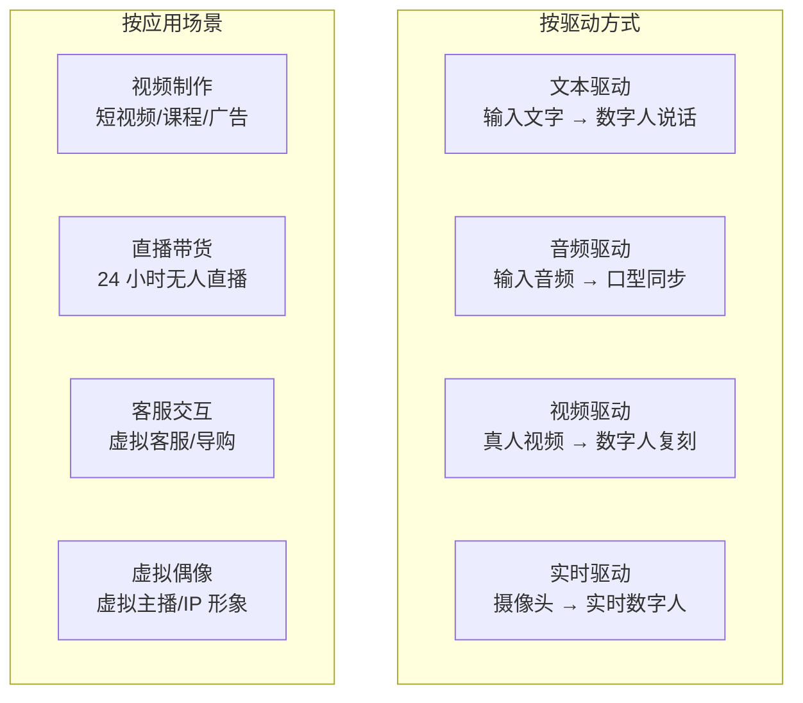
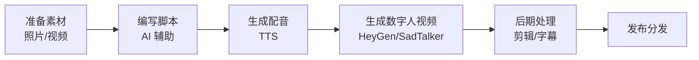

# AI 数字人

## 概念说明

AI 数字人是利用 AI 技术生成的虚拟人物形象，能够模拟真人的外观、表情、动作和语音。数字人技术在直播带货、视频制作、客服、教育等领域快速落地，成为内容创作和商业应用的重要工具。

### 数字人技术分类



### 核心技术

| 技术 | 说明 | 代表工具 |
|------|------|----------|
| **口型同步（Lip Sync）** | 根据音频驱动嘴型运动 | SadTalker、MuseTalk |
| **面部动画** | 生成自然的面部表情 | HeyGen、D-ID |
| **身体动作** | 生成自然的肢体动作 | HeyGen |
| **语音合成** | 生成配套的语音 | TTS 集成 |
| **视频翻译** | 保持口型的多语言翻译 | HeyGen |

## 主流数字人工具详解

### HeyGen

HeyGen 是目前最成熟的商业数字人平台，功能全面。

**核心功能：**

| 功能 | 说明 | 适用场景 |
|------|------|----------|
| **Avatar 视频** | 选择数字人形象 + 输入文本 → 生成视频 | 产品介绍、培训视频 |
| **视频翻译** | 上传视频 → 自动翻译 + 口型适配 | 多语言内容分发 |
| **照片说话** | 上传照片 → 生成说话视频 | 快速制作 |
| **自定义 Avatar** | 上传真人视频 → 创建专属数字人 | 个人 IP 打造 |
| **Streaming Avatar** | 实时交互数字人 | 客服、直播 |

**使用流程：**
```
# 方法一：模板数字人
1. 登录 HeyGen 平台
2. 选择一个数字人形象（100+ 可选）
3. 输入脚本文本或上传音频
4. 选择语言和语音
5. 生成视频（通常 2-5 分钟）
6. 下载或分享

# 方法二：自定义数字人
1. 录制 2-5 分钟的真人视频
   - 正面面对镜头
   - 光线均匀
   - 背景简洁
   - 自然说话
2. 上传到 HeyGen 训练
3. 等待训练完成（约 24 小时）
4. 使用自定义数字人生成任意内容
```

### D-ID

D-ID 以照片驱动和 API 集成著称。

**核心特点：**
- 上传一张照片即可生成说话视频
- API 友好，适合开发者集成
- 支持多语言
- 实时交互 Agent

**API 调用示例：**
```python
import requests

# D-ID API 生成数字人视频
url = "https://api.d-id.com/talks"
headers = {
    "Authorization": "Basic YOUR_API_KEY",
    "Content-Type": "application/json"
}

payload = {
    "source_url": "https://example.com/photo.jpg",
    "script": {
        "type": "text",
        "input": "你好，欢迎来到我们的产品演示。",
        "provider": {
            "type": "microsoft",
            "voice_id": "zh-CN-XiaoxiaoNeural"
        }
    }
}

response = requests.post(url, json=payload, headers=headers)
talk_id = response.json()["id"]
print(f"视频生成中，ID: {talk_id}")
```

### 硅基智能

硅基智能是国内领先的数字人平台，专注中文场景。

**核心特点：**
- 中文数字人质量高
- 支持直播场景
- 与国内平台集成好
- 价格相对亲民

### 开源方案

#### SadTalker

SadTalker 是开源的口型同步工具，可本地部署。

```
# SadTalker 使用流程
1. 准备一张正面照片
2. 准备一段音频文件
3. 运行 SadTalker 生成口型同步视频

# 安装
git clone https://github.com/OpenTalker/SadTalker
cd SadTalker
pip install -r requirements.txt

# 生成
python inference.py \
    --driven_audio input/audio.wav \
    --source_image input/photo.jpg \
    --result_dir output/
```

#### MuseTalk

MuseTalk 是更新的开源口型同步方案，质量更高。

```
# MuseTalk 特点
- 实时口型同步
- 支持视频输入
- 质量优于 SadTalker
- 需要较好的 GPU（8GB+ VRAM）
```

## 数字人工具选型对比表

| 维度 | HeyGen | D-ID | 硅基智能 | SadTalker | MuseTalk |
|------|--------|------|----------|-----------|----------|
| **视频质量** | ⭐⭐⭐⭐⭐ | ⭐⭐⭐⭐ | ⭐⭐⭐⭐ | ⭐⭐⭐ | ⭐⭐⭐⭐ |
| **口型同步** | ⭐⭐⭐⭐⭐ | ⭐⭐⭐⭐ | ⭐⭐⭐⭐ | ⭐⭐⭐ | ⭐⭐⭐⭐ |
| **中文支持** | ⭐⭐⭐⭐ | ⭐⭐⭐ | ⭐⭐⭐⭐⭐ | ⭐⭐⭐ | ⭐⭐⭐⭐ |
| **自定义形象** | ✅ | ✅ | ✅ | ✅ 照片 | ✅ 照片/视频 |
| **实时交互** | ✅ | ✅ | ✅ | ❌ | ✅ |
| **API 可用** | ✅ | ✅ | ✅ | ✅ 本地 | ✅ 本地 |
| **开源** | ❌ | ❌ | ❌ | ✅ | ✅ |
| **本地部署** | ❌ | ❌ | ❌ | ✅ | ✅ |
| **GPU 需求** | 无（云端） | 无（云端） | 无（云端） | 4GB+ | 8GB+ |
| **月费** | $24-120 | $5.9-108 | ¥99 起 | 免费 | 免费 |
| **适合人群** | 商业用户 | 开发者 | 国内企业 | 技术用户 | 技术用户 |

## 实战要点

### 数字人视频制作流程



### 场景化选型建议

| 场景 | 推荐方案 | 理由 |
|------|----------|------|
| 商业视频制作 | HeyGen | 质量最高、功能全面 |
| 多语言视频翻译 | HeyGen 视频翻译 | 口型适配效果好 |
| 开发者集成 | D-ID API | API 友好、文档完善 |
| 国内直播 | 硅基智能 | 中文优化、国内合规 |
| 个人项目/学习 | SadTalker/MuseTalk | 免费开源、可本地部署 |
| 预算有限 | 开源方案 + 免费 TTS | 零成本 |

### 数字人直播方案

```
# 24 小时无人直播方案
1. 准备数字人形象（HeyGen 自定义或开源方案）
2. 准备直播脚本库（产品介绍、互动话术）
3. 配置自动化流程：
   - 定时切换脚本
   - 弹幕关键词触发回复
   - 自动展示商品
4. 使用 OBS 推流到直播平台
5. 监控直播数据，优化脚本

# 注意事项
- 部分平台禁止纯 AI 直播
- 需要标注 AI 生成内容
- 互动体验不如真人
```

### 质量优化技巧

1. **照片质量**：使用高清正面照片，光线均匀，表情自然
2. **音频质量**：配音清晰无噪声，语速适中
3. **脚本优化**：短句为主，避免长句导致口型不自然
4. **后期处理**：适当裁剪、添加字幕和背景

## 注意事项

- **肖像权**：不得未经授权使用他人照片/视频创建数字人
- **深度伪造**：不得用于制作虚假信息或欺诈内容
- **平台规则**：部分平台对 AI 数字人内容有限制
- **标注义务**：需要标注 AI 生成内容
- **法律风险**：关注各地关于深度合成的法律法规

## 参考资料

- [HeyGen 官方网站](https://www.heygen.com)
- [D-ID 官方网站](https://www.d-id.com)
- [SadTalker GitHub](https://github.com/OpenTalker/SadTalker)
- [MuseTalk GitHub](https://github.com/TMElyralab/MuseTalk)
- [硅基智能](https://www.guiji.ai)
