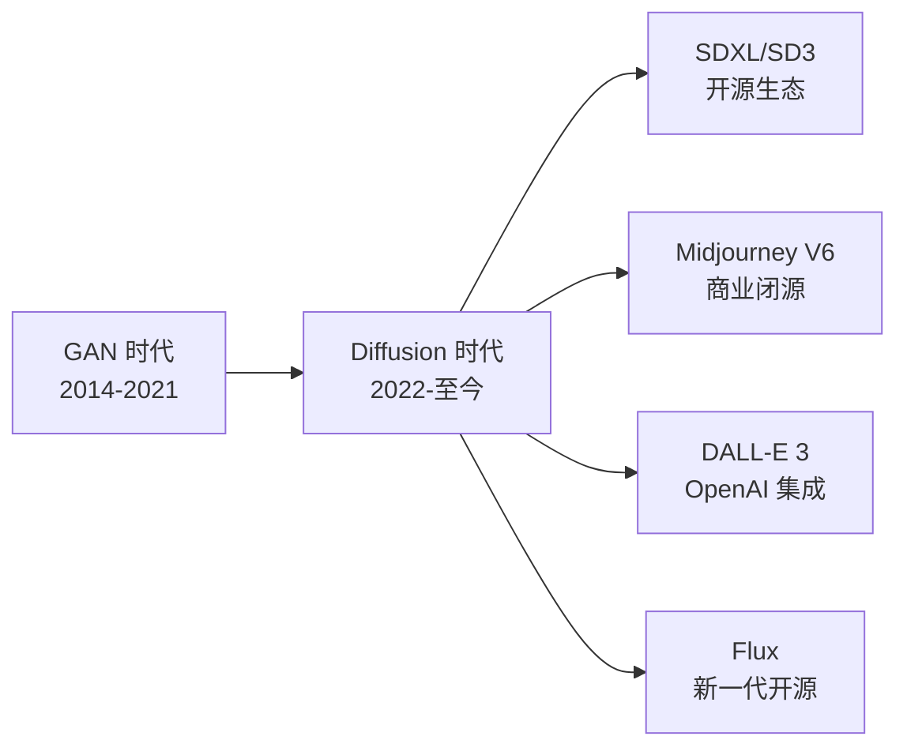

# AI 图像生成

## 概念说明

AI 图像生成是利用深度学习模型（主要是 Diffusion Model）根据文本描述、参考图片或其他条件生成图像的技术。2024-2025 年，AI 图像生成已从"能用"进化到"好用"，在设计、营销、内容创作等领域广泛应用。

### AI 图像生成技术演进



### 核心概念

| 概念 | 说明 |
|------|------|
| **Prompt** | 文本描述，告诉 AI 要生成什么图像 |
| **Negative Prompt** | 反向提示词，告诉 AI 不要生成什么 |
| **采样器（Sampler）** | 生成图像的算法，影响质量和速度 |
| **CFG Scale** | 提示词引导强度，越高越贴合描述 |
| **Steps** | 采样步数，越多质量越高但速度越慢 |
| **Seed** | 随机种子，相同种子可复现结果 |
| **LoRA** | 轻量级微调模型，用于特定风格或角色 |
| **ControlNet** | 条件控制，用姿势、边缘等引导生成 |

## 主流工具详解

### Midjourney

Midjourney 是目前图像质量最高的 AI 绘画工具，以艺术感和美学著称。

**使用方式：** Discord 机器人 / 官网（V6 开始支持）

**Prompt 语法：**
```
/imagine prompt: [主体描述], [风格描述], [参数]

# 基础示例
/imagine prompt: a cute cat sitting on a windowsill, 
golden hour lighting, watercolor style --ar 16:9 --v 6

# 参数说明
--ar 16:9    # 宽高比
--v 6        # 模型版本
--s 750      # 风格化程度（0-1000）
--c 30       # 混乱度/创意度（0-100）
--q 2        # 质量（.25/.5/1/2）
--no text    # 排除元素
--seed 12345 # 固定种子
```

**进阶技巧：**

| 技巧 | 语法 | 说明 |
|------|------|------|
| 图生图 | 上传图片 + 描述 | 基于参考图生成 |
| 混合图片 | /blend + 多张图 | 融合多张图片风格 |
| 局部重绘 | Vary (Region) | 选择区域重新生成 |
| 放大 | Upscale | 提高分辨率 |
| 平铺 | --tile | 生成无缝纹理 |

### Stable Diffusion

Stable Diffusion 是最流行的开源图像生成模型，生态丰富、可本地部署。

**部署方式：**

| 方式 | 说明 | 适合人群 |
|------|------|----------|
| **WebUI（A1111）** | 最流行的图形界面 | 入门用户 |
| **ComfyUI** | 节点式工作流 | 进阶用户 |
| **Diffusers** | Python 库，代码调用 | 开发者 |
| **云端部署** | Colab/AutoDL | 无 GPU 用户 |

**模型选择指南：**

| 模型 | 特点 | 适用场景 |
|------|------|----------|
| **SDXL** | 1024px 高质量、细节丰富 | 通用图像生成 |
| **SD 3** | 最新架构、文字渲染好 | 需要文字的图像 |
| **Flux** | 新一代开源、质量接近 MJ | 高质量生成 |
| **Pony Diffusion** | 动漫风格优化 | 二次元插画 |
| **RealVisXL** | 真实感照片 | 写实风格 |

**WebUI 基础操作：**
```
# 安装（Linux/Mac）
git clone https://github.com/AUTOMATIC1111/stable-diffusion-webui
cd stable-diffusion-webui
./webui.sh

# 基础参数设置
Prompt: masterpiece, best quality, a beautiful landscape, 
        mountains, lake, sunset, cinematic lighting
Negative Prompt: low quality, blurry, deformed, ugly
Sampler: DPM++ 2M Karras
Steps: 30
CFG Scale: 7
Size: 1024x1024
```

**Python API 调用示例：**
```python
# 使用 Diffusers 库生成图像
from diffusers import StableDiffusionXLPipeline
import torch

# 加载模型
pipe = StableDiffusionXLPipeline.from_pretrained(
    "stabilityai/stable-diffusion-xl-base-1.0",
    torch_dtype=torch.float16,
    variant="fp16"
)
pipe = pipe.to("cuda")

# 生成图像
prompt = "a beautiful sunset over mountains, cinematic, 8k"
image = pipe(
    prompt=prompt,
    num_inference_steps=30,
    guidance_scale=7.5
).images[0]

image.save("output.png")
```

### DALL-E 3

DALL-E 3 是 OpenAI 的图像生成模型，与 ChatGPT 深度集成。

**核心特点：**
- 与 ChatGPT 对话式生成，自然语言描述即可
- 文字渲染能力强
- 安全过滤严格
- 通过 API 可编程调用

**API 调用示例：**
```python
from openai import OpenAI

client = OpenAI()

response = client.images.generate(
    model="dall-e-3",
    prompt="一只穿着宇航服的猫咪在月球上散步，背景是地球，写实风格",
    size="1024x1024",
    quality="hd",
    n=1,
)

image_url = response.data[0].url
print(f"图像 URL: {image_url}")
```

## AI 图像工具选型对比表

| 维度 | Midjourney | Stable Diffusion | DALL-E 3 | Flux |
|------|-----------|-----------------|----------|------|
| **图像质量** | ⭐⭐⭐⭐⭐ | ⭐⭐⭐⭐ | ⭐⭐⭐⭐ | ⭐⭐⭐⭐⭐ |
| **易用性** | ⭐⭐⭐⭐ | ⭐⭐⭐ | ⭐⭐⭐⭐⭐ | ⭐⭐⭐ |
| **可控性** | ⭐⭐⭐ | ⭐⭐⭐⭐⭐ | ⭐⭐⭐ | ⭐⭐⭐⭐⭐ |
| **开源** | ❌ | ✅ | ❌ | ✅ |
| **本地部署** | ❌ | ✅ | ❌ | ✅ |
| **API 可用** | ❌ | ✅ | ✅ | ✅ |
| **LoRA 支持** | ❌ | ✅ | ❌ | ✅ |
| **ControlNet** | ❌ | ✅ | ❌ | ✅ |
| **文字渲染** | ⭐⭐⭐ | ⭐⭐ | ⭐⭐⭐⭐⭐ | ⭐⭐⭐⭐ |
| **中文 Prompt** | ⭐⭐⭐ | ⭐⭐ | ⭐⭐⭐⭐⭐ | ⭐⭐⭐ |
| **GPU 需求** | 无（云端） | 8GB+ VRAM | 无（API） | 12GB+ VRAM |
| **月费** | $10-60 | 免费（需 GPU） | 按量付费 | 免费（需 GPU） |
| **适合人群** | 设计师、创作者 | 开发者、深度用户 | 普通用户 | 技术用户 |

## 实战要点

### Prompt 编写技巧

**通用 Prompt 结构：**
```
[主体] + [环境/场景] + [风格] + [光照] + [镜头] + [质量词]

示例：
a young woman reading a book in a cozy cafe, 
warm afternoon light streaming through windows, 
oil painting style, soft focus, 
masterpiece, best quality, highly detailed
```

**风格关键词速查：**

| 风格 | 关键词 |
|------|--------|
| 写实照片 | photorealistic, 8k, RAW photo, film grain |
| 油画 | oil painting, impasto, canvas texture |
| 水彩 | watercolor, soft edges, paper texture |
| 动漫 | anime style, cel shading, vibrant colors |
| 3D 渲染 | 3D render, octane render, unreal engine |
| 扁平设计 | flat design, vector art, minimal |
| 赛博朋克 | cyberpunk, neon lights, futuristic |

### 场景化选型建议

| 场景 | 推荐工具 | 理由 |
|------|----------|------|
| 快速出图、高质量 | Midjourney | 质量最高、操作简单 |
| 批量生成、可控性强 | Stable Diffusion | 开源免费、参数可控 |
| 与文字结合 | DALL-E 3 | 文字渲染最好 |
| 商业设计 | Midjourney + SD | MJ 出概念、SD 精修 |
| 开发集成 | SD Diffusers / DALL-E API | 可编程调用 |

### 硬件需求参考

| 配置 | 推荐方案 |
|------|----------|
| 无 GPU | Midjourney / DALL-E 3 / 云端 SD |
| RTX 3060 12GB | SD WebUI（SDXL 可用） |
| RTX 4090 24GB | ComfyUI + SDXL + ControlNet |
| 多卡服务器 | Diffusers + 批量生成 |

## 注意事项

- **版权问题**：AI 生成图像的版权归属尚有争议，商用需谨慎
- **肖像权**：不要生成真实人物的图像，避免侵权
- **内容安全**：遵守平台规则，不生成违规内容
- **标注义务**：部分平台要求标注 AI 生成内容

## 参考资料

- [Midjourney 官方文档](https://docs.midjourney.com)
- [Stable Diffusion WebUI](https://github.com/AUTOMATIC1111/stable-diffusion-webui)
- [ComfyUI](https://github.com/comfyanonymous/ComfyUI)
- [Hugging Face Diffusers](https://huggingface.co/docs/diffusers)
- [OpenAI DALL-E API](https://platform.openai.com/docs/guides/images)
