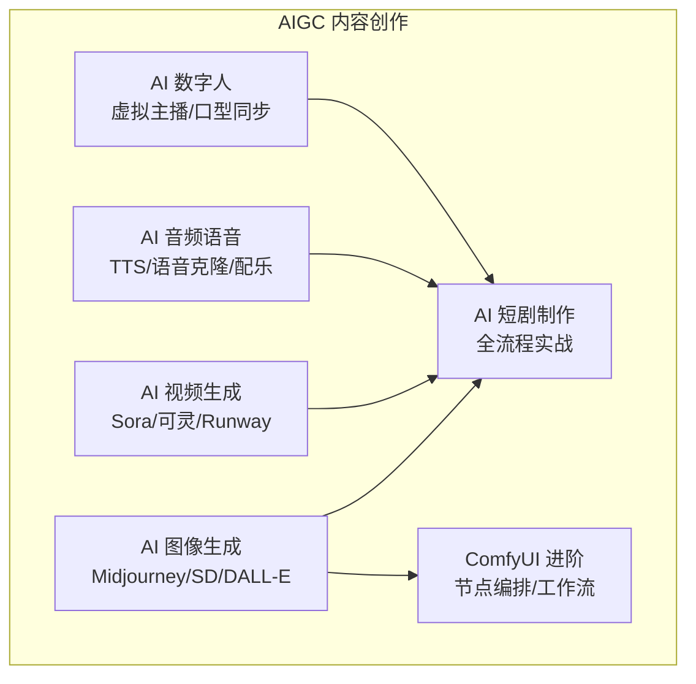

# 7.2 AIGC 内容创作

> **前置依赖**：无，本模块为独立参考章节，可随时查阅。
> **建议学习时间**：1-2 周

## 模块概览

本子模块覆盖 AI 内容生成（AIGC）的主要领域，从图像、视频到音频、数字人，帮助你掌握 AI 内容创作的核心工具和工作流。



## 知识点目录

| 序号 | 知识点 | 核心内容 | 文档 |
|------|--------|----------|------|
| 1 | AI 图像生成 | Midjourney/SD/ComfyUI/DALL-E 3 对比 | [image-generation](./image-generation) |
| 2 | AI 视频生成 | Sora/可灵/Runway/Pika/Vidu 对比 | [video-generation](./video-generation) |
| 3 | AI 短剧制作 | 全流程实战（剧本→分镜→视频→配音→剪辑） | [short-drama](./short-drama) |
| 4 | AI 音频/语音 | TTS/语音克隆/AI 配乐 | [audio-voice](./audio-voice) |
| 5 | AI 数字人 | 虚拟主播/口型同步/数字人工具对比 | [digital-human](./digital-human) |
| 6 | ComfyUI 进阶 | 节点编排/自定义工作流/批量生成 | [comfyui-advanced](./comfyui-advanced) |

## AIGC 工具全景图

| 创作类型 | 推荐工具 | 备选工具 | 预算 |
|----------|----------|----------|------|
| 图像生成 | Midjourney / SD | DALL-E 3 / Flux | $10/月 或免费 |
| 视频生成 | 可灵 / Runway | Sora / Pika | ¥66/月 起 |
| 配音 | Edge TTS / CosyVoice | Fish Audio | 免费 |
| 配乐 | Suno AI | Udio | 免费/Pro |
| 数字人 | HeyGen / SadTalker | D-ID / 硅基智能 | $24/月 或免费 |
| 工作流 | ComfyUI | SD WebUI | 免费 |

## 学习路径建议

1. 先学 [AI 图像生成](./image-generation)，掌握基础的 AI 绘画能力
2. 学习 [ComfyUI 进阶](./comfyui-advanced)，提升图像生成的可控性
3. 学习 [AI 视频生成](./video-generation)，掌握图生视频技能
4. 学习 [AI 音频/语音](./audio-voice)，掌握配音和配乐
5. 综合运用，完成 [AI 短剧制作](./short-drama) 全流程实战
6. 按需学习 [AI 数字人](./digital-human)

## AIGC 创作能力速查表

| 能力 | Midjourney | SD/ComfyUI | DALL-E 3 | 可灵 | Runway | Suno | HeyGen |
|------|-----------|-----------|----------|------|--------|------|--------|
| **图像生成** | ✅ | ✅ | ✅ | ❌ | ❌ | ❌ | ❌ |
| **图像编辑** | ✅ | ✅ | ✅ | ❌ | ❌ | ❌ | ❌ |
| **视频生成** | ❌ | ❌ | ❌ | ✅ | ✅ | ❌ | ❌ |
| **音乐生成** | ❌ | ❌ | ❌ | ❌ | ❌ | ✅ | ❌ |
| **语音合成** | ❌ | ❌ | ❌ | ❌ | ❌ | ❌ | ✅ |
| **数字人** | ❌ | ❌ | ❌ | ❌ | ❌ | ❌ | ✅ |
| **本地部署** | ❌ | ✅ | ❌ | ❌ | ❌ | ❌ | ❌ |
| **API 支持** | ❌ | ✅ | ✅ | ✅ | ✅ | ✅ | ✅ |
| **中文支持** | ⭐⭐⭐ | ⭐⭐⭐ | ⭐⭐⭐⭐ | ⭐⭐⭐⭐⭐ | ⭐⭐⭐ | ⭐⭐⭐ | ⭐⭐⭐ |
| **月费用** | $10 起 | 免费 | 含 ChatGPT | ¥66 起 | $12 起 | 免费/Pro | $24 起 |

> ✅ = 核心能力，❌ = 不支持

## AIGC 全流程工作流示例

```
短视频创作全流程（以 AI 短剧为例）：

1. 剧本 → ChatGPT/Claude 生成
2. 分镜 → Midjourney/SD 生成分镜图
3. 视频 → 可灵/Runway 图生视频
4. 配音 → Edge TTS/CosyVoice 语音合成
5. 配乐 → Suno AI 生成背景音乐
6. 剪辑 → 剪映 AI 自动剪辑
7. 字幕 → 剪映自动识别字幕
8. 发布 → 多平台分发
```

## 常见问题

### Q：AIGC 内容有版权问题吗？

目前各国对 AI 生成内容的版权归属尚无统一定论。建议：商用时使用有明确商用授权的工具（如 Midjourney 付费版），保留生成记录作为证据，避免生成与已知作品高度相似的内容。

### Q：本地部署 vs 云端服务怎么选？

- **云端服务**（Midjourney、可灵、Runway）：开箱即用、效果好、无需硬件投入，适合大多数用户
- **本地部署**（SD/ComfyUI）：免费、可定制、隐私保护好，但需要高性能 GPU（建议 RTX 3060 12GB 以上）

### Q：AIGC 工具更新太快，怎么跟上？

关注核心工具的官方更新日志，加入相关社区（如 ComfyUI 社区、Midjourney Discord），每月花 1-2 小时了解新工具和新功能即可。不必追求每个工具都精通，选择 2-3 个核心工具深入使用。
