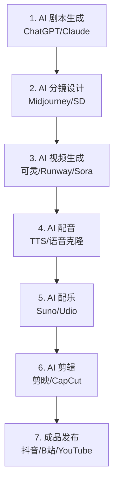

# AI 短剧制作

## 概念说明

AI 短剧制作是利用 AI 工具完成从剧本创作到成片输出的全流程视频制作。通过组合使用多种 AI 工具，一个人就能完成传统需要编剧、导演、演员、摄影、剪辑等多人协作的工作，大幅降低短剧制作的门槛和成本。

### AI 短剧制作全流程



### 传统制作 vs AI 制作对比

| 维度 | 传统制作 | AI 制作 |
|------|----------|---------|
| **团队规模** | 5-20 人 | 1-2 人 |
| **制作周期** | 1-4 周 | 1-3 天 |
| **制作成本** | 数万-数十万 | 数百-数千元 |
| **技术门槛** | 高（专业设备和技能） | 中（会用 AI 工具即可） |
| **质量上限** | 高 | 中等（持续提升中） |
| **灵活性** | 低（修改成本高） | 高（随时调整） |

## 第一步：AI 剧本生成

### 剧本创作 Prompt

**短剧剧本模板：**
```
请为我创作一个短剧剧本：

类型：[爱情/悬疑/搞笑/职场/古风/科幻]
时长：[1分钟/3分钟/5分钟]
集数：[单集/3集/5集]
目标平台：[抖音/B站/小红书]
目标受众：[年龄段/性别/兴趣]

要求：
1. 开头 3 秒必须有强钩子（悬念/冲突/反转）
2. 每 15-30 秒一个情节转折
3. 结尾有反转或悬念（引导看下一集）
4. 对话简洁有力，适合短视频节奏
5. 标注每个场景的画面描述（用于 AI 生成）

输出格式：
场景 1：[场景描述]
画面：[详细的视觉描述，用于 AI 图像/视频生成]
旁白/对话：[台词]
时长：[秒数]
情绪：[情绪基调]
```

**分镜脚本模板：**
```
请将以下剧本转换为分镜脚本：

[粘贴剧本]

输出格式（表格）：
| 镜号 | 景别 | 画面描述 | 台词/旁白 | 时长 | 运镜 | 音效/配乐 |
```

## 第二步：AI 分镜图生成

### 角色一致性方案

**方案一：Midjourney 角色参考**
```
# 先生成角色设定图
/imagine prompt: character design sheet, a young Chinese woman, 
long black hair, wearing a white dress, multiple angles, 
front view, side view, full body --ar 16:9 --v 6

# 后续场景使用角色参考
/imagine prompt: [场景描述], the same woman from [参考图链接] --cref [URL]
```

**方案二：Stable Diffusion + LoRA**
```
# 使用 IP-Adapter 保持角色一致
1. 生成角色参考图
2. 使用 IP-Adapter 节点引用角色特征
3. 在不同场景中保持角色一致性
```

### 分镜图生成技巧

| 场景类型 | Prompt 关键词 | 注意事项 |
|----------|--------------|----------|
| 室内场景 | interior, cozy room, warm lighting | 注意光照一致性 |
| 室外场景 | outdoor, natural lighting, landscape | 注意天气和时间一致 |
| 特写镜头 | close-up, portrait, detailed face | 注意表情和情绪 |
| 全景镜头 | wide shot, establishing shot | 注意场景完整性 |
| 动作场景 | dynamic pose, motion blur | 注意动作合理性 |

## 第三步：AI 视频生成

### 图生视频工作流

```
# 推荐工作流
1. 将分镜图上传到可灵/Runway
2. 添加运动描述（镜头运动 + 角色动作）
3. 生成 4-10 秒视频片段
4. 检查质量，不满意则重新生成
5. 收集所有视频片段

# 可灵图生视频示例
上传：分镜图（角色在咖啡馆的特写）
描述：女主角缓缓抬头，微笑，窗外的雨滴沿玻璃滑落
时长：5 秒
```

### 视频片段质量检查

| 检查项 | 标准 | 处理方式 |
|--------|------|----------|
| 人物变形 | 面部和身体比例正常 | 重新生成 |
| 动作流畅 | 无明显卡顿或跳帧 | 调整运动描述 |
| 场景一致 | 与分镜图风格一致 | 调整 Prompt |
| 光照合理 | 光源方向和强度一致 | 指定光照条件 |

## 第四步：AI 配音

### TTS 配音方案

| 工具 | 特点 | 适用场景 | 中文质量 |
|------|------|----------|----------|
| **Edge TTS** | 免费、质量好 | 旁白配音 | ⭐⭐⭐⭐ |
| **CosyVoice** | 阿里开源、中文优秀 | 角色配音 | ⭐⭐⭐⭐⭐ |
| **Fish Audio** | 音色丰富、克隆能力强 | 个性化配音 | ⭐⭐⭐⭐⭐ |
| **OpenAI TTS** | 质量高、多语言 | 英文配音 | ⭐⭐⭐ |

**Edge TTS 配音脚本：**
```python
import edge_tts
import asyncio

async def generate_voice(text, output_file, voice="zh-CN-XiaoxiaoNeural"):
    """使用 Edge TTS 生成配音"""
    communicate = edge_tts.Communicate(text, voice)
    await communicate.save(output_file)

# 生成旁白
asyncio.run(generate_voice(
    "在这个城市的某个角落，有一家不起眼的咖啡馆...",
    "narration_01.mp3",
    voice="zh-CN-YunxiNeural"  # 男声旁白
))
```

## 第五步：AI 配乐

### AI 音乐生成

```
# Suno AI 生成背景音乐
风格：cinematic, emotional, piano
情绪：melancholic, hopeful
时长：60 秒
歌词：纯音乐（instrumental）

# 不同场景的配乐关键词
悬疑场景：dark, suspenseful, tension, strings
浪漫场景：romantic, gentle, piano, warm
动作场景：energetic, fast-paced, drums, epic
搞笑场景：playful, quirky, upbeat, comedy
```

## 第六步：AI 剪辑

### 剪辑工具选择

| 工具 | 特点 | 适用场景 | 价格 |
|------|------|----------|------|
| **剪映** | 中文友好、AI 功能多 | 国内短视频 | 免费/会员 |
| **CapCut** | 剪映国际版 | 海外短视频 | 免费/Pro |
| **DaVinci Resolve** | 专业级、免费版功能强 | 专业制作 | 免费/付费 |

### 剪辑工作流

```
1. 导入所有视频片段和音频
2. 按分镜脚本排列视频片段
3. 调整每个片段的时长和过渡
4. 添加配音和背景音乐
5. 调整音量平衡（配音 > 配乐 > 音效）
6. 添加字幕（剪映 AI 自动识别）
7. 添加转场效果和特效
8. 调色统一风格
9. 导出成品
```

## 实战要点

### 完整制作案例

**案例：1 分钟悬疑短剧**

```
预算：约 ¥50（AI 工具费用）
制作时间：约 4 小时
工具组合：
- 剧本：ChatGPT（免费）
- 分镜：Midjourney（$10/月）
- 视频：可灵（免费额度）
- 配音：Edge TTS（免费）
- 配乐：Suno（免费额度）
- 剪辑：剪映（免费）
```

### 质量提升技巧

1. **剧本是核心**：好的剧本比好的画面更重要
2. **角色一致性**：使用同一参考图保持角色外观一致
3. **节奏把控**：短视频节奏要快，每 3-5 秒一个画面变化
4. **音画同步**：配音和画面的情绪要匹配
5. **字幕设计**：字幕是短视频的重要信息载体

### 常见问题和解决方案

| 问题 | 原因 | 解决方案 |
|------|------|----------|
| 角色不一致 | 每次生成的角色不同 | 使用角色参考图/LoRA |
| 视频质量差 | Prompt 不够详细 | 优化 Prompt，增加细节描述 |
| 动作不自然 | AI 视频的通病 | 选择简单动作，避免复杂运动 |
| 口型不同步 | 配音和画面不匹配 | 使用口型同步工具（HeyGen） |
| 风格不统一 | 不同工具生成的风格差异 | 统一使用同一工具和参数 |

## 注意事项

- **内容合规**：遵守平台内容规范，避免违规内容
- **版权风险**：AI 生成内容的版权归属需关注
- **标注要求**：部分平台要求标注 AI 生成内容
- **质量预期**：当前 AI 短剧质量与真人拍摄仍有差距
- **持续学习**：AI 视频工具更新快，需要持续跟进

## 参考资料

- [可灵 AI 官方教程](https://kling.kuaishou.com)
- [Runway 官方文档](https://runwayml.com/docs)
- [剪映官方教程](https://www.capcut.cn)
- [Suno AI 音乐生成](https://suno.com)
- [Edge TTS Python 库](https://github.com/rany2/edge-tts)
