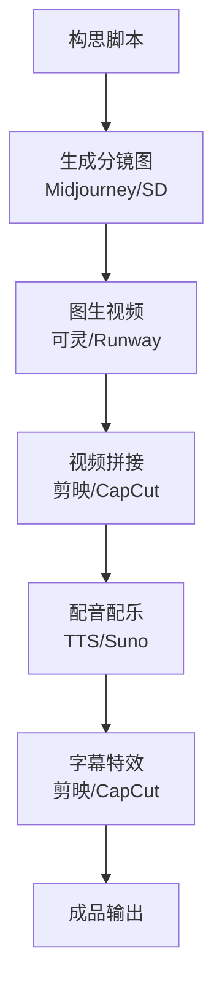

# AI 视频生成

## 概念说明

AI 视频生成是利用深度学习模型从文本描述、图片或视频片段生成视频内容的技术。2024 年是 AI 视频生成的爆发之年，从 OpenAI Sora 的惊艳亮相到国产工具的快速跟进，AI 视频正在重塑内容创作行业。

### AI 视频生成方式

| 生成方式 | 说明 | 典型工具 |
|----------|------|----------|
| **文生视频** | 文本描述 → 视频 | Sora、可灵、Runway |
| **图生视频** | 静态图片 → 动态视频 | Runway、Pika、可灵 |
| **视频编辑** | 修改已有视频内容 | Runway、Pika |
| **视频延长** | 延长视频时长 | 可灵、Runway |
| **风格转换** | 改变视频风格 | Runway、Pika |

## 主流工具详解

### Sora（OpenAI）

Sora 是 OpenAI 推出的视频生成模型，以超高质量和物理真实感著称。

**核心能力：**
- 最长 60 秒高质量视频生成
- 出色的物理世界模拟能力
- 多角色、复杂场景处理
- 支持文生视频和图生视频

**使用限制：**
- 需要 ChatGPT Plus/Pro 订阅
- 生成速度较慢
- 每月有生成次数限制
- 部分场景仍有物理不合理现象

**Prompt 技巧：**
```
# 好的视频 Prompt 结构
[场景描述] + [主体动作] + [镜头运动] + [光照氛围] + [风格]

示例：
A golden retriever puppy running through a field of sunflowers 
on a sunny afternoon. The camera follows the puppy at eye level, 
with warm golden hour lighting. Cinematic, shallow depth of field.
```

### 可灵 Kling（快手）

可灵是快手推出的 AI 视频生成工具，在中文场景和人物生成方面表现突出。

**核心能力：**
- 支持最长 3 分钟视频生成
- 中文 Prompt 理解能力强
- 人物一致性较好
- 支持图生视频、视频延长
- 口型同步功能

**使用方式：**
- 网页端：kling.kuaishou.com
- API 接口可用

**实操流程：**
```
# 文生视频
1. 访问可灵官网
2. 选择"文生视频"模式
3. 输入中文描述：一位年轻女性在咖啡馆里阅读书籍，
   窗外是下雨的城市街景，温暖的室内灯光
4. 选择视频时长和画面比例
5. 点击生成，等待 2-5 分钟

# 图生视频
1. 上传一张静态图片
2. 描述希望的运动效果
3. 生成动态视频
```

### Runway

Runway 是专业级 AI 视频工具，功能最全面。

**核心功能：**

| 功能 | 说明 |
|------|------|
| **Gen-3 Alpha** | 最新视频生成模型 |
| **Text to Video** | 文本生成视频 |
| **Image to Video** | 图片生成视频 |
| **Video to Video** | 视频风格转换 |
| **Motion Brush** | 指定区域运动方向 |
| **Inpainting** | 视频内容替换 |
| **Remove Background** | 视频背景移除 |
| **Green Screen** | 绿幕抠像 |

**Motion Brush 使用：**
```
# 精确控制运动
1. 上传一张图片
2. 使用 Motion Brush 在图片上绘制运动方向
   - 蓝色箭头：向左运动
   - 红色箭头：向右运动
   - 绿色箭头：向上运动
3. 设置运动强度
4. 生成视频
```

### Pika

Pika 以简单易用和风格化视频著称。

**核心特点：**
- 操作简单，适合新手
- 风格化视频效果好
- 唇形同步功能
- 支持视频编辑和修改

### Vidu（生数科技）

Vidu 是国产视频生成工具，在中文场景和长视频方面有优势。

**核心特点：**
- 中文理解能力强
- 支持较长视频生成
- 人物一致性好
- 价格相对亲民

## 视频工具选型对比表

| 维度 | Sora | 可灵 | Runway | Pika | Vidu |
|------|------|------|--------|------|------|
| **视频质量** | ⭐⭐⭐⭐⭐ | ⭐⭐⭐⭐ | ⭐⭐⭐⭐ | ⭐⭐⭐ | ⭐⭐⭐⭐ |
| **最长时长** | 60s | 3min | 16s | 4s | 16s |
| **中文 Prompt** | ⭐⭐⭐ | ⭐⭐⭐⭐⭐ | ⭐⭐⭐ | ⭐⭐⭐ | ⭐⭐⭐⭐⭐ |
| **人物一致性** | ⭐⭐⭐⭐ | ⭐⭐⭐⭐ | ⭐⭐⭐ | ⭐⭐⭐ | ⭐⭐⭐⭐ |
| **物理真实感** | ⭐⭐⭐⭐⭐ | ⭐⭐⭐⭐ | ⭐⭐⭐ | ⭐⭐⭐ | ⭐⭐⭐ |
| **编辑功能** | ⭐⭐ | ⭐⭐⭐ | ⭐⭐⭐⭐⭐ | ⭐⭐⭐⭐ | ⭐⭐⭐ |
| **图生视频** | ✅ | ✅ | ✅ | ✅ | ✅ |
| **视频延长** | ❌ | ✅ | ✅ | ❌ | ✅ |
| **口型同步** | ❌ | ✅ | ❌ | ✅ | ❌ |
| **API 可用** | ✅ | ✅ | ✅ | ✅ | ✅ |
| **访问方式** | 需科学上网 | 直接访问 | 需科学上网 | 需科学上网 | 直接访问 |
| **免费额度** | 有限 | 有 | 有限 | 有限 | 有 |
| **月费** | $20+（含 ChatGPT） | ¥66 起 | $12-76 | $8-58 | ¥49 起 |

## 实战要点

### 视频 Prompt 编写技巧

**结构化 Prompt 模板：**
```
[场景设定]：描述环境和背景
[主体描述]：描述主要角色或物体
[动作描述]：描述运动和变化
[镜头语言]：描述镜头运动方式
[氛围风格]：描述光照、色调、风格

示例：
场景：一个安静的日式庭院，樱花树下
主体：一位穿着和服的年轻女性
动作：缓缓转身，微风吹起发丝和花瓣
镜头：从中景缓慢推近到特写
氛围：柔和的午后阳光，粉色和白色色调，电影感
```

**镜头语言关键词：**

| 镜头类型 | 英文关键词 | 效果 |
|----------|-----------|------|
| 推近 | zoom in, dolly in | 聚焦主体 |
| 拉远 | zoom out, pull back | 展示全景 |
| 平移 | pan left/right | 横向展示 |
| 跟拍 | tracking shot | 跟随主体 |
| 航拍 | aerial shot, drone | 俯瞰视角 |
| 慢动作 | slow motion | 强调细节 |
| 延时 | timelapse | 时间压缩 |

### 场景化选型建议

| 场景 | 推荐工具 | 理由 |
|------|----------|------|
| 高质量短视频 | Sora | 质量最高 |
| 中文内容创作 | 可灵 / Vidu | 中文理解好、国内可用 |
| 专业视频编辑 | Runway | 功能最全面 |
| 快速原型 | Pika | 操作简单、速度快 |
| 长视频制作 | 可灵 | 支持最长 3 分钟 |
| 批量生成 | API 调用 | 可编程自动化 |

### AI 视频制作工作流



## 注意事项

- **版权风险**：AI 生成视频的版权归属尚不明确
- **内容合规**：不要生成涉及真实人物、暴力、色情的内容
- **标注要求**：部分平台要求标注 AI 生成内容
- **质量把控**：AI 视频可能出现物理不合理、人物变形等问题
- **成本控制**：视频生成消耗较多算力，注意控制使用量

## 参考资料

- [OpenAI Sora](https://openai.com/sora)
- [可灵 AI](https://kling.kuaishou.com)
- [Runway](https://runwayml.com)
- [Pika](https://pika.art)
- [Vidu](https://www.vidu.studio)
