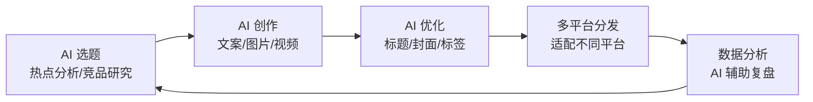

# AI 自媒体

## 概念说明

AI 自媒体是利用 AI 工具辅助内容创作、分发和运营的自媒体模式。AI 可以帮助自媒体创作者大幅提升内容生产效率，从选题策划到内容创作，从数据分析到运营优化，AI 正在重塑自媒体行业的工作方式。

### AI 自媒体工作流



## AI 生成内容分发

### 主流平台特点与算法

| 平台 | 内容形式 | 算法特点 | AI 内容策略 |
|------|----------|----------|------------|
| **抖音** | 短视频 | 兴趣推荐、完播率优先 | 前 3 秒钩子、节奏快、竖屏 |
| **B 站** | 中长视频 | 互动率、粉丝粘性 | 深度内容、知识分享、横屏 |
| **小红书** | 图文/短视频 | 搜索 + 推荐、种草属性 | 精美图片、实用教程、标签 |
| **YouTube** | 中长视频 | 观看时长、点击率 | 高质量缩略图、SEO 优化 |
| **公众号** | 图文 | 社交分发、打开率 | 标题党适度、深度内容 |
| **知乎** | 图文/视频 | 内容质量、专业度 | 专业回答、长文分析 |

### 平台适配策略

**抖音/快手（短视频）：**
```
AI 辅助流程：
1. 选题：用 AI 分析热门话题和趋势
2. 脚本：ChatGPT 生成短视频脚本（15-60 秒）
3. 画面：AI 图像/视频生成
4. 配音：Edge TTS / CosyVoice
5. 剪辑：剪映 AI 自动剪辑
6. 标题：AI 生成多个标题 A/B 测试
7. 标签：AI 推荐相关标签
```

**小红书（图文）：**
```
AI 辅助流程：
1. 选题：AI 分析小红书热门笔记
2. 文案：AI 生成种草文案（200-500 字）
3. 图片：Midjourney/SD 生成精美配图
4. 标题：AI 生成带 emoji 的吸引力标题
5. 标签：AI 推荐 5-10 个相关标签
6. 发布时间：AI 分析最佳发布时间
```

**B 站/YouTube（中长视频）：**
```
AI 辅助流程：
1. 选题：AI 搜索热门话题 + 竞品分析
2. 大纲：AI 生成视频大纲和脚本
3. 素材：AI 生成配图、动画、数据可视化
4. 配音：TTS 或真人配音
5. 字幕：AI 自动生成字幕
6. 缩略图：AI 生成吸引力封面
7. SEO：AI 优化标题、描述、标签
```

## 账号运营

### AI 辅助选题

**选题 Prompt 模板：**
```
你是一位资深的 [领域] 自媒体运营专家。

请帮我生成下周的内容选题计划：
平台：[抖音/小红书/B站]
账号定位：[账号定位描述]
目标受众：[受众画像]
近期热点：[列出近期热点]

要求：
1. 生成 7 个选题（每天一个）
2. 每个选题包含：标题、核心卖点、预期互动点
3. 混合热点话题和常青内容
4. 标注每个选题的预期流量级别
```

### 内容规划

**月度内容日历 Prompt：**
```
请为我的 [平台] 账号制定本月内容日历：

账号信息：
- 领域：[领域]
- 粉丝数：[粉丝数]
- 更新频率：[每周 X 篇]
- 内容类型：[教程/测评/日常/干货]

要求：
1. 按周规划，每周 [X] 篇内容
2. 内容类型比例：干货 40% + 热点 30% + 互动 20% + 个人 10%
3. 标注每篇内容的制作难度和预计耗时
4. 预留 1-2 个热点追踪位
```

### 数据分析

**AI 辅助数据复盘：**
```
请分析以下自媒体数据，给出优化建议：

近 30 天数据：
| 内容标题 | 阅读量 | 点赞 | 评论 | 收藏 | 分享 |
[粘贴数据]

请分析：
1. 哪类内容表现最好？为什么？
2. 哪类内容表现不佳？可能的原因？
3. 最佳发布时间是什么时候？
4. 互动率最高的内容有什么共同特点？
5. 下一步的内容优化建议
```

## 内容合规

### AI 生成内容标注要求

| 平台 | 标注要求 | 处罚措施 |
|------|----------|----------|
| **抖音** | AI 生成内容需标注 | 限流/下架 |
| **小红书** | AI 生成内容需标注 | 限流/封号 |
| **B 站** | 建议标注 | 暂无强制 |
| **YouTube** | AI 生成内容需标注 | 限流/下架 |
| **公众号** | 深度合成内容需标注 | 限流/封号 |

### 版权风险防范

| 风险类型 | 说明 | 防范措施 |
|----------|------|----------|
| **AI 图像版权** | AI 生成图像的版权归属不明确 | 使用开源模型、保留生成记录 |
| **AI 文案版权** | AI 可能生成与他人相似的内容 | 人工修改、查重检测 |
| **AI 音乐版权** | AI 音乐的商用授权 | 使用有商用授权的工具 |
| **素材侵权** | 训练数据可能包含版权素材 | 使用合规的模型和素材 |
| **肖像权** | AI 生成的人脸可能侵权 | 避免生成真实人物 |

### 合规清单

```
发布前检查清单：
□ AI 生成内容是否已标注
□ 是否包含虚假信息或误导性内容
□ 图片/视频是否涉及版权问题
□ 是否涉及真实人物的肖像权
□ 是否符合平台社区规范
□ 是否涉及敏感话题
□ 商业推广是否已标注
□ 数据和引用是否准确
```

## AI 自媒体工具组合

### 按平台推荐

| 平台 | 选题 | 创作 | 配图 | 数据分析 |
|------|------|------|------|----------|
| **抖音** | DeepSeek | ChatGPT | 可灵/剪映 | 抖音数据中心 |
| **小红书** | 秘塔搜索 | Claude | Midjourney | 小红书数据 |
| **B 站** | Perplexity | ChatGPT | SD/ComfyUI | B 站数据 |
| **公众号** | DeepSeek | Claude | Midjourney | 公众号后台 |

### 按预算推荐

| 预算 | 工具组合 | 月成本 |
|------|----------|--------|
| **零成本** | DeepSeek + 秘塔 + Edge TTS + 剪映 | ¥0 |
| **低成本** | ChatGPT + Midjourney + 剪映 | ~¥200/月 |
| **专业级** | ChatGPT + Claude + MJ + Runway + Suno | ~¥500/月 |

## AI 自媒体工具选型对比表

| 维度 | DeepSeek | ChatGPT | Claude | Midjourney | 可灵 | 剪映 |
|------|----------|---------|--------|-----------|------|------|
| **核心用途** | 选题/文案 | 文案/脚本 | 长文写作 | 配图/封面 | 短视频生成 | 视频剪辑 |
| **中文支持** | ⭐⭐⭐⭐⭐ | ⭐⭐⭐⭐ | ⭐⭐⭐⭐ | ⭐⭐⭐ | ⭐⭐⭐⭐⭐ | ⭐⭐⭐⭐⭐ |
| **内容质量** | ⭐⭐⭐⭐ | ⭐⭐⭐⭐⭐ | ⭐⭐⭐⭐⭐ | ⭐⭐⭐⭐⭐ | ⭐⭐⭐⭐ | ⭐⭐⭐⭐ |
| **生成速度** | 快 | 快 | 快 | 中等 | 慢 | 快 |
| **月费用** | 免费 | ¥140/月 | ¥140/月 | ¥70/月 | ¥66/月起 | 免费/Pro |
| **适合平台** | 全平台 | 全平台 | 公众号/知乎 | 小红书/B站 | 抖音/快手 | 全平台 |
| **批量能力** | API 支持 | API 支持 | API 支持 | 批量生成 | 有限 | 批量剪辑 |

### 场景化选型建议

| 自媒体类型 | 推荐工具组合 | 月预算 |
|-----------|-------------|--------|
| 图文博主（小红书/公众号） | DeepSeek + Midjourney + Canva | ¥70/月 |
| 短视频博主（抖音/快手） | ChatGPT + 可灵 + 剪映 + Edge TTS | ¥200/月 |
| 知识博主（B站/YouTube） | Claude + SD/ComfyUI + OBS | ¥140/月 |
| 全平台矩阵运营 | ChatGPT + Claude + MJ + 可灵 + 剪映 | ¥400/月 |

## 实战要点

### 自媒体起号策略

1. **定位清晰**：用 AI 分析竞品，找到差异化定位
2. **内容矩阵**：多平台分发，适配不同平台特点
3. **持续输出**：利用 AI 提效，保持稳定更新频率
4. **数据驱动**：用 AI 分析数据，持续优化内容策略
5. **人设打造**：AI 辅助但保持个人特色和真实感

### 常见误区

| 误区 | 正确做法 |
|------|----------|
| 完全用 AI 生成内容 | AI 辅助 + 人工润色和个性化 |
| 忽视平台规则 | 了解并遵守各平台的 AI 内容政策 |
| 追求数量忽视质量 | 质量优先，AI 提效而非降质 |
| 不做数据分析 | 定期复盘，用数据指导内容策略 |
| 忽视互动 | 及时回复评论，建立粉丝关系 |

## 注意事项

- **内容真实性**：AI 辅助创作但不要制造虚假信息
- **合规标注**：遵守各平台的 AI 内容标注要求
- **版权保护**：注意 AI 生成内容的版权风险
- **个人特色**：保持个人风格，避免千篇一律的 AI 味
- **持续学习**：AI 工具和平台规则都在快速变化

## 参考资料

- [抖音创作者服务中心](https://creator.douyin.com)
- [小红书创作者中心](https://creator.xiaohongshu.com)
- [B 站创作中心](https://member.bilibili.com)
- [YouTube Creator Academy](https://creatoracademy.youtube.com)
