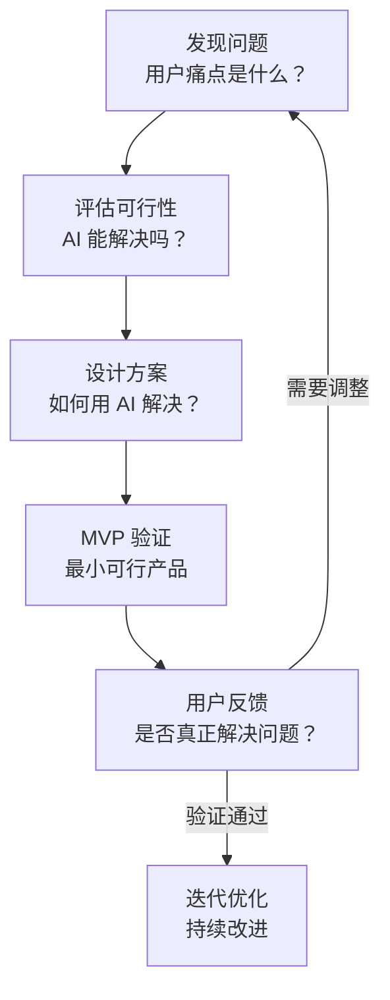
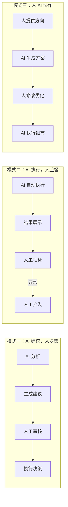

# AI 产品思维

## 概念说明

AI 产品思维是将 AI 能力与实际业务需求结合，设计出真正解决用户问题的产品的思维方式。核心不是"用 AI 做什么"，而是"用户需要什么，AI 能否更好地满足"。很多 AI 产品失败的原因不是技术不行，而是没有找到真正的用户需求。

### AI 产品设计思维框架



## 用 AI 解决实际业务问题

### 需求分析框架

**第一步：识别真实需求**

| 问题 | 说明 |
|------|------|
| 用户是谁？ | 明确目标用户群体 |
| 痛点是什么？ | 用户当前面临的具体问题 |
| 现有方案是什么？ | 用户目前如何解决这个问题 |
| 现有方案的不足？ | 为什么现有方案不够好 |
| AI 能带来什么改进？ | AI 相比现有方案的优势 |

**需求分析 Prompt：**
```
我想用 AI 解决以下问题：
[描述问题]

请帮我分析：
1. 这个问题的核心痛点是什么？
2. 目标用户群体有多大？
3. 现有的解决方案有哪些？各自的优缺点？
4. AI 能在哪些环节提供改进？
5. 技术可行性如何？需要什么 AI 能力？
6. 潜在的风险和挑战？
```

**第二步：AI 可行性评估**

| AI 能力 | 适合的场景 | 不适合的场景 |
|---------|-----------|-------------|
| **文本生成** | 内容创作、客服回复、报告生成 | 需要 100% 准确的法律/医疗文本 |
| **文本理解** | 文档分析、情感分析、分类 | 需要深度领域专业知识的判断 |
| **图像生成** | 设计辅助、素材生成、概念图 | 需要像素级精确的工程图 |
| **图像识别** | 质检、分类、OCR | 极端环境下的实时识别 |
| **语音合成** | 配音、客服、有声书 | 需要真人情感的场景 |
| **推荐系统** | 内容推荐、商品推荐 | 用户量极少的冷启动 |

**可行性评估清单：**
```
□ AI 能力是否匹配需求？
□ 数据是否充足？
□ 准确率要求是否合理？（AI 不是 100% 准确）
□ 延迟要求是否可接受？
□ 成本是否可控？
□ 是否有合规风险？
□ 用户是否接受 AI 参与？
```

### AI 产品设计案例

**案例一：AI 客服系统**
```
需求：电商客服响应慢，人力成本高
AI 方案：
- 一线：AI 自动回复常见问题（覆盖 70% 咨询）
- 二线：AI 辅助人工客服（提供建议回复）
- 三线：复杂问题转人工

关键设计：
- AI 回复置信度低于阈值时自动转人工
- 保留人工介入的能力
- 持续收集反馈优化模型
```

**案例二：AI 文档助手**
```
需求：企业内部文档多，员工找信息效率低
AI 方案：
- RAG 架构：文档向量化 + 语义检索 + AI 回答
- 支持多种文档格式（PDF/Word/PPT/网页）
- 回答附带来源引用

关键设计：
- 权限控制（不同角色看到不同文档）
- 回答准确性保障（引用来源、置信度标注）
- 反馈机制（用户标记回答是否有用）
```

## AI 产品设计思路

### AI 功能定位

| 定位 | 说明 | 示例 |
|------|------|------|
| **AI 为核心** | 产品的核心价值由 AI 提供 | ChatGPT、Midjourney |
| **AI 为增强** | AI 增强现有产品的某个功能 | Notion AI、WPS AI |
| **AI 为自动化** | AI 自动化重复性工作 | 自动客服、自动标注 |
| **AI 为辅助** | AI 辅助人类做决策 | AI 诊断辅助、AI 审核 |

### 用户体验设计原则

**1. 透明性**
```
- 明确告知用户 AI 参与了哪些环节
- 显示 AI 的置信度或不确定性
- 提供 AI 决策的解释
```

**2. 可控性**
```
- 用户可以修改 AI 的输出
- 用户可以选择是否使用 AI 功能
- 提供人工回退选项
```

**3. 渐进式信任**
```
- 初期：AI 建议 + 人工确认
- 中期：AI 自动执行 + 人工抽检
- 后期：AI 全自动 + 异常告警
```

**4. 错误处理**
```
- AI 出错时的优雅降级
- 清晰的错误提示
- 快速的人工介入通道
```

### AI 能力边界管理

| 策略 | 说明 | 实现方式 |
|------|------|----------|
| **设定边界** | 明确 AI 能做和不能做的事 | 功能说明、使用引导 |
| **置信度过滤** | 低置信度结果不直接展示 | 阈值设定、人工审核 |
| **兜底方案** | AI 失败时的备选方案 | 规则引擎、人工处理 |
| **持续监控** | 监控 AI 输出质量 | 日志分析、用户反馈 |
| **迭代优化** | 根据反馈持续改进 | A/B 测试、模型更新 |

## MVP 设计与验证

### MVP 设计原则

```
AI 产品 MVP 设计原则：

1. 最小功能集
   - 只实现核心 AI 功能
   - 其他功能用最简单的方式实现
   - 目标：验证 AI 能否解决核心问题

2. 快速迭代
   - 2-4 周完成 MVP
   - 快速上线收集反馈
   - 根据反馈调整方向

3. 数据收集
   - 从 MVP 开始收集用户行为数据
   - 收集 AI 输出的质量反馈
   - 为后续优化积累数据

4. 成本控制
   - 初期使用 API 而非自建模型
   - 按量付费，避免固定成本
   - 验证需求后再投入基础设施
```

### MVP 技术选型建议

| 阶段 | AI 方案 | 成本 | 适用场景 |
|------|---------|------|----------|
| **验证期** | 调用 API（OpenAI/Claude） | 按量付费 | 快速验证需求 |
| **成长期** | 开源模型 + 云 GPU | 中等 | 需要定制化 |
| **成熟期** | 自建模型 + 自有算力 | 高 | 大规模、高要求 |

### 用户验证方法

| 方法 | 说明 | 适用阶段 |
|------|------|----------|
| **用户访谈** | 直接与目标用户交流 | 需求验证 |
| **原型测试** | 用 Figma 做交互原型 | 方案验证 |
| **MVP 测试** | 最小可行产品上线 | 产品验证 |
| **A/B 测试** | 对比有无 AI 的效果 | 效果验证 |
| **数据分析** | 分析用户行为数据 | 持续优化 |

## 人机协作设计

### 协作模式



### 选择协作模式的依据

| 因素 | AI 建议+人决策 | AI 执行+人监督 | 人 AI 协作 |
|------|---------------|---------------|-----------|
| 错误成本 | 高 | 低 | 中 |
| 任务复杂度 | 高 | 低 | 中 |
| 处理量 | 低 | 高 | 中 |
| AI 准确率 | 不够高 | 足够高 | 中等 |

## 实战要点

### AI 产品常见失败原因

| 失败原因 | 说明 | 避免方法 |
|----------|------|----------|
| 伪需求 | 用户并不真正需要 | 先验证需求再开发 |
| 技术过度 | 用 AI 解决简单问题 | 评估 AI 是否必要 |
| 准确率不足 | AI 输出质量不达标 | 设定质量基线，人工兜底 |
| 体验差 | AI 响应慢、不可控 | 优化延迟，提供控制选项 |
| 成本失控 | API 调用成本过高 | 缓存、模型优化、成本监控 |

### 产品思维检查清单

```
□ 是否找到了真实的用户痛点？
□ AI 是否是解决这个问题的最佳方式？
□ 用户是否愿意为此付费？
□ AI 的准确率是否满足业务要求？
□ 出错时是否有兜底方案？
□ 用户体验是否流畅？
□ 成本是否可控？
□ 是否有合规风险？
□ 是否有竞争壁垒？
□ 是否可以持续迭代优化？
```

## 注意事项

- **需求优先**：先验证需求，再考虑技术方案
- **用户中心**：始终从用户角度思考，而非技术角度
- **管理预期**：AI 不是万能的，要管理用户对 AI 的预期
- **数据驱动**：用数据验证假设，而非凭直觉
- **合规先行**：在设计阶段就考虑数据隐私和合规要求

## 参考资料

- [AI 产品经理手册](https://www.oreilly.com/library/view/ai-product-management/9781098104061/)
- [Google AI 设计指南](https://pair.withgoogle.com)
- [Microsoft AI 设计原则](https://www.microsoft.com/en-us/ai/responsible-ai)
- [Y Combinator AI 创业指南](https://www.ycombinator.com)
