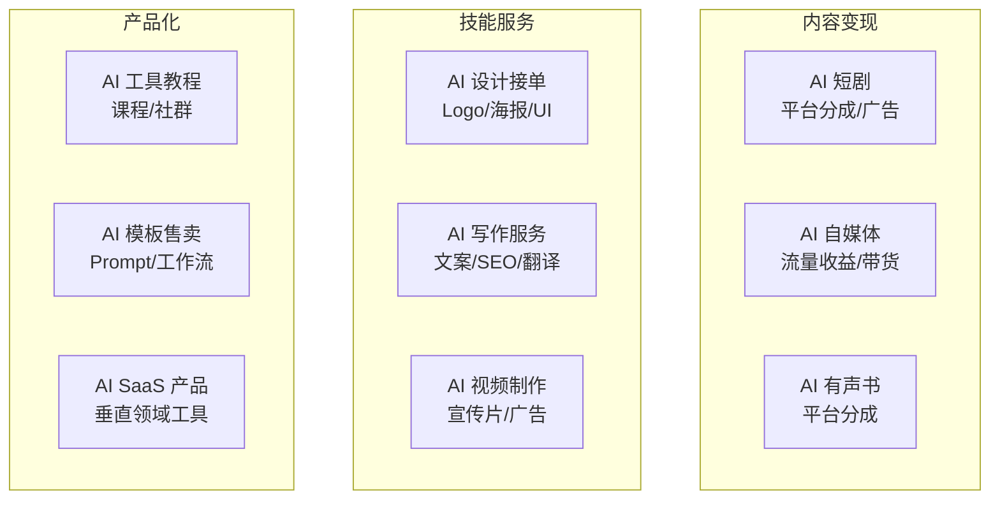

# AI 副业

## 概念说明

AI 副业是利用 AI 工具的能力差（你会用 AI，别人不会或不熟练）来提供服务或创造内容，从而获取收入。核心逻辑是：**AI 降低了技能门槛，但没有降低需求**。掌握 AI 工具的人可以更高效地满足市场需求。

### AI 副业收入模型



## AI 短剧变现

### 变现模式

| 模式 | 说明 | 预期收入 | 难度 |
|------|------|----------|------|
| **平台分成** | 抖音/快手短剧分账 | ¥1000-50000/月 | ⭐⭐⭐ |
| **广告植入** | 品牌合作/软广 | ¥500-5000/条 | ⭐⭐⭐⭐ |
| **付费短剧** | 小程序付费观看 | ¥2000-100000/月 | ⭐⭐⭐⭐ |
| **IP 授权** | 角色/故事 IP 授权 | 不定 | ⭐⭐⭐⭐⭐ |

### 短剧制作成本控制

| 环节 | 传统成本 | AI 成本 | 节省比例 |
|------|----------|---------|----------|
| 剧本 | ¥2000-10000 | ¥0（AI 生成） | 100% |
| 演员 | ¥5000-50000 | ¥0（AI 数字人） | 100% |
| 拍摄 | ¥3000-20000 | ¥100-500（AI 视频） | 95%+ |
| 配音 | ¥500-3000 | ¥0（TTS） | 100% |
| 配乐 | ¥500-2000 | ¥0（Suno） | 100% |
| 剪辑 | ¥1000-5000 | ¥0（剪映 AI） | 100% |
| **总计** | **¥12000-90000** | **¥100-500** | **95%+** |

### 实操流程

```
AI 短剧变现完整流程：

1. 市场调研（1 天）
   - 用 AI 搜索分析热门短剧类型
   - 确定目标受众和平台
   - 分析竞品的成功要素

2. 剧本创作（半天）
   - ChatGPT/Claude 生成剧本
   - 人工优化剧情和对话
   - 生成分镜脚本

3. 素材制作（1-2 天）
   - Midjourney/SD 生成分镜图
   - 可灵/Runway 图生视频
   - Edge TTS 生成配音
   - Suno 生成背景音乐

4. 后期制作（半天）
   - 剪映拼接和剪辑
   - 添加字幕和特效
   - 调色和音频混合

5. 发布运营（持续）
   - 多平台分发
   - 数据分析和优化
   - 持续更新系列内容
```

## AI 设计接单

### 接单平台

| 平台 | 类型 | 适合项目 | 客单价 |
|------|------|----------|--------|
| **猪八戒** | 综合设计平台 | Logo/海报/包装 | ¥100-5000 |
| **千图网** | 设计素材平台 | 模板/素材 | ¥50-500/个 |
| **Fiverr** | 国际自由职业 | Logo/插画/UI | $5-500 |
| **Upwork** | 国际自由职业 | 设计项目 | $50-5000 |
| **闲鱼** | 二手/服务平台 | 各类设计 | ¥50-2000 |
| **淘宝** | 电商服务 | 批量设计 | ¥20-500 |

### AI 设计服务类型

| 服务类型 | AI 工具 | 客单价 | 制作时间 |
|----------|---------|--------|----------|
| **Logo 设计** | Midjourney + 矢量化 | ¥100-500 | 1-2 小时 |
| **海报设计** | Midjourney/SD + Canva | ¥50-300 | 30 分钟-1 小时 |
| **电商主图** | SD + 产品图合成 | ¥30-100/张 | 15-30 分钟 |
| **头像/表情包** | Midjourney/SD | ¥20-100 | 15-30 分钟 |
| **PPT 设计** | Gamma AI + 美化 | ¥100-500 | 1-2 小时 |
| **UI 设计** | Midjourney + Figma | ¥500-3000 | 2-8 小时 |

### 接单技巧

```
AI 设计接单策略：

1. 建立作品集
   - 用 AI 生成 20-30 个高质量作品
   - 覆盖不同风格和类型
   - 在各平台展示

2. 定价策略
   - 新手期低价引流（市场价 50-70%）
   - 积累好评后逐步提价
   - 提供套餐服务（Logo + 名片 + 海报）

3. 效率提升
   - 建立常用 Prompt 模板库
   - 准备不同风格的 LoRA/参考图
   - 批量生成多个方案供客户选择

4. 客户沟通
   - 用 AI 快速出 3-5 个初稿
   - 让客户选择方向后精修
   - 提供源文件和修改服务
```

## AI 写作服务

### 服务类型与定价

| 服务类型 | 工具 | 客单价 | 交付时间 |
|----------|------|--------|----------|
| **SEO 文章** | ChatGPT/Claude | ¥50-200/篇 | 30 分钟-1 小时 |
| **产品描述** | ChatGPT | ¥20-100/个 | 15-30 分钟 |
| **公众号文章** | Claude/DeepSeek | ¥100-500/篇 | 1-2 小时 |
| **学术润色** | Claude | ¥200-1000/篇 | 1-3 小时 |
| **翻译服务** | ChatGPT/DeepL | ¥100-500/千字 | 按量 |
| **简历优化** | ChatGPT | ¥50-200/份 | 30 分钟 |

### 写作服务工作流

```
1. 接单沟通
   - 了解客户需求（主题、风格、字数、用途）
   - 确认交付时间和价格
   - 收取定金（50%）

2. AI 辅助创作
   - 用 AI 生成初稿
   - 人工审核和修改
   - 确保内容准确性和原创性
   - 查重检测（维普/知网）

3. 交付和修改
   - 提交初稿
   - 根据反馈修改（通常 1-2 次）
   - 收取尾款

注意：学术代写存在伦理和法律风险，建议仅提供润色服务。
```

### 伦理边界

| 行为 | 合规性 | 说明 |
|------|--------|------|
| AI 辅助写营销文案 | ✅ 合规 | 正常商业服务 |
| AI 辅助写 SEO 文章 | ✅ 合规 | 注意内容质量 |
| AI 辅助学术润色 | ✅ 合规 | 仅润色不代写 |
| AI 代写学术论文 | ❌ 不合规 | 学术不端 |
| AI 代写毕业论文 | ❌ 不合规 | 学术不端 |
| AI 生成虚假评论 | ❌ 不合规 | 商业欺诈 |

## AI 副业工具选型对比表

| 副业方向 | 核心工具 | 辅助工具 | 月投入 | 预期月收入 | 上手难度 |
|----------|---------|---------|--------|-----------|---------|
| **AI 短剧** | 可灵 + ChatGPT | Edge TTS + Suno + 剪映 | ¥100-300 | ¥1000-50000 | ⭐⭐⭐ |
| **AI 设计接单** | Midjourney + SD | Canva + Figma | ¥70-200 | ¥2000-10000 | ⭐⭐ |
| **AI 写作服务** | Claude + ChatGPT | DeepL + 查重工具 | ¥0-280 | ¥1000-8000 | ⭐⭐ |
| **AI 自媒体** | DeepSeek + MJ | 剪映 + Canva | ¥0-200 | ¥500-20000 | ⭐⭐⭐ |
| **AI 教程/课程** | 录屏 + ChatGPT | 剪映 + Canva | ¥0-100 | ¥1000-20000 | ⭐⭐⭐⭐ |
| **Prompt 模板售卖** | MJ + SD + ChatGPT | PromptBase | ¥70-200 | ¥500-5000 | ⭐⭐ |

### 副业方向选型建议

| 个人条件 | 推荐方向 | 理由 |
|----------|---------|------|
| 有设计审美 | AI 设计接单 | 门槛低、需求大、客单价适中 |
| 文字功底好 | AI 写作服务 | 几乎零成本、交付快 |
| 有表达欲 | AI 自媒体/教程 | 长期积累、被动收入 |
| 有故事创意 | AI 短剧 | 天花板高、可规模化 |
| 技术背景 | AI SaaS/工具 | 壁垒高、收入上限高 |
| 时间有限 | Prompt 模板售卖 | 一次制作、持续收益 |

## 其他 AI 副业方向

### AI 教程/课程

```
变现方式：
- 录制 AI 工具教程视频 → B 站/YouTube 流量收益
- 制作 AI 使用课程 → 知识星球/小报童付费
- 建立 AI 学习社群 → 会员制收费
- 写 AI 工具评测文章 → 自媒体流量

预期收入：¥1000-20000/月（取决于粉丝量和内容质量）
```

### AI 模板/Prompt 售卖

```
变现方式：
- Midjourney Prompt 模板 → PromptBase 售卖
- ComfyUI 工作流 → 社区/平台售卖
- ChatGPT Prompt 库 → 知识付费
- SD LoRA 模型 → Civitai 打赏

预期收入：¥500-5000/月（被动收入）
```

## 实战要点

### AI 副业选择框架

| 评估维度 | 问题 |
|----------|------|
| **技能匹配** | 你擅长什么？AI 能帮你放大什么技能？ |
| **市场需求** | 这个服务有人愿意付费吗？竞争激烈吗？ |
| **时间投入** | 每周能投入多少时间？ |
| **收入预期** | 期望月收入多少？这个方向能达到吗？ |
| **可持续性** | 这个方向能长期做吗？会被 AI 替代吗？ |
| **风险评估** | 有什么法律或伦理风险？ |

### 起步建议

1. **从小开始**：先在闲鱼/淘宝接几单小活，验证市场需求
2. **建立作品集**：用 AI 生成高质量作品展示能力
3. **持续学习**：AI 工具更新快，保持学习新工具和技巧
4. **口碑积累**：前期低价做口碑，好评是最好的营销
5. **逐步扩展**：从单一服务扩展到套餐服务或产品化

### 收入增长路径

```
阶段一：接单服务（月入 ¥1000-5000）
→ 在平台接单，按件收费

阶段二：品牌化（月入 ¥5000-20000）
→ 建立个人品牌，提高客单价

阶段三：产品化（月入 ¥20000+）
→ 将服务产品化（课程/模板/工具）

阶段四：规模化（月入 ¥50000+）
→ 建立团队，批量交付
```

## 注意事项

- **合法合规**：确保服务内容合法，避免灰色地带
- **质量把控**：AI 生成内容需要人工审核和优化
- **客户预期**：明确告知使用 AI 辅助，管理客户预期
- **持续学习**：AI 工具迭代快，需要持续更新技能
- **税务合规**：收入达到一定规模需要依法纳税

## 参考资料

- [猪八戒网](https://www.zbj.com)
- [Fiverr](https://www.fiverr.com)
- [PromptBase](https://promptbase.com)
- [Civitai](https://civitai.com)
