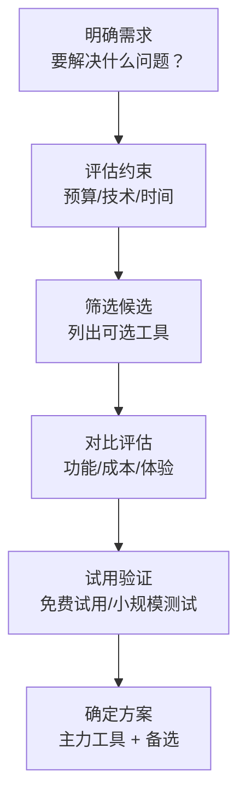

# AI 工具选型

## 概念说明

面对数百种 AI 工具，如何根据自己的场景、预算和技术水平选择合适的工具组合？本节提供系统化的 AI 工具选型框架，帮助你在不同场景下做出最优选择。

### 选型决策框架



## 按场景推荐

### 日常办公场景

| 需求 | 推荐工具 | 备选工具 | 月成本 |
|------|----------|----------|--------|
| 日常对话/问答 | DeepSeek | Kimi / 通义千问 | 免费 |
| 代码辅助 | Cursor | Copilot / Kiro | $0-20 |
| 文档写作 | Claude | ChatGPT / DeepSeek | $0-20 |
| 信息搜索 | 秘塔搜索 | Perplexity | 免费 |
| PPT 制作 | 讯飞智文 | Gamma AI | 免费 |
| 会议纪要 | 通义听悟 | 飞书妙记 | 免费 |
| 翻译 | 沉浸式翻译 | DeepL | 免费 |
| 邮件 | ChatGPT/Claude | DeepSeek | $0-20 |

### 内容创作场景

| 需求 | 推荐工具 | 备选工具 | 月成本 |
|------|----------|----------|--------|
| 图像生成 | Midjourney | SD/ComfyUI | $10 或免费 |
| 视频生成 | 可灵 | Runway / Sora | ¥66 起 |
| 配音 | Edge TTS | CosyVoice | 免费 |
| 配乐 | Suno AI | Udio | 免费 |
| 数字人 | HeyGen | SadTalker | $24 或免费 |
| 短视频剪辑 | 剪映 | CapCut | 免费 |
| 文案创作 | Claude | ChatGPT | $0-20 |

### 开发者场景

| 需求 | 推荐工具 | 备选工具 | 月成本 |
|------|----------|----------|--------|
| 代码编写 | Cursor | Kiro / Copilot | $0-20 |
| 代码审查 | Claude | ChatGPT | $0-20 |
| 技术调研 | Perplexity | 秘塔搜索 | $0-20 |
| API 文档 | ChatGPT | Claude | $0-20 |
| 测试生成 | Copilot | Cursor | $0-20 |
| 架构设计 | Claude | ChatGPT | $0-20 |
| 运维排查 | ChatGPT | DeepSeek | $0-20 |

### 学术研究场景

| 需求 | 推荐工具 | 备选工具 | 月成本 |
|------|----------|----------|--------|
| 论文搜索 | Elicit | Semantic Scholar | 免费 |
| 论文阅读 | Kimi | ChatPDF / Claude | 免费 |
| 文献综述 | Claude | ChatGPT | $0-20 |
| 学术写作 | Claude | ChatGPT | $0-20 |
| 论文润色 | Claude | ChatGPT | $0-20 |
| 数据分析 | ChatGPT Code Interpreter | DeepSeek | $0-20 |
| 思维导图 | Xmind AI | 秘塔搜索 | 免费 |

## 按预算推荐

### 零成本方案

```
适合：学生、个人学习、预算有限

对话助手：DeepSeek（免费额度充足）
AI 搜索：秘塔搜索（免费）
代码辅助：Trae / Kiro（免费额度）
文档阅读：Kimi（免费，200 万字上下文）
PPT 制作：讯飞智文（免费）
图像生成：SD WebUI（需 GPU）或在线免费工具
视频生成：可灵（免费额度）
配音：Edge TTS（免费）
配乐：Suno（免费额度）
会议纪要：通义听悟（免费额度）
翻译：沉浸式翻译 + DeepSeek（免费）

总成本：¥0/月
```

### 轻量付费方案（¥150/月）

```
适合：职场人士、自由职业者

对话助手：ChatGPT Plus（$20/月 ≈ ¥150）
  - 包含 GPT-4o、DALL-E 3、Sora、代码执行
AI 搜索：秘塔搜索（免费）
代码辅助：Cursor（免费额度通常够用）
文档阅读：Kimi（免费）
其他：使用 ChatGPT Plus 覆盖

总成本：约 ¥150/月
```

### 专业方案（¥400/月）

```
适合：内容创作者、专业开发者

对话助手：ChatGPT Plus（$20/月）
代码辅助：Cursor Pro（$20/月）
图像生成：Midjourney Standard（$30/月）
其他工具：使用免费方案补充

总成本：约 ¥500/月
```

### 全栈方案（¥800+/月）

```
适合：专业团队、商业用途

对话助手：ChatGPT Plus + Claude Pro（$40/月）
代码辅助：Cursor Pro（$20/月）
AI 搜索：Perplexity Pro（$20/月）
图像生成：Midjourney Pro（$60/月）
视频生成：Runway Standard（$12/月）
数字人：HeyGen Creator（$24/月）

总成本：约 ¥1200/月
```

## 按技术水平推荐

### 入门级（非技术用户）

| 特点 | 推荐 |
|------|------|
| 操作简单 | ChatGPT、Kimi、DeepSeek |
| 无需安装 | 网页版工具为主 |
| 中文友好 | 国产工具优先 |
| 免费优先 | 免费工具 + 免费额度 |

**推荐组合：** DeepSeek + Kimi + 秘塔搜索 + 讯飞智文 + 剪映

### 中级（有一定技术基础）

| 特点 | 推荐 |
|------|------|
| 可以安装软件 | 桌面应用 + 网页工具 |
| 会基础配置 | Cursor、ComfyUI |
| 愿意付费 | 付费工具提升效率 |
| 追求效率 | 工具组合优化 |

**推荐组合：** ChatGPT + Cursor + Midjourney + 可灵 + Edge TTS

### 高级（开发者/技术用户）

| 特点 | 推荐 |
|------|------|
| 可以本地部署 | SD/ComfyUI/Ollama |
| 会写代码调用 API | API 集成 |
| 追求可控性 | 开源工具优先 |
| 可以自定义 | LoRA/工作流/Prompt |

**推荐组合：** Claude API + Cursor + ComfyUI + Ollama + CosyVoice + 自建工作流

## AI 工具组合方案

### 日常办公组合

```
核心工具：
├── 对话：DeepSeek（日常）+ ChatGPT（复杂任务）
├── 搜索：秘塔搜索（中文）+ Perplexity（英文）
├── 写作：Claude（长文）+ DeepSeek（短文）
├── 办公：通义听悟（会议）+ 讯飞智文（PPT）
└── 翻译：沉浸式翻译（网页）+ Claude（文档）
```

### 内容创作组合

```
核心工具：
├── 文案：ChatGPT/Claude
├── 图像：Midjourney（概念）+ ComfyUI（精修）
├── 视频：可灵（生成）+ 剪映（剪辑）
├── 配音：Edge TTS（旁白）+ CosyVoice（角色）
├── 配乐：Suno AI
└── 数字人：HeyGen / SadTalker
```

### 开发提效组合

```
核心工具：
├── 编码：Cursor（主力）+ Copilot（补充）
├── 调研：Perplexity（技术）+ 秘塔（中文）
├── 文档：Claude（设计文档）+ ChatGPT（API 文档）
├── 测试：Copilot（单元测试）+ ChatGPT（测试用例）
└── 运维：ChatGPT（排查）+ DeepSeek（脚本）
```

## 工具评估维度

### 评估矩阵

| 维度 | 权重 | 评估标准 |
|------|------|----------|
| **功能匹配** | 30% | 是否满足核心需求 |
| **输出质量** | 25% | 生成内容的质量和准确性 |
| **易用性** | 15% | 学习成本和操作便捷性 |
| **性价比** | 15% | 功能与价格的比值 |
| **中文支持** | 10% | 中文理解和生成质量 |
| **生态/集成** | 5% | 与其他工具的集成能力 |

### 工具替换策略

```
当需要替换工具时：
1. 评估替换成本（学习成本、数据迁移、工作流调整）
2. 新工具试用期（至少 1-2 周并行使用）
3. 逐步迁移（先迁移非核心任务）
4. 保留备选（不要完全依赖单一工具）
```

## 实战要点

### 工具选型常见误区

| 误区 | 正确做法 |
|------|----------|
| 追求最新最贵 | 选择最适合自己需求的 |
| 工具越多越好 | 精通 3-5 个核心工具 |
| 忽视学习成本 | 评估学习投入和产出比 |
| 不做试用对比 | 先试用再决定 |
| 忽视数据安全 | 评估工具的数据隐私政策 |

### 工具更新跟踪

```
AI 工具更新速度极快，建议：
1. 关注 2-3 个 AI 资讯源（如 AI 产品榜、少数派）
2. 每月评估一次工具组合是否需要调整
3. 新工具出现时先观望，等口碑稳定后再尝试
4. 核心工具保持稳定，边缘工具可以灵活替换
```

## 注意事项

- **需求驱动**：先明确需求，再选择工具，而非反过来
- **成本控制**：定期审查工具订阅，取消不常用的
- **数据安全**：了解工具的数据使用政策
- **避免锁定**：不要过度依赖单一工具，保持灵活性
- **持续评估**：AI 工具迭代快，定期重新评估选型

## 参考资料

- [AI 工具导航 — AI 产品榜](https://aicpb.com)
- [There's An AI For That](https://theresanaiforthat.com)
- [Futurepedia — AI 工具目录](https://www.futurepedia.io)
- [AI 工具集](https://ai-bot.cn)
