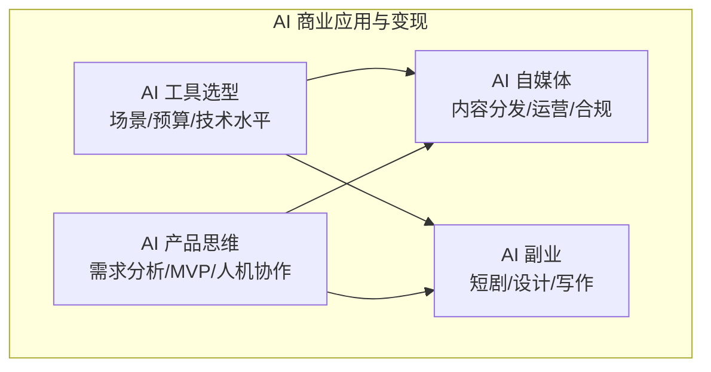

# 7.3 AI 商业应用与变现

> **前置依赖**：无，本模块为独立参考章节，可随时查阅。
> **建议学习时间**：1 周

## 模块概览

本子模块帮助你将 AI 能力转化为实际价值，覆盖自媒体运营、副业变现、产品思维和工具选型四个方面。

## 知识点目录

| 序号 | 知识点 | 核心内容 | 文档 |
|------|--------|----------|------|
| 1 | AI 自媒体 | AI 生成内容分发/账号运营/内容合规 | [ai-media](./ai-media) |
| 2 | AI 副业 | AI 短剧变现/AI 设计接单/AI 写作服务 | [ai-side-hustle](./ai-side-hustle) |
| 3 | AI 产品思维 | 用 AI 解决业务问题/AI 产品设计/MVP | [ai-product](./ai-product) |
| 4 | AI 工具选型 | 按场景/预算/技术水平推荐工具组合 | [ai-tool-selection](./ai-tool-selection) |

## 快速导航

### 按目标选择

| 目标 | 推荐阅读顺序 |
|------|-------------|
| 想做自媒体 | 工具选型 → 自媒体 → 副业 |
| 想做 AI 副业 | 工具选型 → 副业 → 自媒体 |
| 想做 AI 产品 | 产品思维 → 工具选型 |
| 想选合适的工具 | 工具选型 |

## 学习建议

1. 先阅读 [AI 工具选型](./ai-tool-selection)，了解工具全景
2. 根据自己的目标选择深入方向
3. 实践是最好的学习方式，边学边做
4. 关注行业动态，AI 商业模式在快速演变

## AI 商业应用能力矩阵

| 能力维度 | AI 自媒体 | AI 副业 | AI 产品 | AI 工具选型 |
|----------|----------|---------|---------|-----------|
| **内容创作** | ⭐⭐⭐⭐⭐ | ⭐⭐⭐⭐ | ⭐⭐⭐ | ⭐⭐ |
| **运营分析** | ⭐⭐⭐⭐⭐ | ⭐⭐⭐ | ⭐⭐⭐⭐ | ⭐⭐⭐ |
| **商业变现** | ⭐⭐⭐⭐ | ⭐⭐⭐⭐⭐ | ⭐⭐⭐⭐⭐ | ⭐⭐ |
| **技术门槛** | 低 | 低-中 | 中-高 | 低 |
| **启动成本** | ¥0-200/月 | ¥0-300/月 | ¥500+/月 | ¥0 |
| **收入天花板** | 中 | 中-高 | 高 | — |
| **时间投入** | 持续 | 灵活 | 集中 | 一次性 |

## 变现路径速查

| 目标月收入 | 推荐路径 | 所需时间 | 核心工具 |
|-----------|---------|---------|---------|
| ¥1000-3000 | AI 写作/设计接单 | 1-2 周上手 | ChatGPT + Midjourney |
| ¥3000-10000 | AI 自媒体 + 接单 | 1-3 个月积累 | 全套 AI 工具 |
| ¥10000-30000 | AI 短剧/课程/品牌化 | 3-6 个月积累 | 全套 AI 工具 + 运营 |
| ¥30000+ | AI 产品/团队化 | 6-12 个月积累 | 技术 + 商业能力 |

## 风险提示

| 风险类型 | 说明 | 防范措施 |
|----------|------|----------|
| **合规风险** | AI 内容标注、版权争议 | 遵守平台规则，标注 AI 生成 |
| **质量风险** | AI 生成内容质量不稳定 | 人工审核把关，建立质量标准 |
| **竞争风险** | AI 降低门槛导致竞争加剧 | 建立差异化优势，持续提升 |
| **政策风险** | AI 相关法规持续变化 | 关注政策动态，及时调整 |
| **依赖风险** | 过度依赖单一工具或平台 | 多工具备选，多平台分发 |

## 常见问题

### Q：没有技术背景能做 AI 商业应用吗？

完全可以。AI 自媒体和 AI 副业（设计接单、写作服务）对技术要求很低，只需要掌握 AI 工具的使用方法。AI 产品思维需要一定的产品和商业能力，但不一定需要编程技能。

### Q：AI 副业能做多久？会不会很快被淘汰？

AI 工具在不断进化，但人的创意、审美和商业判断力不会被替代。关键是持续学习新工具，同时建立自己的差异化优势（如特定领域的专业知识、独特的创作风格、稳定的客户关系）。

### Q：如何平衡主业和 AI 副业？

建议从每周投入 5-10 小时开始，选择一个方向深入。利用 AI 工具提效，减少重复性工作的时间。当副业收入稳定后，再考虑是否增加投入。

### Q：AI 商业应用有哪些法律风险需要注意？

主要关注三个方面：一是 AI 生成内容的版权归属（目前各国法律尚未统一）；二是各平台对 AI 内容的标注要求（不标注可能被限流或封号）；三是数据隐私保护（使用客户数据时需遵守相关法规）。建议在商业化之前咨询专业法律意见。
