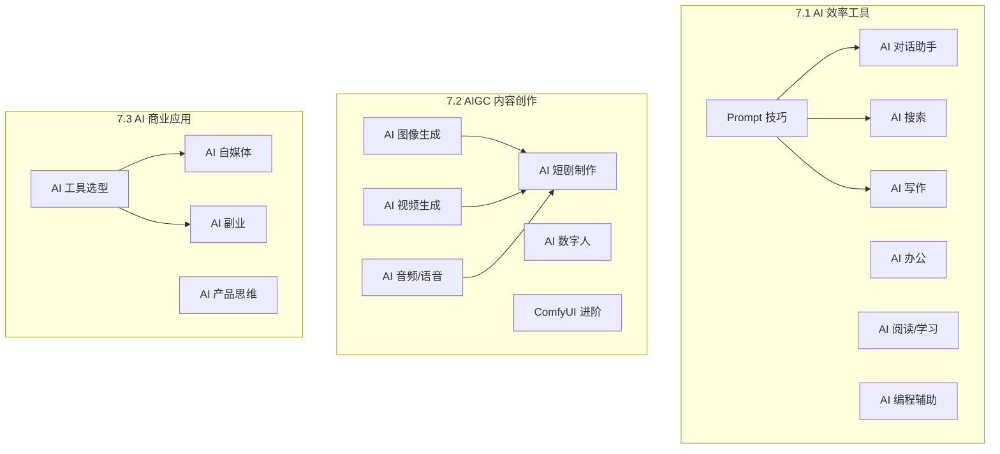
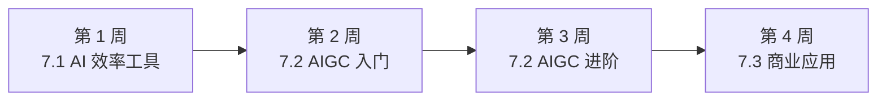

# 模块 7：AI 使用与实践

> **前置依赖**：无，本模块为独立参考章节，可随时查阅。
> **建议学习时间**：2-4 周（按需选读）
> **模块定位**：工具参考手册，与编码线（模块 0-6）互补

## 模块概览

本模块是 AI 工具使用的独立参考手册，覆盖日常效率工具、AIGC 内容创作和商业变现三大方向。无论你是开发者、内容创作者还是商业从业者，都能在这里找到适合自己的 AI 工具和使用方法。



## 子模块目录

### 7.1 AI 效率工具

日常工作中最常用的 AI 提效工具，覆盖对话、搜索、写作、办公、阅读、编程等场景。

| 序号 | 知识点 | 核心内容 | 文档 |
|------|--------|----------|------|
| 1 | AI 对话助手 | ChatGPT/Claude/Gemini/DeepSeek/Kimi 选型对比 | [ai-chat](./7.1-efficiency/ai-chat) |
| 2 | AI 搜索 | Perplexity/秘塔/天工 + AI 搜索 vs 传统搜索 | [ai-search](./7.1-efficiency/ai-search) |
| 3 | AI 写作 | 文案生成/邮件撰写/报告总结/翻译润色 | [ai-writing](./7.1-efficiency/ai-writing) |
| 4 | AI 办公 | PPT 生成/Excel 公式/文档总结/会议纪要 | [ai-office](./7.1-efficiency/ai-office) |
| 5 | AI 阅读/学习 | 论文阅读/知识整理/思维导图生成 | [ai-reading](./7.1-efficiency/ai-reading) |
| 6 | AI 编程辅助 | Copilot/Cursor/Kiro/Trae 日常使用 | [ai-coding](./7.1-efficiency/ai-coding) |
| 7 | Prompt 技巧 | 日常 Prompt 写法/角色设定/结构化提问 | [prompt-tips](./7.1-efficiency/prompt-tips) |

→ [7.1 子模块索引](./7.1-efficiency/)

### 7.2 AIGC 内容创作

AI 生成内容（AIGC）的核心工具和工作流，覆盖图像、视频、音频、数字人等领域。

| 序号 | 知识点 | 核心内容 | 文档 |
|------|--------|----------|------|
| 1 | AI 图像生成 | Midjourney/SD/ComfyUI/DALL-E 3 对比 | [image-generation](./7.2-aigc/image-generation) |
| 2 | AI 视频生成 | Sora/可灵/Runway/Pika/Vidu 对比 | [video-generation](./7.2-aigc/video-generation) |
| 3 | AI 短剧制作 | 全流程实战（剧本→分镜→视频→配音→剪辑） | [short-drama](./7.2-aigc/short-drama) |
| 4 | AI 音频/语音 | TTS/语音克隆/AI 配乐 | [audio-voice](./7.2-aigc/audio-voice) |
| 5 | AI 数字人 | 虚拟主播/口型同步/数字人工具对比 | [digital-human](./7.2-aigc/digital-human) |
| 6 | ComfyUI 进阶 | 节点编排/自定义工作流/批量生成 | [comfyui-advanced](./7.2-aigc/comfyui-advanced) |

→ [7.2 子模块索引](./7.2-aigc/)

### 7.3 AI 商业应用与变现

将 AI 能力转化为实际价值，覆盖自媒体运营、副业变现、产品思维和工具选型。

| 序号 | 知识点 | 核心内容 | 文档 |
|------|--------|----------|------|
| 1 | AI 自媒体 | AI 生成内容分发/账号运营/内容合规 | [ai-media](./7.3-business/ai-media) |
| 2 | AI 副业 | AI 短剧变现/AI 设计接单/AI 写作服务 | [ai-side-hustle](./7.3-business/ai-side-hustle) |
| 3 | AI 产品思维 | 用 AI 解决业务问题/AI 产品设计/MVP | [ai-product](./7.3-business/ai-product) |
| 4 | AI 工具选型 | 按场景/预算/技术水平推荐工具组合 | [ai-tool-selection](./7.3-business/ai-tool-selection) |

→ [7.3 子模块索引](./7.3-business/)

## 学习路径建议

### AI 工具使用者路线（2-4 周）

适合非技术背景的用户，快速掌握 AI 工具使用能力。



| 周次 | 学习内容 | 重点 |
|------|----------|------|
| 第 1 周 | Prompt 技巧 → 对话助手 → 搜索 → 写作 → 办公 | 掌握日常 AI 提效 |
| 第 2 周 | 图像生成 → 视频生成 → 音频语音 | 掌握 AIGC 基础 |
| 第 3 周 | ComfyUI → 短剧制作 → 数字人 | 掌握 AIGC 进阶 |
| 第 4 周 | 工具选型 → 自媒体 → 副业 → 产品思维 | 掌握商业应用 |

### 开发者快速参考

如果你是开发者，重点关注：
1. [AI 编程辅助](./7.1-efficiency/ai-coding) — Copilot/Cursor/Kiro 使用技巧
2. [Prompt 技巧](./7.1-efficiency/prompt-tips) — 高效与 AI 对话
3. [AI 搜索](./7.1-efficiency/ai-search) — 技术调研提效
4. [AI 工具选型](./7.3-business/ai-tool-selection) — 选择适合的工具组合

## 与编码线的关系

模块 7 作为独立参考手册，与编码线（模块 0-6）通过链接互相引用：

| 编码模块 | 推荐的模块 7 工具 |
|----------|------------------|
| 模块 0：前提准备 | AI 编程辅助、AI 搜索 |
| 模块 1：ML 基础 | AI 搜索（查论文）、AI 阅读（读论文） |
| 模块 2：LLM | AI 对话助手（体验模型）、AI 搜索 |
| 模块 3：AI 应用 | AI 编程辅助、Prompt 技巧 |
| 模块 4：CV | AI 图像生成、ComfyUI |
| 模块 5：工程化 | AI 办公（文档/报告）、AI 编程辅助 |
| 模块 6：前沿 | AI 编程辅助、AI 搜索 |

---

## 🔄 工具更新指南

AI 工具迭代速度极快，本模块的内容需要定期更新。以下是维护指南：

### 更新频率建议

| 内容类型 | 更新频率 | 说明 |
|----------|----------|------|
| 工具对比表 | 每季度 | 新工具发布、价格变动、功能更新 |
| 使用教程 | 每半年 | 界面变化、新功能上线 |
| 选型建议 | 每季度 | 市场格局变化 |
| Prompt 模板 | 持续 | 随模型能力提升优化 |

### 信息来源

| 来源 | 类型 | 链接 |
|------|------|------|
| 各工具官方博客 | 功能更新 | 各工具官网 |
| Product Hunt | 新工具发现 | producthunt.com |
| AI 产品榜 | 中文 AI 工具导航 | aicpb.com |
| Twitter/X AI 社区 | 行业动态 | twitter.com |
| 少数派 | 中文工具评测 | sspai.com |

### 更新流程

```
1. 每月检查一次各工具的版本更新
2. 新工具发布后 1-2 周内评估是否需要收录
3. 价格变动及时更新对比表
4. 重大功能更新后更新使用教程
5. 每季度重新评估选型建议
```

### 贡献方式

如果你发现本模块的信息过时或有误，欢迎通过以下方式贡献：
1. 提交 GitHub Issue 报告过时信息
2. 提交 Pull Request 更新内容
3. 在 Discussion 中分享新工具推荐

---

> 💡 **提示**：AI 工具变化很快，本模块的具体工具推荐和价格信息可能会过时。建议结合官方网站获取最新信息。
