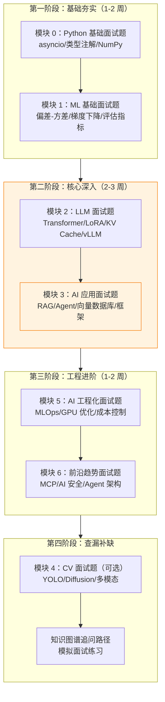

# 🎯 AI 面试总入口

> **使用方式说明**：本知识库采用"分散 + 集中"混合方案管理面试内容。
> - **日常学习**：看各模块的 `interview.md`，面试题紧跟对应知识点，边学边练
> - **面试冲刺**：看本页面（汇总入口），按维度快速索引到各模块面试题
> - **链接机制**：本页不重复写题，通过链接跳转到各模块 `interview.md` 的具体位置

---

## 📋 面试准备路线图

---

## 📊 各模块面试题数量统计

| 模块 | 面试题数量 | 难度分布 | 链接 |
|:----:|:----------:|----------|------|
| 模块 0：前提准备 | 7 题 | ⭐⭐ 3 题 / ⭐⭐⭐ 4 题 | [查看](/0-prerequisites/interview) |
| 模块 1：AI/ML 基础 | 12 题 | ⭐⭐ 4 题 / ⭐⭐⭐ 6 题 / ⭐⭐⭐⭐ 2 题 | [查看](/1-ml-basics/interview) |
| 模块 2：大语言模型 | 11 题 | ⭐⭐ 3 题 / ⭐⭐⭐ 5 题 / ⭐⭐⭐⭐ 3 题 | [查看](/2-llm/interview) |
| 模块 3：AI 应用开发 | 11 题 | ⭐⭐ 3 题 / ⭐⭐⭐ 5 题 / ⭐⭐⭐⭐ 3 题 | [查看](/3-ai-apps/interview) |
| 模块 4：计算机视觉 | 10 题 | ⭐⭐ 3 题 / ⭐⭐⭐ 5 题 / ⭐⭐⭐⭐ 2 题 | [查看](/4-cv/interview) |
| 模块 5：AI 工程化 | 12 题 | ⭐⭐ 4 题 / ⭐⭐⭐ 5 题 / ⭐⭐⭐⭐ 3 题 | [查看](/5-ai-engineering/interview) |
| 模块 6：AI 前沿 | 9 题 | ⭐⭐ 3 题 / ⭐⭐⭐ 4 题 / ⭐⭐⭐⭐ 2 题 | [查看](/6-ai-frontier/interview) |
| **合计** | **72 题** | | |

---

## 🔥 高频题 Top 20 快速索引

以下是面试中出现频率最高的 20 道题，按重要程度排序：

| # | 题目 | 模块 | 难度 | 频率 | 链接 |
|:-:|------|:----:|:----:|:----:|------|
| 1 | Transformer 自注意力机制原理 | 模块 2 | ⭐⭐⭐ | 🔥🔥🔥 | [查看](/2-llm/interview#q1) |
| 2 | RAG 完整架构和工作流程 | 模块 3 | ⭐⭐⭐ | 🔥🔥🔥 | [查看](/3-ai-apps/interview#q1) |
| 3 | LoRA/QLoRA 微调原理 | 模块 2 | ⭐⭐⭐ | 🔥🔥🔥 | [查看](/2-llm/interview#q3) |
| 4 | KV Cache 与 vLLM PagedAttention | 模块 2 | ⭐⭐⭐⭐ | 🔥🔥🔥 | [查看](/2-llm/interview#q5) |
| 5 | 向量数据库选型对比 | 模块 3 | ⭐⭐⭐ | 🔥🔥🔥 | [查看](/3-ai-apps/interview#q2) |
| 6 | Agent 架构设计（ReAct/Multi-Agent） | 模块 3 | ⭐⭐⭐ | 🔥🔥🔥 | [查看](/3-ai-apps/interview#q5) |
| 7 | 偏差-方差权衡 | 模块 1 | ⭐⭐⭐ | 🔥🔥🔥 | [查看](/1-ml-basics/interview#q1) |
| 8 | 梯度消失与梯度爆炸 | 模块 1 | ⭐⭐⭐ | 🔥🔥🔥 | [查看](/1-ml-basics/interview#q2) |
| 9 | asyncio 事件循环原理 | 模块 0 | ⭐⭐⭐ | 🔥🔥🔥 | [查看](/0-prerequisites/interview#q1) |
| 10 | GPU 显存优化策略 | 模块 5 | ⭐⭐⭐ | 🔥🔥🔥 | [查看](/5-ai-engineering/interview#q5) |
| 11 | MLOps 流水线设计 | 模块 5 | ⭐⭐⭐ | 🔥🔥🔥 | [查看](/5-ai-engineering/interview#q1) |
| 12 | Embedding 模型选型 | 模块 3 | ⭐⭐⭐ | 🔥🔥🔥 | [查看](/3-ai-apps/interview#q3) |
| 13 | Transformer 为何取代 RNN | 模块 1 | ⭐⭐⭐ | 🔥🔥🔥 | [查看](/1-ml-basics/interview#q5) |
| 14 | YOLO 架构演进 | 模块 4 | ⭐⭐⭐ | 🔥🔥🔥 | [查看](/4-cv/interview#q1) |
| 15 | Prompt Injection 防御 | 模块 6 | ⭐⭐⭐ | 🔥🔥🔥 | [查看](/6-ai-frontier/interview#q1) |
| 16 | vLLM 推理加速原理 | 模块 5 | ⭐⭐⭐⭐ | 🔥🔥🔥 | [查看](/5-ai-engineering/interview#q3) |
| 17 | LangChain vs LangGraph 选型 | 模块 3 | ⭐⭐⭐ | 🔥🔥 | [查看](/3-ai-apps/interview#q8) |
| 18 | 模型量化（GGUF 格式） | 模块 2 | ⭐⭐⭐ | 🔥🔥 | [查看](/2-llm/interview#q7) |
| 19 | MCP 协议原理 | 模块 6 | ⭐⭐⭐ | 🔥🔥 | [查看](/6-ai-frontier/interview#q3) |
| 20 | NumPy 向量化运算原理 | 模块 0 | ⭐⭐ | 🔥🔥🔥 | [查看](/0-prerequisites/interview#q6) |

---

## 🧭 按维度筛选导航

### 按难度筛选

| 难度 | 适合岗位 | 题目数量 | 详情 |
|:----:|----------|:--------:|------|
| ⭐⭐ 初级 | AI 应用工程师初面 | ~23 题 | [按难度查看](/interview/by-difficulty#初级题) |
| ⭐⭐⭐ 中级 | ML/LLM 工程师面试 | ~35 题 | [按难度查看](/interview/by-difficulty#中级题) |
| ⭐⭐⭐⭐ 高级 | 大厂 AI Lab / 高级岗位 | ~14 题 | [按难度查看](/interview/by-difficulty#高级题) |

### 按岗位筛选

| 岗位 | 重点模块 | 详情 |
|------|----------|------|
| AI 应用工程师 | 模块 3（RAG/Agent/框架） | [按岗位查看](/interview/by-position#ai-应用工程师) |
| ML 工程师 | 模块 1（ML 基础）+ 模块 5（MLOps） | [按岗位查看](/interview/by-position#ml-工程师) |
| LLM 工程师 | 模块 2（微调/量化/部署） | [按岗位查看](/interview/by-position#llm-工程师) |
| AI 产品经理 | 模块 7.3（产品设计/可行性） | [按岗位查看](/interview/by-position#ai-产品经理) |

### 按公司类型筛选

| 公司类型 | 面试特点 | 详情 |
|----------|----------|------|
| 大厂 AI Lab | 侧重原理深度 | [按公司查看](/interview/by-company#大厂-ai-lab) |
| AI 创业公司 | 侧重实战能力 | [按公司查看](/interview/by-company#ai-创业公司) |
| 传统企业 AI 部门 | 侧重落地方案 | [按公司查看](/interview/by-company#传统企业-ai-部门) |

### 知识图谱

想了解知识点之间的关联和常见追问路径？查看 [AI 知识图谱](/interview/knowledge-map)。

---

## 💡 面试准备建议

1. **按岗位聚焦**：先确定目标岗位，按 [岗位分类](/interview/by-position) 找到重点模块
2. **按难度递进**：从初级题开始，逐步挑战高级题
3. **追问路径**：利用 [知识图谱](/interview/knowledge-map) 准备追问，面试官通常会沿着知识链深入
4. **代码实战**：每道题对应的代码示例一定要跑一遍，面试中可能要求手写
5. **模拟面试**：找同学互相模拟，练习口头表达和时间控制
