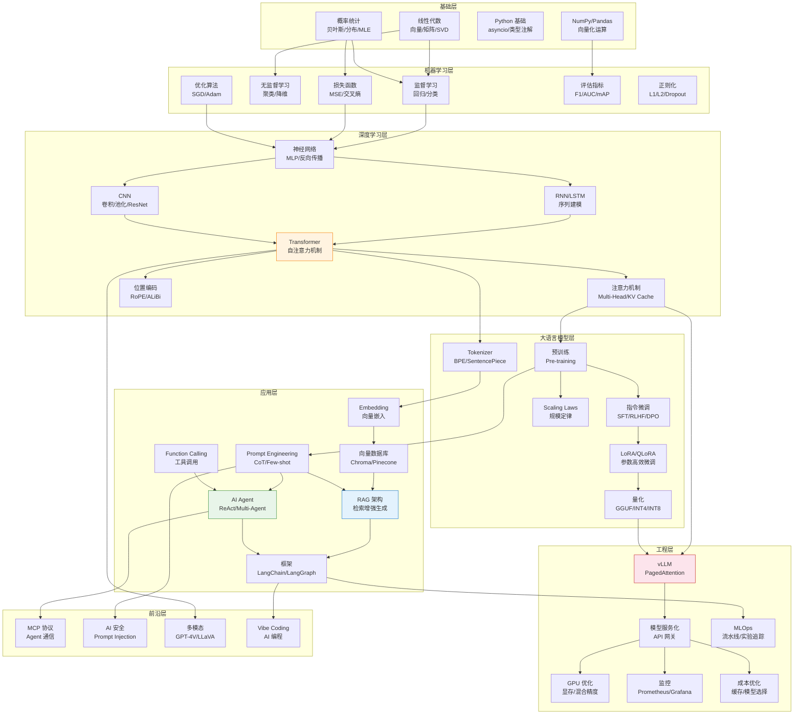
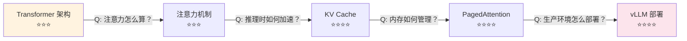
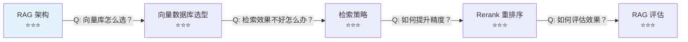
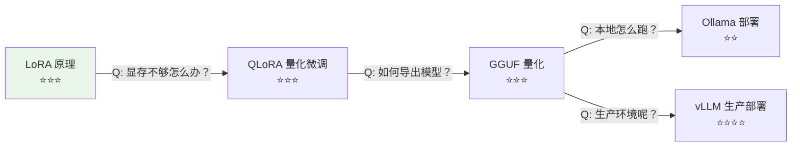
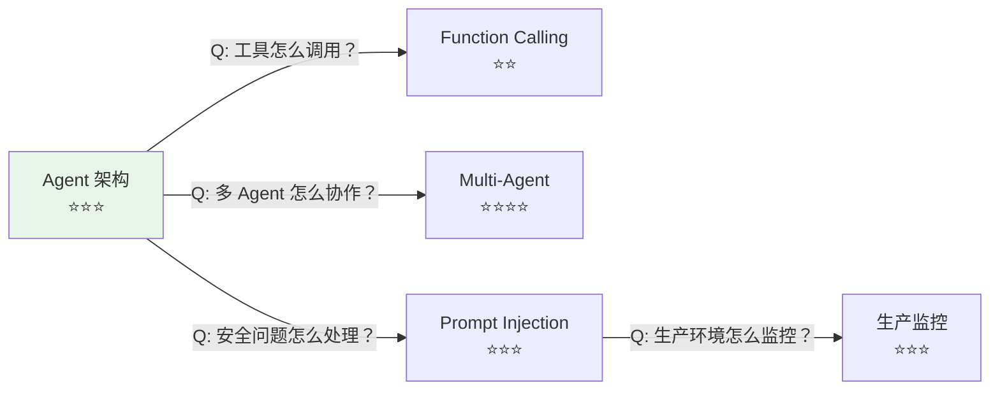
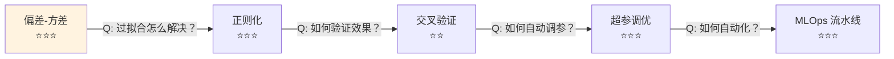

# 🧠 AI 知识图谱

> 本页展示 AI 知识点之间的关联关系和面试中常见的追问路径。面试官通常会沿着知识链深入追问，提前了解追问路径有助于准备更充分。

---

## 核心知识图谱

---

## 高频追问路径

面试官通常会沿着以下路径深入追问。每个节点链接到对应模块的面试题。

### 路径 1：Transformer → 推理优化

- [Transformer 架构](/2-llm/interview#q1) → [注意力机制](/2-llm/interview#q1) → [KV Cache](/2-llm/interview#q5) → [vLLM PagedAttention](/5-ai-engineering/interview#q3)

### 路径 2：RAG → 优化 → 评估

- [RAG 架构](/3-ai-apps/interview#q1) → [向量数据库](/3-ai-apps/interview#q2) → [RAG 优化](/3-ai-apps/interview#q4) → [RAG 评估](/3-ai-apps/interview#q9)

### 路径 3：微调 → 量化 → 部署

- [LoRA 原理](/2-llm/interview#q3) → [量化](/2-llm/interview#q7) → [部署方案对比](/2-llm/interview#q10)

### 路径 4：Agent → 安全 → 监控

- [Agent 架构](/3-ai-apps/interview#q5) → [Multi-Agent](/3-ai-apps/interview#q7) → [Prompt Injection](/6-ai-frontier/interview#q1) → [生产监控](/5-ai-engineering/interview#q11)

### 路径 5：ML 基础 → 工程化

- [偏差-方差](/1-ml-basics/interview#q1) → [正则化](/1-ml-basics/interview#q3) → [交叉验证](/1-ml-basics/interview#q4) → [MLOps](/5-ai-engineering/interview#q1)

---

## 知识点关联矩阵

| 知识点 | 强关联 | 弱关联 |
|--------|--------|--------|
| Transformer | 注意力机制、位置编码、KV Cache | CNN、RNN、Scaling Laws |
| RAG | Embedding、向量数据库、Rerank | Prompt Engineering、LangChain |
| LoRA | QLoRA、PEFT、微调数据 | 量化、部署 |
| Agent | Function Calling、ReAct、记忆 | MCP、LangGraph |
| vLLM | PagedAttention、KV Cache、GPU | Tensor Parallelism、负载均衡 |
| MLOps | 实验追踪、模型注册、CI/CD | 监控、成本优化 |

---

## 💡 使用建议

1. **面试前**：沿着追问路径练习，确保每条路径上的知识点都能流畅回答
2. **模拟面试**：让同学从路径起点开始提问，逐步深入
3. **查漏补缺**：如果某条路径中断，说明该知识点需要加强
4. **建立联系**：理解知识点之间的关联，面试时能自然地引导话题
