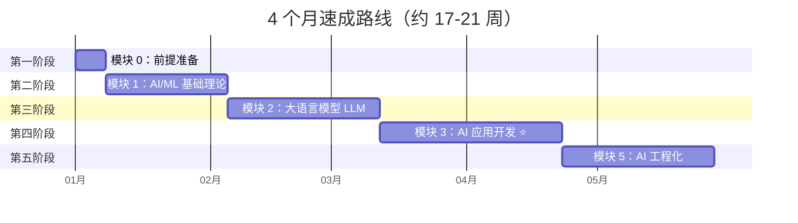

# 🚀 4 个月速成路线

> 专注 LLM 应用落地，适合有后端开发经验、希望快速转型 AI 应用工程师的开发者。

---

## 路线总览

---

## 第一阶段：前提准备（1 周）

> 目标：补齐 Python 生产级编程和数据工具基础

| 天数 | 学习内容 | 文档 | 代码示例 |
|:----:|----------|------|----------|
| Day 1 | 异步编程（asyncio/async-await） | [文档](/0-prerequisites/01-async-programming) | [代码](https://github.com/) |
| Day 2 | 错误处理 + 类型注解 | [文档](/0-prerequisites/02-error-handling) / [文档](/0-prerequisites/03-type-annotations) | [代码](https://github.com/) |
| Day 3 | NumPy 基础操作 | [文档](/0-prerequisites/05-numpy-basics) | [代码](https://github.com/) |
| Day 4 | Pandas 基础操作 | [文档](/0-prerequisites/06-pandas-basics) | [代码](https://github.com/) |
| Day 5 | 包管理 + 虚拟环境 | [文档](/0-prerequisites/04-package-management) / [文档](/0-prerequisites/09-virtual-env) | — |
| Day 6-7 | 里程碑项目：CSV 处理 + FastAPI 服务 | [模块索引](/0-prerequisites/) | [项目代码](https://github.com/) |

**检查点**：能独立完成 CSV 数据处理脚本并封装为 FastAPI 服务。

---

## 第二阶段：AI/ML 基础理论（3-4 周）

> 目标：理解机器学习和深度学习核心原理，为 LLM 学习打基础

### 第 1 周：机器学习基础

| 学习内容 | 文档 | 重点 |
|----------|------|------|
| 监督学习（分类/回归） | [文档](/1-ml-basics/01-supervised-learning) | 理解损失函数和梯度下降 |
| 无监督学习（聚类/降维） | [文档](/1-ml-basics/02-unsupervised-learning) | K-Means 和 PCA 原理 |
| 常见算法实战 | [文档](/1-ml-basics/04-classic-algorithms) | scikit-learn 实现 |
| 评估与调优 | [文档](/1-ml-basics/10-evaluation-tuning) | 交叉验证、评估指标 |

### 第 2 周：深度学习基础

| 学习内容 | 文档 | 重点 |
|----------|------|------|
| 神经网络（MLP/反向传播） | [文档](/1-ml-basics/05-neural-networks) | PyTorch 实现 |
| CNN 基础 | [文档](/1-ml-basics/06-cnn) | 卷积/池化/经典架构 |
| RNN/LSTM | [文档](/1-ml-basics/07-rnn-lstm) | 序列建模（了解即可） |
| 数学基础 | [文档](/1-ml-basics/09-math-foundations) | 够用即可，边做边补 |

### 第 3 周：Transformer + 里程碑

| 学习内容 | 文档 | 重点 |
|----------|------|------|
| Transformer 架构 | [文档](/1-ml-basics/08-transformer) | ⭐ 重中之重 |
| 损失函数 | [文档](/1-ml-basics/11-loss-functions) | MSE/交叉熵 |
| 里程碑项目 1：垃圾邮件分类器 | [模块索引](/1-ml-basics/) | scikit-learn + PyTorch |
| 里程碑项目 2：MNIST API | [模块索引](/1-ml-basics/) | CNN → FastAPI 服务 |

**检查点**：能解释 Transformer 自注意力机制，完成 MNIST 分类 API。

---

## 第三阶段：大语言模型 LLM（4-5 周）

> 目标：深入理解 LLM 原理，掌握微调和部署技术

### 第 1-2 周：LLM 原理

| 学习内容 | 文档 | 重点 |
|----------|------|------|
| Transformer 架构详解 | [文档](/2-llm/01-transformer-deep-dive) | Decoder-Only 架构 |
| 注意力机制深入 | [文档](/2-llm/02-attention-mechanism) | KV Cache、Flash Attention |
| 位置编码 | [文档](/2-llm/03-position-encoding) | RoPE 原理 |
| 训练流程 | [文档](/2-llm/04-training-pipeline) | 预训练/SFT/RLHF/DPO |
| 主流模型对比 | [文档](/2-llm/06-model-comparison) | GPT/Claude/Llama/Qwen |
| Tokenizer | [文档](/2-llm/15-tokenizer) | BPE 原理 |

### 第 3-4 周：微调与部署

| 学习内容 | 文档 | 重点 |
|----------|------|------|
| LoRA/QLoRA 微调 | [文档](/2-llm/07-lora-qlora) | ⭐ 面试高频 |
| 微调数据准备 | [文档](/2-llm/09-data-preparation) | Alpaca/ShareGPT 格式 |
| 量化与 GGUF | [文档](/2-llm/11-quantization-gguf) | 量化级别对比 |
| vLLM 推理加速 | [文档](/2-llm/12-vllm-deployment) | PagedAttention |
| Ollama 本地部署 | [文档](/2-llm/13-ollama-local) | 快速上手 |

### 第 5 周：里程碑项目

| 项目 | 说明 |
|------|------|
| 多模型对比评测 | 本地部署 Qwen2-7B，编写评测脚本 |
| 领域模型微调 | LoRA 微调 → GGUF 导出 → API 部署 |

**检查点**：能独立完成 LoRA 微调并部署为 API 服务。

---

## 第四阶段：AI 应用开发（5-6 周）⭐ 最核心

> 目标：掌握 RAG、Agent、框架实战，能开发生产级 AI 应用

### 第 1-2 周：RAG 全链路

| 学习内容 | 文档 | 重点 |
|----------|------|------|
| Prompt Engineering | [文档](/3-ai-apps/01-prompt-engineering) | CoT/Few-shot |
| 文档加载与切分 | [文档](/3-ai-apps/05-document-loading) / [文档](/3-ai-apps/06-text-splitting) | 切分策略 |
| Embedding 模型 | [文档](/3-ai-apps/07-embedding-models) | 模型选型 |
| 向量数据库 | [文档](/3-ai-apps/08-vector-databases) | Chroma 实战 |
| 检索策略 + Rerank | [文档](/3-ai-apps/09-retrieval-strategies) / [文档](/3-ai-apps/10-rerank) | 混合检索 |
| RAG 优化 | [文档](/3-ai-apps/11-rag-optimization) | HyDE/查询改写 |

### 第 3-4 周：Agent 开发

| 学习内容 | 文档 | 重点 |
|----------|------|------|
| Function Calling | [文档](/3-ai-apps/12-function-calling) | 工具定义 |
| Tool Use | [文档](/3-ai-apps/13-tool-use) | 自定义工具 |
| ReAct 模式 | [文档](/3-ai-apps/14-react-pattern) | 推理-行动循环 |
| Multi-Agent | [文档](/3-ai-apps/15-multi-agent) | 多 Agent 协作 |
| LangChain + LangGraph | [文档](/3-ai-apps/17-langchain) / [文档](/3-ai-apps/18-langgraph) | ⭐ 框架实战 |

### 第 5-6 周：里程碑项目

| 项目 | 说明 |
|------|------|
| 企业级 RAG 知识库 | 文档加载 → 切分 → 向量化 → 检索 → 生成 → 评估 |
| 多 Agent 系统 | LangGraph 实现多 Agent 协作 |
| 智能客服系统 | RAG + Agent + 对话管理 + FastAPI |

**检查点**：能独立搭建企业级 RAG 系统，理解 Agent 架构设计。

---

## 第五阶段：AI 工程化（4-5 周）

> 目标：掌握 MLOps、模型服务化和生产监控

### 第 1-2 周：MLOps + 服务化

| 学习内容 | 文档 | 重点 |
|----------|------|------|
| MLOps 流水线 | [文档](/5-ai-engineering/01-mlops-pipeline) | 自动化流程 |
| 实验追踪 | [文档](/5-ai-engineering/02-experiment-tracking) | MLflow/W&B |
| vLLM 推理服务 | [文档](/5-ai-engineering/05-vllm-serving) | 生产部署 |
| API 网关 | [文档](/5-ai-engineering/07-api-gateway) | FastAPI + 推理后端 |
| 缓存策略 | [文档](/5-ai-engineering/09-caching-strategies) | 语义缓存 |

### 第 3-4 周：优化 + 监控

| 学习内容 | 文档 | 重点 |
|----------|------|------|
| GPU 选型 + 显存优化 | [文档](/5-ai-engineering/10-gpu-selection) / [文档](/5-ai-engineering/11-memory-optimization) | 成本控制 |
| 成本优化 | [文档](/5-ai-engineering/18-cost-optimization) | Token 计费/模型选择 |
| Prometheus + Grafana | [文档](/5-ai-engineering/20-prometheus-grafana) | 监控面板 |
| 告警策略 | [文档](/5-ai-engineering/22-alerting) | 生产告警 |

### 第 5 周：里程碑项目

| 项目 | 说明 |
|------|------|
| CI/CD 流水线 | 数据准备 → 训练 → 评估 → 部署自动化 |
| vLLM + 监控面板 | vLLM 推理加速 + Prometheus/Grafana |

**检查点**：能搭建完整的 MLOps 流水线和监控体系。

---

## 学习资源推荐

| 资源 | 类型 | 适用阶段 |
|------|------|----------|
| fast.ai《Practical Deep Learning》 | 课程 | 第二阶段 |
| Hugging Face《LLM Course》 | 课程 | 第三阶段 |
| LangChain 官方文档 | 文档 | 第四阶段 |
| Hugging Face《AI Agents Course》 | 课程 | 第四阶段 |

---

## 完成标准

完成本路线后，你应该能够：

- ✅ 理解 Transformer 架构和 LLM 训练流程
- ✅ 独立完成 LoRA 微调并部署模型
- ✅ 搭建企业级 RAG 知识库系统
- ✅ 开发 Multi-Agent 协作应用
- ✅ 搭建 MLOps 流水线和生产监控
- ✅ 通过 AI 应用工程师 / LLM 工程师面试
