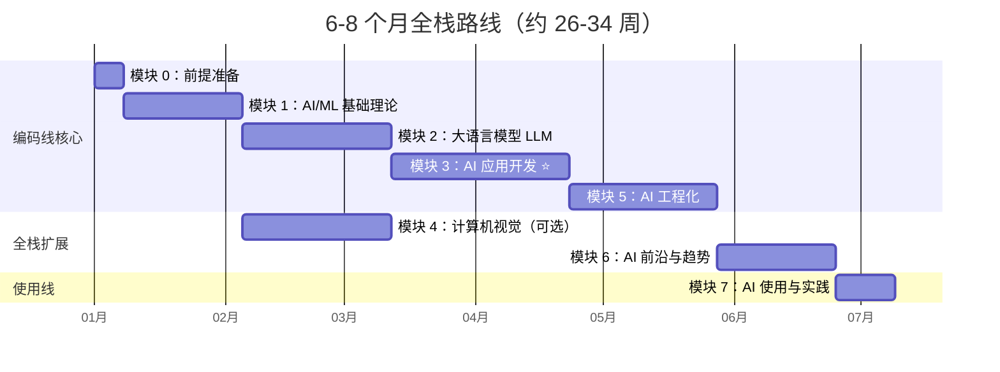

# 📚 6-8 个月全栈路线

> 全阶段覆盖，适合希望系统性掌握 AI 全栈能力的开发者。在 4 个月速成路线基础上，额外学习计算机视觉、AI 前沿趋势和 AI 工具使用与变现。

---

## 路线总览

> 💡 模块 4（计算机视觉）可以在模块 1 完成后并行学习，不影响主线进度。

---

## 阶段规划

### 第一阶段：前提准备（1 周）

与 [4 个月速成路线](/learning-paths/fast-track#第一阶段前提准备1-周) 相同。

- 📖 [模块 0 文档](/0-prerequisites/)
- ✅ 检查点：完成 CSV 处理 + FastAPI 服务里程碑项目

### 第二阶段：AI/ML 基础理论（3-4 周）

与 [4 个月速成路线](/learning-paths/fast-track#第二阶段aiml-基础理论3-4-周) 相同。

- 📖 [模块 1 文档](/1-ml-basics/)
- ✅ 检查点：完成 MNIST 分类 API 里程碑项目

### 第三阶段：大语言模型 LLM（4-5 周）

与 [4 个月速成路线](/learning-paths/fast-track#第三阶段大语言模型-llm4-5-周) 相同。

- 📖 [模块 2 文档](/2-llm/)
- ✅ 检查点：完成 LoRA 微调 + API 部署里程碑项目

### 第四阶段：AI 应用开发（5-6 周）⭐ 最核心

与 [4 个月速成路线](/learning-paths/fast-track#第四阶段ai-应用开发5-6-周-最核心) 相同。

- 📖 [模块 3 文档](/3-ai-apps/)
- ✅ 检查点：完成企业级 RAG + 多 Agent + 智能客服三个里程碑项目

### 第五阶段：AI 工程化（4-5 周）

与 [4 个月速成路线](/learning-paths/fast-track#第五阶段ai-工程化4-5-周) 相同。

- 📖 [模块 5 文档](/5-ai-engineering/)
- ✅ 检查点：完成 CI/CD 流水线 + vLLM 监控面板里程碑项目

---

### 第六阶段：计算机视觉（可选，4-5 周）

> 目标：掌握 CV 核心技术，拓展多模态应用能力
> 可在模块 1 完成后并行学习，不阻塞主线

#### 第 1-2 周：图像基础 + 目标检测

| 学习内容 | 文档 | 重点 |
|----------|------|------|
| OpenCV 基础 | [文档](/4-cv/01-opencv-basics) | 图像读取/处理 |
| 图像处理 + 颜色空间 | [文档](/4-cv/02-image-processing) / [文档](/4-cv/03-color-spaces) | 滤波/边缘检测 |
| YOLO 目标检测 | [文档](/4-cv/06-yolo-detection) | YOLOv8/v11 |
| 模型训练 + 微调 | [文档](/4-cv/07-model-training) / [文档](/4-cv/08-model-finetuning) | 自定义数据集 |
| 模型评估 + 导出 | [文档](/4-cv/09-model-evaluation) / [文档](/4-cv/10-model-export) | mAP/ONNX |

#### 第 3-4 周：图像生成 + 多模态

| 学习内容 | 文档 | 重点 |
|----------|------|------|
| Diffusion Model 原理 | [文档](/4-cv/11-diffusion-model) | 扩散/去噪 |
| Stable Diffusion | [文档](/4-cv/12-stable-diffusion) | 文生图/图生图 |
| Diffusers 库 | [文档](/4-cv/13-diffusers-library) | Pipeline 使用 |
| LLaVA 多模态 | [文档](/4-cv/14-llava-multimodal) | 图文理解 |
| 视觉-语言模型 | [文档](/4-cv/15-vision-language) | GPT-4V/Qwen-VL |

#### 第 5 周：里程碑项目

| 项目 | 说明 |
|------|------|
| YOLOv11 实时检测 API | 自定义数据集训练 → 模型导出 → FastAPI 服务 |
| 多模态应用 | LLaVA/Qwen-VL 图文理解 + API 服务 |
| Diffusion 图像生成 | Stable Diffusion + ControlNet 条件生成 |

- 📖 [模块 4 文档](/4-cv/)
- ✅ 检查点：完成 YOLO 检测 API + 多模态应用里程碑项目

---

### 第七阶段：AI 前沿与趋势（3-4 周）

> 目标：了解 AI 前沿技术，保持技术敏感度

#### 第 1 周：MCP + AI Coding

| 学习内容 | 文档 | 重点 |
|----------|------|------|
| MCP 协议原理 | [文档](/6-ai-frontier/01-mcp-protocol) | 协议规范 |
| MCP Server 开发 | [文档](/6-ai-frontier/02-mcp-server-dev) | Python 实现 |
| AI Coding IDE 对比 | [文档](/6-ai-frontier/08-ide-comparison) | Copilot/Cursor/Kiro |
| Vibe Coding | [文档](/6-ai-frontier/21-vibe-coding) | 自然语言驱动开发 |

#### 第 2 周：AI 安全

| 学习内容 | 文档 | 重点 |
|----------|------|------|
| Prompt Injection 防御 | [文档](/6-ai-frontier/15-prompt-injection) | 防御策略 |
| Bias 检测 | [文档](/6-ai-frontier/16-bias-detection) | 公平性指标 |
| 红队测试 | [文档](/6-ai-frontier/17-red-teaming) | 攻击向量 |
| Agent 安全 | [文档](/6-ai-frontier/12-agent-security) | 沙箱/权限 |

#### 第 3 周：多模态 + 里程碑

| 学习内容 | 文档 | 重点 |
|----------|------|------|
| 多模态 API 实战 | [文档](/6-ai-frontier/19-multimodal-fusion) | GPT-4V/Gemini |
| 跨模态趋势 | [文档](/6-ai-frontier/20-cross-modal-trends) | 视频/语音 |
| 里程碑项目 | [模块索引](/6-ai-frontier/) | MCP Multi-Agent + 安全审计 |

- 📖 [模块 6 文档](/6-ai-frontier/)
- ✅ 检查点：完成 MCP Multi-Agent 系统 + 安全审计项目

---

### 第八阶段：AI 使用与实践（2 周，独立参考）

> 目标：掌握 AI 工具使用技巧，了解 AI 变现路径

| 周次 | 学习内容 | 文档 |
|:----:|----------|------|
| 第 1 周 | AI 效率工具（对话/搜索/写作/办公/编程） | [7.1 效率工具](/7-ai-tools/7.1-efficiency/) |
| 第 1 周 | AIGC 内容创作（图像/视频/音频/数字人） | [7.2 AIGC 创作](/7-ai-tools/7.2-aigc/) |
| 第 2 周 | AI 商业应用与变现（自媒体/副业/产品思维） | [7.3 商业变现](/7-ai-tools/7.3-business/) |

- 📖 [模块 7 文档](/7-ai-tools/)
- ✅ 检查点：能熟练使用 AI 工具提效，了解 AI 变现路径

---

## 与速成路线的对比

| 维度 | 4 个月速成 | 6-8 个月全栈 |
|------|:----------:|:------------:|
| 时间 | 17-21 周 | 26-34 周 |
| 模块覆盖 | 0→1→2→3→5 | 0→1→2→3→4→5→6→7 |
| 计算机视觉 | ❌ | ✅ |
| AI 前沿趋势 | ❌ | ✅ |
| AI 工具使用 | ❌ | ✅ |
| 适合岗位 | AI 应用工程师 | AI 全栈工程师 |
| 面试覆盖 | 核心模块 | 全模块 |

---

## 完成标准

完成本路线后，你应该能够：

- ✅ 速成路线的所有能力
- ✅ 开发 YOLO 目标检测和多模态应用
- ✅ 理解 Diffusion Model 原理并使用 Stable Diffusion
- ✅ 开发 MCP Server 并构建 Multi-Agent 系统
- ✅ 实施 AI 安全防护（Prompt Injection 防御、红队测试）
- ✅ 熟练使用 AI 工具提升工作效率
- ✅ 了解 AI 商业化和变现路径
- ✅ 通过 AI 全栈工程师面试
