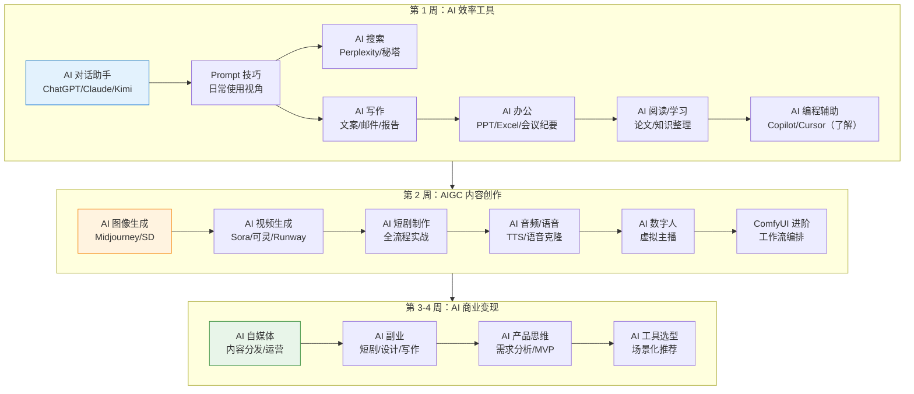

# 🔧 AI 工具使用者路线

> 仅学习模块 7，适合不需要编程能力、只想掌握 AI 工具使用技巧的用户。2-4 周即可完成。

---

## 适合人群

- 产品经理、运营、市场等非技术岗位
- 内容创作者（自媒体、短视频、设计师）
- 希望用 AI 工具提升工作效率的职场人
- 对 AI 变现感兴趣的创业者

## 前置要求

- 无编程基础要求
- 能使用浏览器和基本办公软件
- 有一定的学习意愿和好奇心

---

## 路线总览

---

## 第 1 周：AI 效率工具

> 目标：掌握日常工作中最实用的 AI 工具

### Day 1-2：AI 对话 + Prompt 技巧

| 学习内容 | 文档 | 重点 |
|----------|------|------|
| AI 对话助手 | [查看](/7-ai-tools/7.1-efficiency/ai-chat) | ChatGPT/Claude/Kimi 使用对比 |
| Prompt 技巧 | [查看](/7-ai-tools/7.1-efficiency/prompt-tips) | 清晰指令/角色设定/结构化提问 |

**实践**：用 ChatGPT 完成一个实际工作任务（写邮件/做总结/翻译文档）

### Day 3：AI 搜索

| 学习内容 | 文档 | 重点 |
|----------|------|------|
| AI 搜索工具 | [查看](/7-ai-tools/7.1-efficiency/ai-search) | Perplexity/秘塔搜索 |

**实践**：用 Perplexity 搜索一个专业问题，对比 Google 搜索结果

### Day 4-5：AI 写作 + 办公

| 学习内容 | 文档 | 重点 |
|----------|------|------|
| AI 写作 | [查看](/7-ai-tools/7.1-efficiency/ai-writing) | 文案/邮件/报告/翻译 |
| AI 办公 | [查看](/7-ai-tools/7.1-efficiency/ai-office) | PPT/Excel/会议纪要 |

**实践**：用 AI 生成一份 PPT 大纲 + 用 AI 写一封商务邮件

### Day 6-7：AI 阅读 + 编程辅助

| 学习内容 | 文档 | 重点 |
|----------|------|------|
| AI 阅读/学习 | [查看](/7-ai-tools/7.1-efficiency/ai-reading) | 论文阅读/知识整理 |
| AI 编程辅助 | [查看](/7-ai-tools/7.1-efficiency/ai-coding) | 了解即可，非必须 |

**实践**：用 ChatPDF 阅读一篇论文/报告，提取关键信息

✅ **检查点**：能熟练使用 AI 对话助手和搜索工具，掌握基本 Prompt 技巧

---

## 第 2 周：AIGC 内容创作

> 目标：掌握 AI 图像、视频、音频等内容生成工具

### Day 1-2：AI 图像生成

| 学习内容 | 文档 | 重点 |
|----------|------|------|
| AI 图像生成 | [查看](/7-ai-tools/7.2-aigc/image-generation) | Midjourney/SD/DALL-E 3 |

**实践**：用 Midjourney 或 DALL-E 3 生成 5 张不同风格的图片

### Day 3-4：AI 视频生成

| 学习内容 | 文档 | 重点 |
|----------|------|------|
| AI 视频生成 | [查看](/7-ai-tools/7.2-aigc/video-generation) | Sora/可灵/Runway |
| AI 短剧制作 | [查看](/7-ai-tools/7.2-aigc/short-drama) | 全流程实战 |

**实践**：用 AI 工具制作一个 30 秒的短视频

### Day 5-6：AI 音频 + 数字人

| 学习内容 | 文档 | 重点 |
|----------|------|------|
| AI 音频/语音 | [查看](/7-ai-tools/7.2-aigc/audio-voice) | TTS/语音克隆/AI 配乐 |
| AI 数字人 | [查看](/7-ai-tools/7.2-aigc/digital-human) | 虚拟主播/口型同步 |

**实践**：用 TTS 工具为视频配音

### Day 7：ComfyUI 进阶（可选）

| 学习内容 | 文档 | 重点 |
|----------|------|------|
| ComfyUI 进阶 | [查看](/7-ai-tools/7.2-aigc/comfyui-advanced) | 节点编排/自定义工作流 |

✅ **检查点**：能使用 AI 工具生成图像、视频和音频内容

---

## 第 3-4 周：AI 商业变现

> 目标：了解 AI 商业化路径，找到适合自己的变现方式

### 第 3 周：自媒体 + 副业

| 学习内容 | 文档 | 重点 |
|----------|------|------|
| AI 自媒体 | [查看](/7-ai-tools/7.3-business/ai-media) | 内容分发/账号运营/合规 |
| AI 副业 | [查看](/7-ai-tools/7.3-business/ai-side-hustle) | 短剧变现/设计接单/写作服务 |

**实践**：制定一个 AI 自媒体内容计划（选题 + 内容形式 + 发布平台）

### 第 4 周：产品思维 + 工具选型

| 学习内容 | 文档 | 重点 |
|----------|------|------|
| AI 产品思维 | [查看](/7-ai-tools/7.3-business/ai-product) | 需求分析/MVP 设计 |
| AI 工具选型 | [查看](/7-ai-tools/7.3-business/ai-tool-selection) | 场景化推荐/组合方案 |

**实践**：为自己的工作场景设计一套 AI 工具组合方案

✅ **检查点**：有明确的 AI 变现方向和工具使用方案

---

## 完成标准

完成本路线后，你应该能够：

- ✅ 熟练使用 AI 对话助手（ChatGPT/Claude/Kimi）
- ✅ 掌握 Prompt 技巧，能高效与 AI 交互
- ✅ 使用 AI 工具提升日常办公效率（写作/PPT/Excel）
- ✅ 使用 AI 生成图像、视频和音频内容
- ✅ 了解 AI 自媒体运营和副业变现路径
- ✅ 能为不同场景选择合适的 AI 工具组合

---

## 进阶建议

如果学完本路线后想深入学习 AI 技术：

1. **入门编程**：学习 Python 基础 → 进入 [4 个月速成路线](/learning-paths/fast-track)
2. **深入 AIGC**：学习 Stable Diffusion 本地部署 → 模块 4 计算机视觉
3. **AI 产品方向**：学习 AI 应用架构 → 模块 3 AI 应用开发（概念层面）
