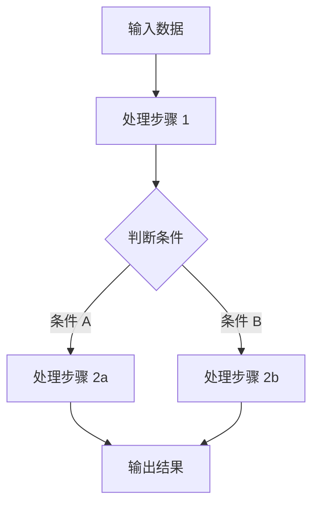

# [知识点标题]

## 概念说明

[用通俗易懂的语言解释这个知识点是什么、解决什么问题。]

[建议从以下角度展开：]
- [这个技术/概念的定义是什么？]
- [它解决了什么实际问题？]
- [对于后端开发者来说，可以类比哪些已有概念？]
- [在 AI 技术栈中处于什么位置？]

## 核心原理

[深入分析底层原理，配合图表说明。]

[对于复杂流程，必须包含 Mermaid 图。以下为 Mermaid 图占位示例：]



[原理分析要点：]
- [核心算法/机制是什么？]
- [关键参数有哪些？如何影响结果？]
- [与其他方案相比，优势和局限是什么？]

## 代码示例

> 💻 完整可运行代码：[code-examples/[模块名]/[知识点路径]/](链接到代码目录)
> 🐍 Python 版本：3.11+
> 📦 依赖：[主要依赖库，如 torch, transformers, langchain]

```python
# [关键代码片段标题]
# 完整代码见上方链接

# [在此放置最核心的代码片段，帮助读者快速理解实现思路]
# [代码应包含中文注释，解释关键逻辑]

def example_function():
    """[函数说明]"""
    pass

if __name__ == "__main__":
    example_function()
```

[如果涉及外部服务依赖，请标注启动命令：]

> ⚠️ 本示例需要启动 [服务名称]，启动命令：
> ```bash
> docker compose -f docker/docker-compose.yml up -d [服务名]
> ```
> 💡 免费替代方案：[说明如何使用免费/本地方案替代付费 API]

## 实战要点

[实际项目中的注意事项和最佳实践。]

**性能优化：**
- [要点 1]
- [要点 2]

**常见陷阱：**
- [陷阱 1：描述问题和解决方案]
- [陷阱 2：描述问题和解决方案]

**生产环境建议：**
- [建议 1]
- [建议 2]

## 常见面试题

### Q1: [面试题目]

**难度**：⭐⭐⭐ | **频率**：🔥🔥🔥

**答题思路**：
1. [第一步：先解释核心概念]
2. [第二步：分析关键原理]
3. [第三步：结合实际场景说明]

**标准答案**：

[完整的参考答案，结构清晰，逻辑严谨。]

**深入追问**：
- [追问 1：更深层次的技术细节]
- [追问 2：与其他技术的对比或结合]

<!-- 可根据需要添加更多面试题，格式与 Q1 保持一致 -->

## 推荐工具

> 📌 以下工具可帮助你更高效地学习和实践本知识点，详见 [模块 7：AI 使用与实践](/7-ai-tools/)

| 工具 | 用途 | 详情 |
|------|------|------|
| [工具名称1] | [用途说明] | [链接到模块 7 对应小节](/7-ai-tools/7.1-efficiency/ai-search) |
| [工具名称2] | [用途说明] | [链接到模块 7 对应小节](/7-ai-tools/7.1-efficiency/ai-coding) |
| [工具名称3] | [用途说明] | [链接到模块 7 对应小节](/7-ai-tools/7.2-aigc/image-generation) |

## 参考资料

- [资料名称1](https://链接地址)
- [资料名称2](https://链接地址)
- [资料名称3](https://链接地址)
